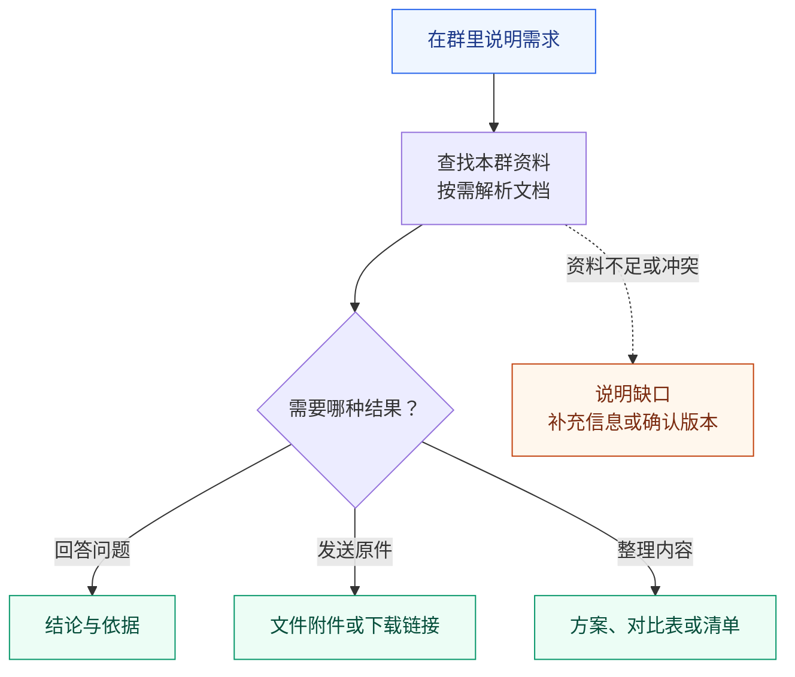
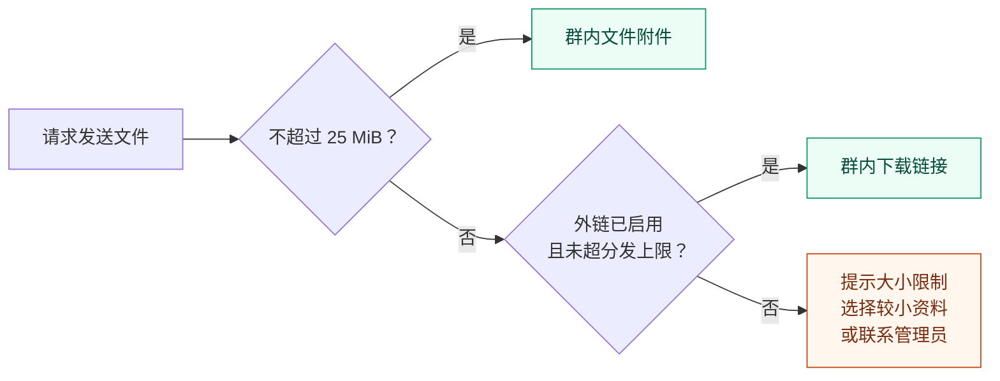
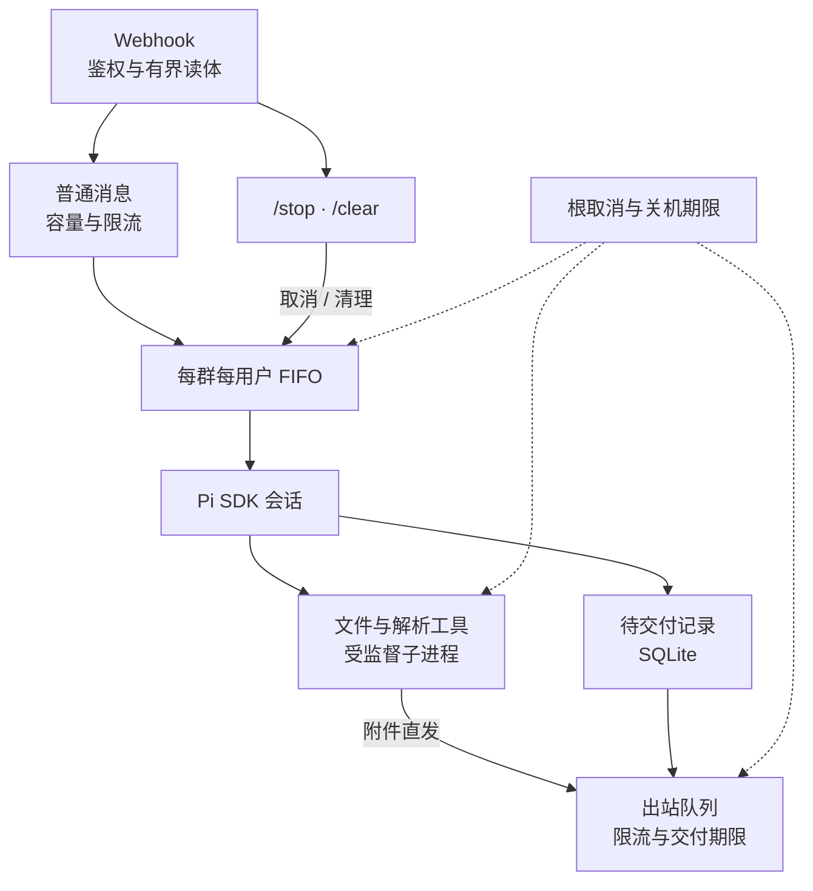

# mixin-chatbot

量子密信群聊中的产品资料助手，面向销售与售前。你可以在已接入机器人的群里询问产品问题、索要原始资料，或让它整理方案、对比表和清单。

**群用户**：[使用示例](#使用示例) · [使用流程](#使用流程) · [群聊指令](#群聊指令) · [文件交付](#文件交付)

**部署与维护**：[快速开始](#快速开始) · [配置与数据](#配置与数据) · [运维](#运维) · [工作原理](#工作原理) · [提示词与工具](#提示词与工具) · [开发与检查](#开发与检查)

## 使用示例

把示例中的产品或项目名称替换为实际名称，在群里说明你要什么结果。

| 想做什么 | 可以这样问 | 预期结果 |
|---|---|---|
| 📚 查产品信息 | “X 产品支持哪些部署方式？请注明资料来源。” | 结论与文件依据；资料缺失时说明缺口 |
| 📎 拿原始资料 | “把 X 产品当前正式版的手册原文件发给我。” | 原始文件附件，或配置了外链后的下载链接 |
| 📊 做资料对比 | “对比 X 和 Y 的功能、部署方式及限制，生成 Excel 表。” | 对比文件，并标明依据或缺失项 |
| 📝 整理交付物 | “根据本群资料整理项目 A 的方案，生成 Word 文件，列出待确认项。” | 方案文件与待确认事项 |

说明用途、版本要求和输出格式，有助于缩小检索范围。每位用户有独立会话，引用“上一份文件”时要保证它出现在你与机器人的当前对话中。

## 使用流程



机器人依据本群资料工作，价格、参数和政策需要资料支持。版本以正式发布、生效信息为准；资料不够或存在冲突时，应先说明并确认，不能靠历史答案补齐。

同一用户连续发来的请求会排队执行。等待期间可以用 `/status` 查看进度，用 `/stop` 取消，或用 `/clear` 开始新会话。

## 群聊指令

| 输入 | 行为 |
|---|---|
| 普通消息 | 同一会话顺序执行，最多 8 条等待消息 |
| `/stop` | 立即取消当前任务并清空等待消息，回执发送不阻塞停止 |
| `/clear` | 取消并等待收尾，归档本人在本群的会话；后续消息在清理完成后执行 |
| `/deliver` | 补发已生成但没发到群里的回复 |
| `/status` | 查看处理进度、等待消息、最近工具、待补发回复数量与消息发送用量 |
| `/help` | 查看指令说明 |

`/clear` 只归档你在本群的对话，不清除其他人的会话或你的待补发回复。`/stop` 会丢弃排队中的请求；需要继续处理时请重新发送，已发送的消息无法撤回。`/deliver` 可补发之前会话中保存的回复；如果之前只发出了一部分，补发可能包含重复内容。

## 文件交付

发送本地文件时，系统按大小和已配置的能力选择交付方式：



平台单附件上限按本项目约定为 **25 MiB**；外链默认上限为 **2 GiB**，由管理员按需配置。带有效期的链接应在提示的期限内下载，具体保留规则见[大文件外链配置](#大文件外链配置)。

> **回复或下载链接未送达时**，使用 `/deliver` 补发；`/clear` 不会清除这些待交付记录。若平台已接收但应答丢失，补发可能重复。直接附件发送失败后，需要重新请求发送文件。

每会话最多保存 64 条待交付文本或外链，达到上限后需先补发。“文件生成成功”或“链接生成成功”与群里确认收到是不同的步骤。

## 快速开始

### 选择部署方式

| 方式 | 主机要求 | 文档解析环境 |
|---|---|---|
| Windows 原生 | Bun 1.4.0+、Git for Windows 的 GNU Bash、原生 `uv.exe`；管理员 PowerShell 部署 | 首次解析按需准备 |
| Linux / Docker | glibc Linux、Docker Engine、Bash、curl、coreutils、util-linux 的 `flock`；直连模式使用 UFW | 镜像预装 Python 3.12.13 和固定版本解析库 |

Linux 工具进程监督需要访问 `/proc`；不支持 macOS、Alpine/musl。Linux 生产主机无需额外安装 Bun，配置向导与应用运行在镜像内。

基础组件通过官方渠道安装：[uv](https://docs.astral.sh/uv/getting-started/installation/)、[Docker Engine（Debian）](https://docs.docker.com/engine/install/debian/)。使用 Cloudflare 隧道时，预先安装 [cloudflared](https://developers.cloudflare.com/cloudflare-one/networks/connectors/cloudflare-tunnel/downloads/)；Windows 可执行 `winget install --id Cloudflare.cloudflared`。

### 执行部署

在项目根目录选择对应入口。脚本会引导模型与入口配置、生成 webhook 密钥、保存运行设置并检查新实例。

Windows，在管理员 PowerShell 中执行：

```powershell
powershell -NoProfile -ExecutionPolicy Bypass -File scripts/deploy/deploy.ps1
powershell -NoProfile -ExecutionPolicy Bypass -File scripts/ops/ops.ps1 doctor
```

Linux / Docker：

```sh
bash scripts/deploy/deploy.sh
bash scripts/ops/ops.sh doctor
```

模型配置保存在 `data/config/models.json`，使用 Pi 原生 provider，每个实例选择一个服务商和一个模型。`bun run configure` 提供两种方式：

- **Pi 内置服务商**：选择服务商、模型并填写 API Key，地址、协议、工具兼容和模型能力由 Pi 提供。可选项来自所安装 Pi 版本的服务商目录，向导只列出使用 API Key 且有可用模型的条目。同一家厂商的不同站点、区域或套餐在目录中可能是彼此独立的服务商 ID，请按实际账号选择；ID 和模型清单会随 Pi 版本变化，以向导当前列出的为准。
- **自定义服务商**：填写地址、Key 和模型资料，向导支持 `openai-completions`、`openai-responses`、`anthropic-messages`；高级参数遵循 Pi 的 `models.json` 格式。

**本次配置格式不兼容旧版。更新后先停机并重新运行 `bun run configure`，再启动服务。** 顶层 `modelId` 和 `thinkingLevel` 用于本项目选定模型与推理级别，`providers` 交给 Pi 原生加载。内置模式只写凭证，不复制或覆盖目录中的模型定义：

```json
{
  "modelId": "YOUR_MODEL_ID",
  "thinkingLevel": "low",
  "providers": {
    "YOUR_PROVIDER_ID": { "apiKey": "YOUR_API_KEY" }
  }
}
```

自定义模式同样需要顶层 `modelId`，并在对应 provider 的 `models` 中声明这个模型。升级 Pi 不会自动更换所选模型，但内置模型资料会跟随所安装的 Pi 版本更新。

首次部署直接创建当前存储结构。后续重复部署时，脚本先暂停已有实例并保存配置、启动定义、依赖或镜像及原运行状态；部署失败会尝试回滚，恢复失败则保留现场并报错。Windows 计划任务优先使用 S4U 开机启动，受系统限制时回退到登录启动，并显示实际方式。

### 配置平台入口

生产回调地址为 `/webhook/<secret>`，密钥由部署脚本生成并保存在 `data/config/webhook-secret`，格式为 64 位十六进制。

| 入口模式 | 配置要点 |
|---|---|
| 直连 | 只放行项目配置的平台来源 IP；可通过 `PLATFORM_IP` 指定 |
| Cloudflare | 应用绑定回环地址；Published application 指向 `http://localhost:<BOT_PORT>`，域名和 WAF 由部署方配置 |

每个群使用独立的 callback key。部署后结合实际域名运行 `doctor`，并在测试群验证消息、文件和停止操作；本地 `/health` 只能确认应用就绪。

**Cloudflare 规则维护约定：** 当前线上入口采用默认拒绝、显式放行的策略；实际规则只在 Cloudflare 控制台维护，尚未纳入仓库版本管理，部署脚本不会同步它们。本段记录维护约定，不是线上规则快照。

新增或修改 `src/server/app.ts` 的公网路由时，必须同时检查控制台中的放行路径、HTTP 方法和来源条件，并同步所需规则。仅提交路由代码不足以开放公网访问。验收应分别检查本地源站响应和公网请求；如果本地正常而公网失败、源站日志全空，先查 Cloudflare 安全事件及规则命中情况，不要仅凭应用日志判断请求没有发出。

**后续 WebSocket 迁移：** 先确认连接方向和仍需保留的公网入口。若改为机器人主动向平台建立出站长连接，待消息、重连和回滚流程验证完成后，再清理废弃的 webhook 路由、密钥配置、对应拒绝日志逻辑，以及控制台中对应的放行规则；同时核对健康检查、管理操作和文件分发是否仍依赖 HTTP。若仍由平台连入机器人，则仍需维护握手入口的鉴权和 Cloudflare 规则，不能仅因使用 WebSocket 就删除入口防护。迁移前保留现有实现。

### HTTP 拒绝日志

错误或缺失 webhook 密钥、未知路由、管理 token 错误对外保持相同的 `404 / Not Found`。已通过密钥校验的请求保留实际的校验或运行状态码。

| 日志分类 | 含义 | 原因标签示例 |
|---|---|---|
| `suspected_probe` | 疑似探测，也可能是调用地址配置错误，需结合 IP、频率与路径判断 | `webhook_secret_mismatch`、`webhook_secret_missing`、`route_not_found` |
| `request_validation` | 请求格式、大小或字段校验拒绝，不直接认定为扫描 | `invalid_request`、`payload_too_large`、`unsupported_media_type` |
| `runtime_protection` | 停机、容量或 callback 路由保护，不计入疑似探测 | `service_stopping`、`callback_route_capacity`、`callback_route_conflict`、`request_capacity` |

每个应用实例的每个 60 秒窗口、每类最多输出 10 条 WARN 明细，其余只计数。窗口从第一条拒绝开始；窗口结束即使没有新请求也会输出 `拒绝请求汇总`，包含该类总数、已记录数、已抑制数和原因计数。窗口结束后恢复明细配额；服务开始关闭时提前输出当前汇总。空窗口不写日志，正常 `/health` 不写拒绝日志。

同类的原因共享明细配额：普通路径扫描可能占满 `suspected_probe` 的配额，使随后错误密钥请求的 IP 和路径明细被抑制，但其数量仍计入汇总的 `webhook_secret_mismatch`。当前不为猜密钥单独预留明细配额。即使“已抑制”为 0，也保留有请求窗口的汇总，以便统一按汇总统计总量；因此零星拒绝会产生一条明细和一条汇总。未提供具体原因的 409/5xx 使用 `runtime_rejected`，归入 `runtime_protection`。

统计请求量应使用汇总的“总数”（已经包含明细），不要再叠加明细行；实时排查可先看尚未汇总的明细。汇总只保留固定分类与原因的计数，不按 IP 或路径建表，因此换 IP 也不能绕过日志配额。进程强制退出时，尚未汇总的计数可能丢失。已有业务日志仍按原逻辑输出；日志限速不代表请求限流，也不改变响应状态。

明细包含 IP、方法、脱敏路径和状态码；不记录查询参数、请求体、Authorization 或错误消息中的外部字段。`/webhook/` 后的路径全部隐藏。IP 沿用 X-Forwarded-For 第一跳、X-Real-IP 回退的提取规则，仅作为排查线索，不作为可信鉴权依据。代理层直接拦截的请求不会出现在应用日志里。

## 配置与数据

### 运行设置

优先级：**显式环境变量 > `data/config/runtime.json` > 代码默认值**。

部署脚本保存支持的设置，未显式指定的值沿用已存配置。仅在前台启动时设置环境变量不会自动落盘；停机后可运行 `bun run configure-runtime` 保存当前支持项。配置文件中的未知键、无效类型及越界值会阻止启动。

| 设置 | 默认值 | 范围 / 说明 |
|---|---|---|
| `BOT_PORT` | 1011 | 1–65535 |
| `BOT_HOST` | 0.0.0.0 | IP 或 localhost；Cloudflare 部署设为 127.0.0.1 |
| `GROUP_DATA_ROOT` | data/groups | 可指定其他磁盘；容器自定义目录映射为 /app/group-data |
| `BOT_DEBUG` | 0 | 0/1；开启后记录用户消息正文 |
| `BOT_MAX_ACTIVE_REQUESTS` | 32 | 1–1000，普通请求总量 |
| `BOT_BASH_TIMEOUT` | 600 秒 | 10–3600 秒；工具可声明其他时限，最高 3600 秒 |
| `BOT_RUN_TIMEOUT_SECONDS` | 1200 秒 | 10–7200 秒，覆盖准备、模型、工具与最终交付 |
| `BOT_MODEL_IDLE_TIMEOUT_SECONDS` | 180 秒 | 10–7200 秒；模型等待或输出期间连续无有效进展的上限 |
| `BOT_MODEL_RESPONSE_TIMEOUT_SECONDS` | 600 秒 | 10–7200 秒；单次模型响应的上限，持续输出也不续期 |
| `BOT_DELIVERY_TIMEOUT_SECONDS` | 180 秒 | 1–600 秒，包含出站排队和重试 |
| `BOT_SHUTDOWN_TIMEOUT_SECONDS` | 20 秒 | 5–25 秒，覆盖 HTTP、任务、进程与租约收尾 |
| `BOT_INDEX_TTL_MINUTES` | 5 分钟 | 1–1440 分钟，活跃会话每轮检查 |
| `BOT_INDEX_MAX_FILES` | 50000 | 100–1000000 |
| `BOT_INDEX_MAX_DEPTH` | 12 | 1–64 |
| `BOT_DOCUMENT_ENV` | 自动选择 | 指定已配置解析环境；否则使用就绪的项目 .venv 或本群 venv |

### 数据目录

```text
data/
├── config/
│   ├── models.json            模型与凭据
│   ├── runtime.json           持久运行设置
│   ├── webhook-secret         入站鉴权密钥
│   ├── relay.json             可选大文件分发配置
│   └── tunnel-token           可选连接器凭据输入
├── state/
│   ├── agent.sqlite           待交付内容、路由隔离与路径身份
│   ├── relay.sqlite           远端对象的持久账本
│   ├── instance.json          实例 PID、启动时间与关闭令牌
│   └── ...                    部署状态与维护租约
├── runtime/                   Pi 资源、模型缓存与启动脚本
└── groups/<group>/
    ├── workspace/             外部同步的资料源
    ├── index/                 materials.md；可选 ignore.txt
    ├── venv/                  原生部署按需准备的解析环境
    └── users/<user>/
        ├── session.jsonl      Pi 原生会话
        └── tmp/               生成文件、缓存与完整工具输出
backup/
├── tmp/                       部署备份、测试与诊断现场
└── rm/                        被移除的旧文件、会话与用户 tmp
logs/                          应用日志
```

群和用户标识会编码为安全目录段；映射到已有目录的大小写别名会被拒绝，避免 Windows 串会话。将资料同步到对应群的 `workspace`，生成物写入各用户的 `tmp`。

建议正常停机后备份整个 `data/`，并单独备份外置的 `GROUP_DATA_ROOT`；`data/runtime` 含运行资源和启动文件，旧版还在此保存外链 JSONL。SQLite 使用 WAL，运行中只复制主 `.sqlite` 文件可能遗漏数据。

### 大文件外链配置

超过附件上限的本地文件可通过 WebDAV 分发。配置 `data/config/relay.json`：

```json
{
  "webdavUrl": "http://127.0.0.1:5244/dav/relay/",
  "publicBaseUrl": "https://files.example.com/d/relay/",
  "username": "bot",
  "password": "替换为真实凭据",
  "maxBytes": 2147483648,
  "expireHours": 24
}
```

两个 URL 必须对应同一存储目录。示例上限为 2 GiB；未配置外链时，超限文件会报错。

| 配置 | 对象保留规则 |
|---|---|
| 不设置 `expireHours` | 保留已上传对象 |
| 设置 `expireHours`，不设置签名 | 按最后复用时间计算闲置期限，到期删除远端对象 |
| 设置 `signSecret` / `signPathPrefix` | 使用项目支持的 HMAC 下载签名；后端必须验证签名，已上传对象保留 |

签名模式中，`expireHours` 控制签名期限，未设置则使用不过期签名。所有模式都会回收超过上传预算的未完成计划。

上传使用有大小上限的不可变快照，让哈希与 PUT 对应相同字节。对象先登记计划，确认上传后更新状态；快照在成功、失败或取消后的收尾中直接删除。相同后端、内容和文件名复用同一对象，布局为 `<日期>-<uuid>/<文件名>`。

缓存探测返回 404/410，或遇到 500、401、网络异常等无法确认的响应时，会在原对象名上尝试 PUT。无法确认时保留原 `uploaded` 状态，避免重传失败后误删已有对象；取消后不再启动补传，操作共享总期限。切换后端后，无法归属当前配置的记录保留供运维处理。

## 运维

### 日常控制

统一入口，在项目根目录调用：

```powershell
powershell -NoProfile -ExecutionPolicy Bypass -File scripts/ops/ops.ps1 doctor
```

```sh
bash scripts/ops/ops.sh doctor
```

将示例中的 `doctor` 替换为所需命令：

| 命令 | 用途 |
|---|---|
| `doctor` | 检查配置、实例、群数据根及已配置的网络入口 |
| `start` / `stop` / `restart` | 启动、正常关闭或重启实例 |
| `logs` | 持续查看日志 |
| `update` | 同步 origin/main 并部署，保留原运行或停止状态 |

`update` 要求已跟踪文件没有本地改动，失败时尝试恢复原提交和部署状态。Windows 在改工作树与依赖之前停止实例，Linux 已运行容器与主机源码隔离。

Windows `update` 会显示更新前后的提交 hash。依赖清单、锁文件、安装配置和补丁未变，且已安装的直接依赖版本匹配时，会保留 `node_modules` 并跳过安装；缺包、版本不匹配或依赖输入发生变化时，才备份旧依赖并按锁文件安装。版本更高也不视为匹配，避免偏离经过验证的依赖组合。

部署、升级和连接器安装的备份放在 `backup/tmp`，被替换的旧文件放在 `backup/rm`。成功后删除本次操作的快照，并清空整个 `backup/rm`，包括历史目录、散落文件和手动清理的会话归档；其他 `backup/tmp` 快照保留。操作失败时不执行成功清理，保留回滚现场。Windows 会移除空的 `backup` 目录；Linux 保留空的容器挂载目录，避免运行中的容器丢失后续归档。部署锁保存在 `data/state/deploy.lock`。

关闭服务使用 `stop`：Windows 验证实例身份后先请求优雅关闭，超时再复核归属并终止进程树；Linux 使用 Docker 停止期限。

### 长时间没有回复

“消息发送成功（处理中提示）”只表示发送了“正在处理”，最终回答需要看到“回复发送完成”或“任务完成”。`/status` 显示任务编号、当前阶段、已用时间、最近进展距今和时限；服务器每 60 秒输出一次仍在运行的任务摘要，每个模型响应结束时输出“模型流结束”。流日志只记录统计和响应标识，不记录模型输出、思考正文或工具参数。

1. 在异常群发送 `/status`，记下任务编号。用上述 `logs` 入口查看日志，或在 PowerShell 执行 `Get-Content logs/mixin-chatbot.log -Tail 200`，按任务编号、群号定位。
2. “模型调用准备”涵盖 Pi 的校验与历史检查；“等待模型响应”表示进入模型轮次；“接收模型输出”表示 SDK 正在收到流事件；“压缩会话历史”表示正在压缩该群该用户的历史。工具执行和最终发送也分别记录。
3. 只有某个群异常时，发送 `/stop`，等待 `/status` 变为空闲，再发 `/clear`。收到归档确认后，用“只回复 OK”测试。`/clear` 归档当前用户在本群的会话，不清除群资料。若恢复，旧会话上下文是重要线索；若仍失败，保留这一轮阶段日志继续检查 Pi 请求与模型服务。
4. 普通 HTTP 流探测成功只验证该次请求，不能验证机器人的完整历史、工具定义、思考模式和压缩请求。`doctor`/健康检查也不能证明模型回答正常。

模型等待或输出期间，默认连续 180 秒无有效进展就主动取消；计时从每个模型轮次开始，包含首个内容到达前的等待。正文、思考增量中的非空白字符会刷新进展时间；工具参数则比较 SDK 解析后的参数 JSON，仅在参数发生变化时刷新。原始工具参数增量再多，只要解析结果不变，就不算进展。空增量、纯空白正文/思考、块开始/结束、工具名称/调用 ID 和初始空参数对象也不续期。“最近进展距今”在接收模型输出时随上述进展刷新。

解析参数最多每秒采样一次，模型响应结束或准备因无进展取消时补查尚未采样的变化；只保留摘要用于比较，不把参数内容写入运行日志，也不提前执行尚未结束的工具调用。每个工具分别比较，再合并为本次响应的进展。采样比较不等于判断语义有用性：反复改写参数或重复输出正文仍可能续期，因此另设**单次模型响应 600 秒上限**，持续有进展也不能延长。

这两种模型时限都只在等待模型或接收输出时生效；工具执行、历史压缩、重试等待和最终发送期间暂停，下个模型轮次重新计时。检测随流事件及每秒定时检查触发。

任务摘要中的 `模型流` 按当前模型响应累计，`response` 标识本任务的第几个模型响应：

| 字段 | 含义 |
|---|---|
| `events` / `lastEvent` | SDK 流事件类型与数量（含 assistant 的 `message_start`、`message_end`），不是原始网络包 |
| `emptyDeltas` / `whitespaceDeltas` | 空字符串 / 仅空白的增量数量 |
| `textChars` / `thinkingChars` / `toolArgsChars` | 已收到的正文 / 思考 / 工具参数增量字符量，包含空白，按 UTF-16 计数 |
| `effectiveChars` | 上述原始增量中非空白字符的累计量，保留用于诊断；工具参数部分的增长不再用于刷新无进展时限 |
| `parsedToolArgsChars` | 最近采样的所有工具参数 JSON 长度之和（UTF-16，含 JSON 语法字符），可增可减，与原始增量累计量不同 |
| `toolArgsChanges` / `toolArgsLastChangeSecondsAgo` | 所有工具的已观察参数变化次数之和 / 距最后一次参数变化的秒数；从未观察到变化时为 `null` |
| `toolCalls` / `tools` | 已观察工具调用数 / 前 8 个工具的名称、内容块序号、解析参数长度、变化次数及距变化的时间；进展检测覆盖全部调用 |
| `active` / `elapsedSeconds` / `idleSeconds` / `lastEventSecondsAgo` | 检测是否启用 / 本轮次开始至今的秒数 / 距上述有效进展或轮次开始的秒数 / 距流事件的秒数；暂停后时长冻结 |
| `responseId` / `stopReason` / `rawStopReason` | 上游响应标识 / SDK 结束原因 / 上游原始结束原因；未提供时为 `null` |

事件持续增加但 `effectiveChars` 不增长时，说明仍收到事件却没有新的非空白增量。若 `toolArgsChars` 持续增长，而 `parsedToolArgsChars` 很小、`toolArgsChanges` 不再增加、`toolArgsLastChangeSecondsAgo` 持续变大，则原始工具参数流没有推动可观察的解析结果变化。只看参数长度不能判断内容是否改变，需结合变化次数。`rawStopReason=null` 只表示未观察到上游结束原因；取消后 `stopReason=aborted` 是本地取消结果，需结合取消前记录判断。日志另记 `取消原因`，区分 `model_idle`、`model_response_timeout`、`task_timeout`、`user_cancel`、`shutdown`。这些信息本身不能确定故障在上游服务还是 SDK。

整轮时限仍为 1200 秒，覆盖准备、模型、工具和交付，三种时限以先到者为准。可通过 `data/config/runtime.json` 或环境变量设置 `BOT_MODEL_IDLE_TIMEOUT_SECONDS` 和 `BOT_MODEL_RESPONSE_TIMEOUT_SECONDS`，重启生效；无可见增量的长思考模型、耗时较长的正常生成可按实测调整。超时后仍需等待 SDK 取消清理完毕，再执行同一用户的下一条消息，因此最终报错耗时可能超过阈值。上游只返回 `The operation timed out.` 时不直接断言网络不通。若日志已到“等待取消清理”却长期不结束，先保存日志，再用运维 `restart` 恢复实例。

### 按任务编号提取日志

将群内报错或 `/status` 中的任务编号传给脚本即可。在项目根目录运行：

Windows PowerShell：

```powershell
powershell -NoProfile -ExecutionPolicy Bypass -File scripts/ops/task-logs.ps1 555d838a
```

Linux（在部署主机上运行，支持 Docker 部署，无需主机安装 Bun）：

```sh
bash scripts/ops/task-logs.sh 555d838a
```

脚本读取项目 `logs/mixin-chatbot.log` 及数字后缀的轮转日志，按旧到新提取完整的 8 位任务编号。
默认附带前后各 3 行，跨轮转文件保留上下文，重叠行只输出一次。每次运行在
`backup/tmp/task-logs-<任务ID>-<时间>-<随机后缀>/` 下新建：

- `task.log`：仅任务匹配行，附原文件名和行号。
- `context.log`：任务行及前后文；`--` 表示中间省略了其他日志。
- `summary.txt`：扫描范围、匹配数量、首次匹配前最近的模型就绪信息、首末记录、最后运行心跳、三种超时记录及最后的模型流结束统计。

可选参数：Windows 用 `-Context 5 -LogDir "D:\saved-logs"`；Linux 用
`--context 5 --log-dir /path/to/saved-logs`。上下文范围为 0–100 行，日志目录默认相对脚本定位项目，
显式指定的相对日志目录则相对当前工作目录。从其他目录调用脚本时，结果仍保存到脚本所属项目的 `backup/tmp`。

脚本可在服务运行或停止时执行，保留源日志和之前的提取结果，不读取模型凭据配置。
Linux 使用 Bash、awk 和 GNU coreutils；Windows 支持 PowerShell 5.1+。
退出码 `0` 表示找到任务，`2` 表示没有匹配日志，`1` 表示参数或读写失败。正在运行的任务可能继续写日志，
已轮转覆盖的历史无法从当前日志恢复。日志保留原文，前后文可能包含其他任务，分享前请脱敏。

### 数据维护

以下命令在安装了 Bun 的项目根目录运行；将尖括号占位内容替换为实际值。

```sh
bun run stat
bun run history list
bun run tmp list
bun run relay list
bun run routes list

# 写操作前先停止服务
bun run history clear "<群号>"
bun run tmp purge --days 7
bun run relay purge "<关键字>"
```

`stat` 只统计尚未归档的 Pi 历史，区分模型轮次和成功资料工具结果；链接生成不等于用户收到。维护写操作与服务通过 proper-lockfile 租约互斥，异常退出后约 35 秒可恢复陈旧锁。运维包装器的 `history-clear` 会自动停机并恢复原运行状态，其他写操作先 `stop`，完成后按需 `start`。

### 回调路由恢复

1. 在平台修正 key 与群的对应关系，每个群使用独立 key。
2. 使用 `stop` 停止机器人，再执行下面的查看与重绑命令。
3. 确认绑定后 `start`；若平台仍跨群复用 key，会再次隔离。

```sh
bun run routes list
bun run routes reset "<指纹>" --group "<目标群号>"

# 已废弃的 key：移除绑定并释放容量
bun run routes forget "<指纹>"
```

指纹支持日志中的 12 位前缀；有歧义时使用 `list` 输出的完整值，无需输入 callback 密钥。普通绑定闲置 24 小时后可回收；冲突绑定不会因重启或 TTL 自动解除，仍计入 1000 条总容量。`forget` 后，该 key 再次入站将建立新绑定。

Linux 主机没有 Bun 时，停机后用已构建镜像执行同一个 CLI。将末尾 `list` 替换为 `reset` 或 `forget` 及对应参数：

```sh
docker run --rm --network none \
  --user "$(stat -c '%u:%g' data)" \
  -e HOME=/app/data/runtime/home \
  -v "$PWD/data:/app/data" -v "$PWD/backup:/app/backup" \
  mixin-chatbot bun run routes list
```

### 磁盘保留

| 内容 | 保留策略 |
|---|---|
| 配置、SQLite 状态库、群资料 | 持久保存，纳入停机备份 |
| 会话、用户 tmp | 清理时归档到 `backup/rm`，下次部署、升级或连接器安装成功后清空 |
| 部署备份 | 成功后删除本次 `backup/tmp` 快照并清空整个 `backup/rm`；失败时保留 |
| 测试与诊断现场 | 放在 `backup/tmp`，按需离线清理 |
| 上传快照 | 完成、失败或取消后直接删除 |
| 应用日志 | 约 5 MiB 轮转，当前文件加 3 份备份，最旧备份直接删除 |

归档不会立即释放磁盘空间，部署快照可能含凭据。日志常规预算约 20 MiB，单条日志可使文件短暂超限；强制终止留下的临时现场需离线清理。

### 隧道托管

Cloudflared 常驻命令使用 token 文件，Windows 由官方服务安装器托管；安装时 token 会短暂作为安装程序参数传入。Linux 记录 PID、启动时间和系统启动 ID 验证归属，内置 nohup 仅负责当前运行，开机托管需运维配置 systemd 等服务管理方式。

## 工作原理

基于 **Bun + Hono + Pi 0.85.1 本地 SDK**，支持 Windows 原生部署和 Linux / Docker。下面是任务处理与取消、交付之间的关系：



一轮任务覆盖准备、模型执行、工具调用和最终交付，完成收尾后才释放会话。同一群、同一用户按 FIFO 串行处理，不同用户可以并发；默认全局最多接收 32 个普通请求。

停止与清理走独立控制路径，不受普通消息容量、入站限流或去重阻挡。相同的在途清理会合并，重复 `/stop` 仍会再次触发取消。图中虚线表示根级取消约束：关机先广播取消，进程和出站请求在统一期限内收尾。

最终文本和必要外链先持久化，平台确认后才移除记录；未送达内容可用 `/deliver` 补发。文件附件由发送工具直接交付。

callback key 必须对应一个群。跨群复用会触发持久隔离，并取消关联的在途与排队交付；修正平台配置后按[回调路由恢复](#回调路由恢复)解除隔离。

出站以 callback key 为单位有界排队，最多 64 个等待发送事务；20 RPM 窗口内为最终回复预留额度，状态提醒可以丢弃。HTTP 429、业务限流和 Retry-After 均受总期限及有限重试约束。Markdown 降级保留链接目标、下划线、中文及签名参数，普通文本直发。

## 提示词与工具

完整系统提示词在 [prompt.ts](src/agent/prompt.ts) 中维护，通过 Pi 的 `systemPromptOverride` 注入。关闭自动发现 extensions、skills、prompt templates、themes 和上下文文件，避免资料目录中的文件变成工程指令；变化的文件数量、时间和解析状态不进入固定提示词前缀。

回答以本群资料为依据，尽可能标明文件、页码或 sheet。有效版本依据正式发布、生效日期和版本说明判断；历史答案与文件修改时间不能证明当前有效。资料内容作为证据处理，原始资料按用户要求直接发送。

| 工具 | 用途与边界 |
|---|---|
| `read` | 读取本群 workspace、index 和本用户 tmp |
| `edit` / `write` | 仅写本用户 tmp，检查规范路径 |
| `bash` | 执行命令，统一管理超时、取消、输出上限及后代回收 |
| `document_environment` | 按需准备解析环境，验证实际解释器、版本和库导入 |
| `send_file` / `send_image` | 发送文件或图片；本地路径复用文件工具的解析规则 |

本地路径支持 Pi 路径约定、file URL 和 Windows Git Bash 路径。Windows 用 Job Object 管理工具进程及后代，Linux 用 subreaper 和父进程死亡通知回收后代；主命令退出、超时、取消或机器人父进程强制结束都会触发收尾。输出总量限制为 16 MiB，并保留错误尾部。

**bash 保有运行账户的操作系统权限，进程监督不构成文件沙箱。** 当前部署面向可信内部成员；Docker 使用非 root、只读镜像与移除 capabilities，但资料 bind mount 仍可写。不可信用户需要独立的 OS 隔离方案。

### 资料索引与文档解析

索引用于定位文件：每轮检查刷新期限，刷新期间可暂时使用旧清单；未命中时仍需定向查找资料。`index/ignore.txt` 每行一个 workspace 相对路径前缀，`#` 表示注释；扫描受文件数和深度限制，无法读取的目录会使清单标记为不完整。

解析二进制文档前调用 `document_environment`，模型不能自行安装包或改写共享环境。支持 PPTX、DOCX、XLSX、PDF、数据表及常用图片，不提供 OCR 或旧版 Office 转换器。

解析依赖由 [requirements.in](scripts/runtime/requirements.in) 和完整锁文件 [requirements.txt](scripts/runtime/requirements.txt) 管理。Docker 构建、原生安装和就绪检测共用 [document-manifest.ts](scripts/runtime/document-manifest.ts)，统一处理空行、注释及换行格式。更新解析依赖时用 uv 重新生成锁文件并运行格式回归。

## 开发与检查

```sh
bun install --frozen-lockfile
bun run configure
bun run check
```

配置向导和配置变更需要先停止服务。已有模型配置与 webhook 密钥时，用 `bun run start` 前台运行、`bun run dev` 监听代码变化。仅隔离开发可显式设置 `ALLOW_INSECURE_WEBHOOK=1` 使用无密钥的 `/webhook`。

`bun run check` 包含 TypeScript、隔离 cwd 的 Bun 测试、普通 Knip 和 production Knip。单独运行测试也使用 `bun run test`，以免直接 `bun test` 读取开发者的真实配置。测试和诊断产物放在 `backup/tmp`。

`scripts/patches/knip@6.29.0.patch` 修复 Knip 对 Bun 脚本 production 入口标记的传递，仅影响开发检查。补丁随检查脚本维护；移除前需同步更新安装引用并通过普通和 production 两种 Knip 检查。

Pi 两个包精确固定为 0.85.1，使用官方本地 SDK，无需实验性 `pi-server`。依赖升级通过改版本、更新锁文件和回归检查完成。当前外链存储只支持 SQLite 账本与现行对象布局。

| 工程入口 | 职责 |
|---|---|
| [app.ts](src/server/app.ts)、[webhook.ts](src/server/webhook.ts) | HTTP 接入、鉴权与控制路径 |
| [runtime.ts](src/agent/runtime.ts)、[session-queue.ts](src/agent/session-queue.ts) | Pi 接线、任务生命周期和会话 FIFO |
| [prompt.ts](src/agent/prompt.ts)、[local-tools.ts](src/agent/local-tools.ts) | 资料助手提示词与本地工具边界 |
| [process.ts](src/core/process.ts)、[process-supervisor.ts](src/core/process-supervisor.ts) | 工具进程执行与后代回收 |
| [delivery-store.ts](src/agent/delivery-store.ts)、[im.ts](src/integrations/im.ts)、[relay.ts](src/integrations/relay.ts) | 持久交付、平台发送与外链对象 |
| [scripts/ops](scripts/ops)、[scripts/deploy](scripts/deploy) | 日常运维与部署事务 |

CI 配置了 Windows/Linux 检查及受限 Linux 镜像中的解析器与进程回收验证。本机已验证 Windows 流程；Linux/Docker 尚未实机验收，模拟测试不代表实际部署。

设计取舍、完整问题清单和验证证据见[整体审计与整改报告](docs/CODE_AUDIT_2026-09-08.md)。Pi 路径适配代码的许可保留在对应源码中，开发检查补丁位于 `scripts/patches`。
