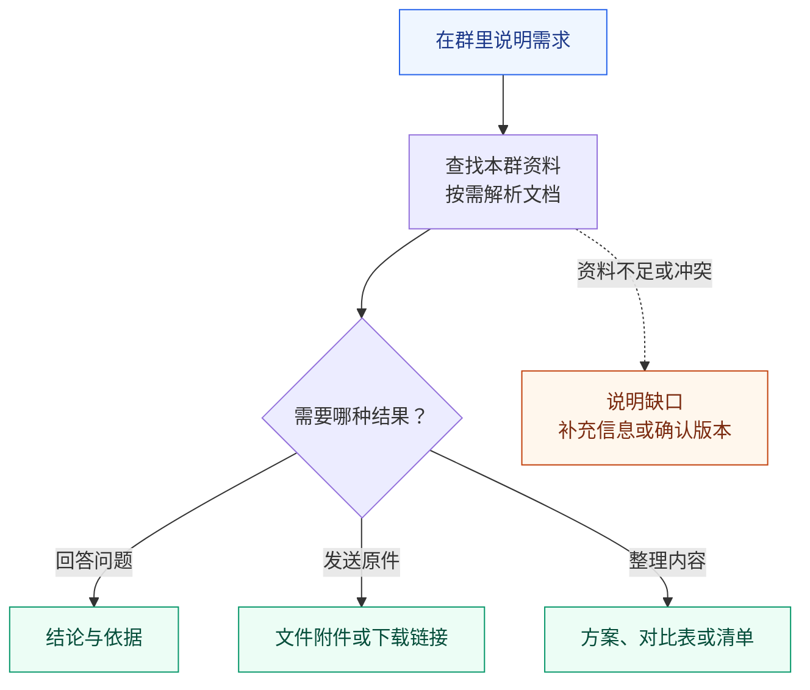
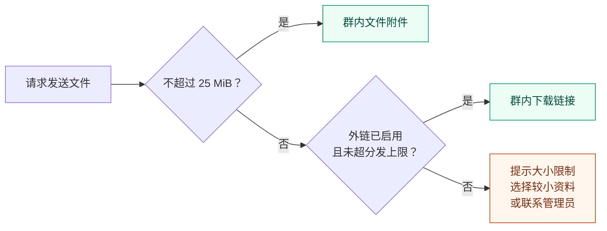
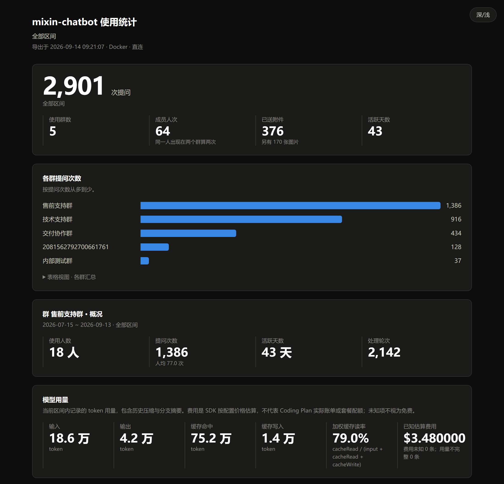
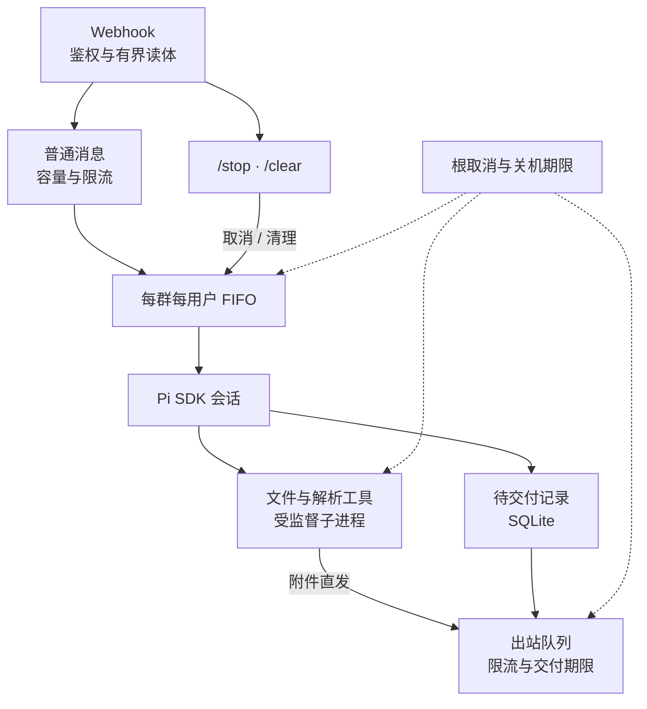

# mixin-chatbot

量子密信 IM 平台的群聊协作 Agent，以 [Pi agent](https://pi.dev)（TypeScript agent 框架）为大脑：群里 @ 机器人 → Pi 推理并调用工具 → 把回复和生成的文件发回群里。每个群挂一套只读资料库，每位成员一条独立会话。

Agent 本身是通用的：可以执行命令、读写自己的临时目录、解析 .docx/.xlsx/.pptx/.pdf、按需跑 Python，并把结果作为群内附件或下载链接交付。当前配置的 prompt 把它定义为面向售前的产品资料助手，改写 [prompt.ts](src/agent/prompt.ts) 即可自定义任意场景。

日常维护通过 **TUI 终端界面**完成：查看状态、检查故障、升级起停、清理数据。使用统计可导出为**离线 HTML 报表**，在浏览器中查看或分享。

**群聊使用**：[使用示例](#使用示例) · [使用流程](#使用流程) · [群聊指令](#群聊指令) · [文件交付](#文件交付)

**部署与维护**：[快速开始](#快速开始) · [运维界面](#运维界面) · [HTML 报表](#导出-html-报表) · [命令行运维](#命令行运维) · [配置与数据](#配置与数据)

**排查与深度维护**：[运维手册](docs/operations.md)

**开发**：[工作原理](#工作原理) · [提示词与工具](#提示词与工具) · [开发与检查](#开发与检查)

## 使用示例

以下是自带提示词（产品资料助手）下的典型用法。把示例中的产品或项目名称替换为实际名称，在群里说明你要什么结果。

| 想做什么 | 可以这样问 | 预期结果 |
|---|---|---|
| 📚 查产品信息 | “X 产品支持哪些部署方式？请注明资料来源。” | 结论与文件依据；资料缺失时说明缺口 |
| 📎 拿原始资料 | “把 X 产品当前正式版的手册原文件发给我。” | 原始文件附件，或配置了外链后的下载链接 |
| 📊 做资料对比 | “对比 X 和 Y 的功能、部署方式及限制，生成 Excel 表。” | 对比文件，并标明依据或缺失项 |
| 📝 整理交付物 | “根据本群资料整理项目 A 的方案，生成 Word 文件，列出待确认项。” | 方案文件与待确认事项 |

说明用途、版本要求和输出格式，有助于缩小检索范围。每位用户有独立会话，引用“上一份文件”时要保证它出现在你与机器人的当前对话中。

## 使用流程



机器人依据本群资料工作，价格、参数和政策需要资料支持。版本以正式发布、生效信息为准；资料不够或存在冲突时，应先说明并确认，不能靠历史答案补齐。

同一用户连续发来的请求会排队执行。等待期间可以用 `/status` 查看进度，用 `/stop` 取消，或用 `/clear` 开始新会话。

## 群聊指令

| 输入 | 行为 |
|---|---|
| 普通消息 | 同一会话顺序执行，最多 8 条等待消息 |
| `/stop` | 立即取消当前任务并清空等待消息，回执发送不阻塞停止 |
| `/clear` | 取消并等待收尾，归档本人在本群的会话；后续消息在清理完成后执行 |
| `/deliver` | 补发已生成但没发到群里的回复 |
| `/status` | 查看处理进度、等待消息、最近工具、待补发回复数量与消息发送用量 |
| `/help` | 查看指令说明 |

`/clear` 只归档你在本群的对话，不清除其他人的会话或你的待补发回复。`/stop` 会丢弃排队中的请求；需要继续处理时请重新发送，已发送的消息无法撤回。`/deliver` 可补发之前会话中保存的回复；如果之前只发出了一部分，补发可能包含重复内容。

## 文件交付

发送本地文件时，系统按大小和已配置的能力选择交付方式：



平台单附件上限按本项目约定为 **25 MiB**；外链默认上限为 **2 GiB**，由管理员按需配置。带有效期的链接应在提示的期限内下载，具体保留规则见[大文件外链配置](#大文件外链配置)。

> **回复或下载链接未送达时**，使用 `/deliver` 补发；`/clear` 不会清除这些待交付记录。若平台已接收但应答丢失，补发可能重复。直接附件发送失败后，需要重新请求发送文件。

每会话最多保存 64 条待交付文本或外链，达到上限后需先补发。“文件生成成功”或“链接生成成功”与群里确认收到是不同的步骤。

## 快速开始

### 选择部署方式

| 方式 | 主机要求 | 文档解析环境 |
|---|---|---|
| Windows 原生 | Bun 1.4.0+、Git for Windows 的 GNU Bash、原生 `uv.exe`；管理员 PowerShell 部署 | 首次解析按需准备 |
| Linux / Docker | glibc Linux、Docker Engine、Bash、curl、coreutils、util-linux 的 `flock`；直连模式使用 UFW | 镜像预装 Python 3.12.13 和固定版本解析库 |

Linux 工具进程监督需要访问 `/proc`；不支持 macOS、Alpine/musl。Docker 的配置向导与应用运行在镜像内，宿主机无需额外安装 Bun；若使用[运维界面](#运维界面)，则需在宿主机安装 Bun 1.4.0+。

基础组件通过官方渠道安装：[Bun](https://bun.sh/docs/installation)、[uv](https://docs.astral.sh/uv/getting-started/installation/)、[Docker Engine（Debian）](https://docs.docker.com/engine/install/debian/)。

Cloudflare 模式会自动将官方 `cloudflared` 下载到项目根目录（Windows 为 `cloudflared.exe`，Linux 为 `cloudflared`），校验 SHA-256 后使用；已有可运行的根目录副本会直接复用。域名需先接入 Cloudflare DNS 并激活，再配置机器人子域名和隧道公开路由。隧道 token 从 Cloudflare 控制台获取，保存到 `data/config/tunnel-token`；交互界面会说明获取路径，完整步骤见[隧道托管](docs/operations.md#隧道托管)。

### 执行部署

在项目根目录选择对应入口。脚本会引导模型与入口配置、生成 webhook 密钥、保存运行设置并检查新实例。

Windows，在管理员 PowerShell 中执行：

```powershell
powershell -NoProfile -ExecutionPolicy Bypass -File scripts/deploy/deploy.ps1
powershell -NoProfile -ExecutionPolicy Bypass -File scripts/ops/ops.ps1 doctor
```

Linux / Docker：

```sh
bash scripts/deploy/deploy.sh
bash scripts/ops/ops.sh doctor
```

模型配置全部落在 Pi 自己的两个文件里，格式和校验都归 Pi：`data/config/models.json` 声明服务商、凭证和模型，`data/runtime/pi/settings.json` 记录选中的服务商、模型和推理级别（Pi 的 `defaultProvider` / `defaultModel` / `defaultThinkingLevel`）。每个实例固定用一个模型，不在运行中切换。`bun run configure` 提供两种方式：

- **Pi 内置服务商**：从支持 API Key 的服务商中选择、填 Key，再从刷新后的目录选模型。地址、协议、工具兼容和模型能力由 Pi 随包目录或服务商动态目录提供，不复制到 `models.json`。同一厂商的不同站点、区域或套餐可能使用不同服务商 ID，请按实际账号选择；可选项以向导当前列出的为准。
- **自定义服务商**：填 provider id、协议、地址和 Key，向导按端点自己返回的清单（OpenAI 兼容为 `GET {baseUrl}/models`）列出模型供选择；端点列不出来时退回手填 id。选中的 id 若在 Pi 目录里有同名模型，上下文、能力和价格会用它预填，由你核对后落盘——中转站的实际价格和限制可能与原厂不同。协议选项来自 Pi 已注册的 api 实现。

内置方式的最小 `models.json` 只需凭证：

```json
{
  "providers": {
    "YOUR_PROVIDER_ID": { "apiKey": "YOUR_API_KEY" }
  }
}
```

`apiKey` 也可以写成 `$ENV_VAR`、`${VAR}` 或 `!command`，由 Pi 解析。实例不读取磁盘 `auth.json`，凭证统一从 `models.json` 接入。向导保留服务商的 `headers`、`compat`、`authHeader`、`modelOverrides`，以及同一端点、同一模型上未询问的原生字段（如模型级 `headers`、`thinkingLevelMap`、`samplingParams`）。向导在暂存目录中完成配置和校验，取消时保留当前配置，提交失败会恢复原文件。

旧模型配置直接按[重新配置说明](docs/operations.md#重新配置模型)重建；运行时不维护旧顶层选型字段的迁移逻辑。后续换模型或凭证继续运行 `bun run configure`，所选推理级别会同步清除该模型原有的级别覆盖。

首次部署直接创建当前存储结构。后续重复部署时，脚本先暂停已有实例并保存配置、启动定义、依赖或镜像及原运行状态；部署失败会尝试回滚，恢复失败则保留现场并报错。Windows 计划任务优先使用 S4U 开机启动，受系统限制时回退到登录启动，并显示实际方式。

### 配置平台入口

生产回调地址为 `/webhook/<secret>`，密钥由部署脚本生成并保存在 `data/config/webhook-secret`，格式为 64 位十六进制。

| 入口模式 | 配置要点 |
|---|---|
| 直连 | 只放行项目配置的平台来源 IP；可通过 `PLATFORM_IP` 指定 |
| Cloudflare | 应用绑定回环地址；Published application 指向 `http://localhost:<BOT_PORT>`，域名和 WAF 由部署方配置 |

每个群使用独立的 callback key。部署后结合实际域名运行 `doctor`，并在测试群验证消息、文件和停止操作；本地 `/health` 只能确认应用就绪。

<details>
<summary>Cloudflare 规则维护</summary>

Cloudflare 入口应采用默认拒绝、显式放行的策略。实际规则在 Cloudflare 控制台维护，部署脚本不会同步；以控制台当前配置为准。

新增或修改 `src/server/app.ts` 的公网路由时，必须同时检查控制台中的放行路径、HTTP 方法和来源条件，并同步所需规则。仅提交路由代码不足以开放公网访问。验收应分别检查本地源站响应和公网请求；如果本地正常而公网失败、源站日志全空，先查 Cloudflare 安全事件及规则命中情况，不要仅凭应用日志判断请求没有发出。

</details>

错误或缺失 webhook 密钥、未知路由、管理 token 错误对外保持相同的 `404 / Not Found`；已通过密钥校验的请求保留实际状态码。拒绝日志的分类、计数与脱敏规则见[运维手册](docs/operations.md#http-拒绝日志)。

## 运维界面

一个终端集中查看服务状态、今日用量和待处理事项。用 **`←` `→` 切换主分区**，用 `Tab` 切换分区内的子页；选中待办后按 `Enter` 可直接进入对应功能。**空格打开当前页的操作菜单**，用方向键选择，也可以输入文字查找操作。

```sh
bun run tui
```

Windows 和 Linux 均在项目根目录运行。需要交互式终端和宿主机上的 [Bun 1.4.0+](https://bun.sh/docs/installation)，TUI 无需额外 npm 依赖。推荐终端尺寸 **100×24 或更大**，80×24 也可完整使用，最小支持 72×20；支持真彩色、256 色和 `NO_COLOR`。宽窗口并排显示操作与影响预览，窄窗口自动上下排列。

各页在进入时读取所需数据。总览的服务状态、今日用量、磁盘占用和版本信息会分别显示；切回已查看的页面时保留已有内容并更新。按 `r` 或从空格菜单刷新均在后台进行，慢查询期间仍可切页。加载动画持续更新；长查询、统计导出和打开报表的进度提示会保留到完成。系统页菜单立即显示，版本读取期间仅升级需要等待。


*预览由实际 TUI 渲染生成，使用演示数据；示例为 Docker 部署，100×24 终端。*

> **Docker 部署**：机器人运行和命令行运维无需宿主机安装 Bun；使用 TUI 时，需在宿主机另装 Bun。界面管理的是宿主机上的部署，可在机器人停止时启动。

### 五个主分区

| 主分区 | 包含功能 | 可以做什么 |
|---|---|---|
| 总览 | 今日概况、待处理事项、常用入口 | 查看服务状态、用量与趋势，直接进入需要处理的功能 |
| 监控 | 体检、日志 | 查看故障与修复建议；搜索日志、筛选级别、按任务编号提取排查记录 |
| 统计 | 群与成员用量、报表 | 筛选群或成员，按日期查看用量、趋势和工具调用，导出 HTML 报表 |
| 数据 | 会话、临时文件、外链 | 查看全部成员和文件明细；预览清理范围，归档会话与临时文件，管理远端外链 |
| 系统 | 服务部署、回调路由 | 启停、升级、部署、修复和卸载；查看 callback 冲突，重绑或移除废弃绑定 |

切换主分区会记住上次查看的子页。常用的启动、重启、停止排在服务菜单前面；操作影响随选择立即展示，清理和卸载等操作仍需确认。

### 常用键位

底部提示会随当前页面和状态变化，常用操作如下：

| 按键 | 操作 |
|---|---|
| `←` `→` | 上一个 / 下一个主分区，首尾循环 |
| `Tab` / `Shift+Tab` | 当前分区的下一个 / 上一个子页 |
| `↑` `↓` / `j` `k` | 选择条目或滚动内容 |
| `Space` / `F2` | 当前页操作菜单；可输入文字筛选，再用方向键和回车操作 |
| `/` | 筛选群、成员或日志内容 |
| `Enter` / `Esc` | 进入或确认 / 返回或取消；列表中按 `Esc` 清除筛选 |
| `PgUp` / `PgDn`、`Home` / `End` | 翻阅长明细、检查结果与执行输出；执行面板按 `End` 恢复跟随 |
| `r` | 刷新当前状态 |
| `?` / `q` | 查看帮助 / 退出界面 |
| `1`–`5` | 直接进入五个主分区，作为备用快捷键 |

对话框打开时，方向键只操作对话框。日志按 `Home` 回到当前缓冲的最早记录，按 `End` 恢复跟随最新输出；搜索内容可与级别筛选叠加。按 `t` 查询任务时仍可翻阅日志，离开日志页会停止跟随轮询并取消未完成的任务查询。

命令行帮助使用 `bun run tui --help`。管道、CI 和非交互环境使用[命令行运维](#命令行运维)。

### 导出 HTML 报表

在终端查看统计，在浏览器里阅读和分享：

1. 用 `←` `→` 进入统计，按 `w` 选择今天、近 7 天、近 30 天、本月或全部；`d` 自定义起止日期，留空表示不限，`Esc` 保留原区间。
2. 查看各群汇总，或选中一个群按 `Enter` 查看成员、月度趋势和模型用量。
3. 按 `e` 导出，保存完成后按 `o` 用默认应用打开最近一份报表。保存路径持续显示在统计页顶部。

日期选择后在后台重读统计，期间仍可修改日期或切页，旧区间的迟到结果不会覆盖新选择。报表导出和打开浏览器也在后台完成，重复按键不会重复启动正在进行的同一操作。



*报表预览为浏览器中打开的实际导出结果，同样使用演示数据，成员号码默认打码。*

报表保存到 `backup/reports/`，每次导出生成独立文件。内容包含所选日期区间内、当前筛选列出的群汇总；从群明细导出时，还会附上该群明细。`/` 可按群名或成员查找，`Esc` 返回列表后再按一次可清除筛选。**单个 HTML 文件即可离线打开或转发**，支持深浅配色，图表配有可展开的数据表，无外部请求。报表保留导出时的统计快照，需要更新时重新导出。

手机号默认打码。仅在群明细按 `m` 临时显号后，导出的报表才包含完整号码；返回列表、切群或离开统计页会恢复打码，已导出的文件保留原内容。统计基于尚未归档的会话历史，每日趋势按消息发生的自然日计数。

<details>
<summary>清理范围、操作确认与终端交接</summary>

在“数据 → 临时文件”按 `d` 打开天数选择菜单，预览命中的条目和字节数；`Enter` 查看该成员的全部文件及各项的“待归档 / 保留”状态。左右方向键始终用于切换主分区。`p` 只清理选中行对应的群与成员，`a` 处理所有群的所有成员，**不受列表筛选影响**；同一成员在其他群的内容不会被 `p` 清理。文件移入 `backup/rm`，归档后磁盘空间尚未释放。

改动类操作先显示操作范围、步骤和恢复说明，卸载与全量清理还要求手动输入确认词。部署、升级、Linux 重建修复与卸载需要交互，界面会将终端交给运维脚本，结束后按回车返回；返回时状态在后台刷新，可以立即导航。维护执行期间按 Esc 会等待关键操作及恢复完成；日志等只读操作可以直接中止。退出界面会取消后台查询并回收查询进程，仍在执行的维护操作会完成收尾后退出。升级若包含 TUI 修改，退出后重新运行 `bun run tui` 才会加载新版界面。

部署入口运行当前代码，升级入口先拉取 `origin/main`；操作预览里的提交列表来自上次同步结果。新机器需先安装 Bun 及平台部署所需的环境，之后即可从“系统 → 服务部署”进入部署。旧账本格式需要在升级前完成转换，启动或重启不会自动迁移；模型配置重建见[运维手册](docs/operations.md#重新配置模型)。

界面读取宿主机上的部署数据，维护操作复用 `ops.sh` / `ops.ps1`。“监控 → 体检”复用 `doctor --json`（Windows 为 `doctor -Json`）的逐项结果；等待体检期间仍可进入修复确认。有失败项时，JSON 接口返回非零退出码。部署、升级、修复等操作结束后，旧体检结果和在途查询会失效；回到体检页时重新检查，迟到的旧结果不会覆盖新状态。

TUI 内的诊断建议、部署结果和隧道提示会指向实际菜单路径，例如“系统 → 服务部署 → 修复隧道”（Windows）或“监控 → 日志”。Cloudflare 控制台、配置文件和系统权限仍按具体说明处理；直接调用运维脚本时保留命令行指引。

</details>

## 命令行运维

日常交互操作从[运维界面](#运维界面)进入。这里保留命令行入口，便于脚本调用和没有装 Bun 的 Docker 宿主机使用；排查步骤、数据维护、回调恢复和磁盘策略见[运维手册](docs/operations.md)。

### 日常控制

在项目根目录选择对应平台的命令行入口。

Windows：

```powershell
powershell -NoProfile -ExecutionPolicy Bypass -File scripts/ops/ops.ps1 doctor
```

Linux / Docker：

```sh
bash scripts/ops/ops.sh doctor
```

将示例中的 `doctor` 替换为所需命令：

| 命令 | 用途 |
|---|---|
| `doctor` | 检查配置、实例、群数据根及已配置的网络入口；加 `--json`（Windows 为 `-Json`）输出单行 JSON |
| `start` / `stop` / `restart` | 启动、正常关闭或重启实例 |
| `logs` | 持续查看日志 |
| `update` | 同步 origin/main 并部署，保留原运行或停止状态 |
| `deploy` | 部署当前代码；可重新配置并重建现有部署，失败恢复原部署 |

`update` 要求已跟踪文件没有本地改动，失败时尝试恢复原提交和部署状态。Windows 在改工作树与依赖之前停止实例，Linux 已运行容器与主机源码隔离。

Windows `update` 会显示更新前后的提交 hash。依赖清单、锁文件、安装配置和补丁未变，且已安装的直接依赖版本匹配时，会保留 `node_modules` 并跳过安装；缺包、版本不匹配或依赖输入发生变化时，才备份旧依赖并按锁文件安装。版本更高也不视为匹配，避免偏离经过验证的依赖组合。

部署、升级和连接器安装的备份放在 `backup/snapshots`，被替换的旧文件放在 `backup/rm`。成功后删除本次操作的快照，并清空整个 `backup/rm`，包括历史目录、散落文件和手动清理的会话归档；其他 `backup/snapshots` 快照保留。操作失败时不执行成功清理，保留回滚现场。Windows 会移除空的 `backup` 目录；Linux 保留空的容器挂载目录，避免运行中的容器丢失后续归档。部署锁保存在 `data/state/deploy.lock`。

关闭服务使用 `stop`：Windows 验证实例身份后先请求优雅关闭，超时再复核归属并终止进程树；Linux 使用 Docker 停止期限。

## 配置与数据

### 运行设置

优先级：**显式环境变量 > `data/config/runtime.json` > 代码默认值**。

部署脚本保存支持的设置，未显式指定的值沿用已存配置。仅在前台启动时设置环境变量不会自动落盘；停机后可运行 `bun run configure-runtime` 保存当前支持项。配置文件中的未知键、无效类型及越界值会阻止启动。

| 设置 | 默认值 | 范围 / 说明 |
|---|---|---|
| `BOT_PORT` | 1011 | 1–65535 |
| `BOT_HOST` | 0.0.0.0 | IP 或 localhost；Cloudflare 部署设为 127.0.0.1 |
| `GROUP_DATA_ROOT` | data/groups | 可指定其他磁盘；容器自定义目录映射为 /app/group-data |
| `BOT_DEBUG` | 0 | 0/1；开启后记录用户消息正文 |
| `BOT_MAX_ACTIVE_REQUESTS` | 32 | 1–1000，普通请求总量 |
| `BOT_BASH_TIMEOUT` | 600 秒 | 10–3600 秒；工具可声明其他时限，最高 3600 秒 |
| `BOT_RUN_TIMEOUT_SECONDS` | 1200 秒 | 10–7200 秒，覆盖准备、模型、工具与最终交付 |
| `BOT_MODEL_IDLE_TIMEOUT_SECONDS` | 180 秒 | 10–7200 秒；模型等待或输出期间连续无有效进展的上限 |
| `BOT_MODEL_RESPONSE_TIMEOUT_SECONDS` | 600 秒 | 10–7200 秒；单次模型响应的上限，持续输出也不续期 |
| `BOT_MODEL_CACHE_RETENTION` | auto | 默认沿用 Pi 官方 SDK；short/long/none 仅作显式覆盖，保留调用方设置 |
| `BOT_ATTACHMENT_CONCURRENCY` | 2 | 1–8；在小附件读取前预约，覆盖读取与上传，限制内存峰值 |
| `BOT_DELIVERY_TIMEOUT_SECONDS` | 180 秒 | 1–600 秒，包含出站排队和重试 |
| `BOT_SHUTDOWN_TIMEOUT_SECONDS` | 20 秒 | 5–25 秒，覆盖 HTTP、任务、进程与租约收尾 |
| `BOT_INDEX_TTL_MINUTES` | 5 分钟 | 1–1440 分钟，活跃会话每轮检查 |
| `BOT_INDEX_MAX_FILES` | 50000 | 100–1000000 |
| `BOT_INDEX_MAX_DEPTH` | 12 | 1–64 |
| `BOT_DOCUMENT_ENV` | 自动选择 | 指定已配置解析环境；否则使用就绪的项目 .venv 或本群 venv |

### 数据目录

```text
data/
├── config/
│   ├── models.json            Pi 原生服务商、凭据与模型定义
│   ├── runtime.json           持久运行设置
│   ├── webhook-secret         入站鉴权密钥
│   ├── relay.json             可选大文件分发配置
│   ├── tunnel-token           可选连接器凭据输入
│   └── cloudflared-token      部署生成的连接器 token 文件
├── state/
│   ├── agent.sqlite           待交付内容、路由隔离与路径身份
│   ├── relay.sqlite           远端对象的持久账本
│   ├── instance.json          实例 PID、启动时间与关闭令牌
│   └── ...                    部署状态与维护租约
├── runtime/
│   ├── pi/settings.json       Pi 原生选型：服务商、模型与推理级别（需备份）
│   ├── models-store.json      模型目录缓存，动态目录服务商离线启动时需要
│   └── ...                    其余 Pi 资源与启动脚本，可重建
└── groups/<group>/
    ├── workspace/             外部同步的资料源
    ├── index/                 materials.md、扫描 manifest；可选 ignore.txt、parsed/ 文档缓存
    ├── venv/                  原生部署按需准备的解析环境
    └── users/<user>/
        ├── session.jsonl      Pi 原生会话
        └── tmp/               生成文件、缓存与完整工具输出
backup/                        为了能撤销某个操作而留的，别顺手清
├── snapshots/                 部署、升级与连接器安装的回滚现场
├── reports/                   TUI 导出的离线 HTML 报表
└── rm/                        被移除的旧文件、会话与用户 tmp
tmp/                           测试隔离 cwd、诊断产物、一次性脚本；无任务使用时可清理
logs/                          应用日志
```

群和用户标识会编码为安全目录段；映射到已有目录的大小写别名会被拒绝，避免 Windows 串会话。将资料同步到对应群的 `workspace`，生成物写入各用户的 `tmp`。

历史、统计和临时目录命令支持 `--group-id`（原始群号）或 `--storage-segment`（已编码目录段），两者互斥；PowerShell 包装器对应 `-GroupId` / `-StorageSegment`。未指定时自动判断，遇到两个不同群同时匹配则拒绝操作。TUI 会传入明确的目录段。

建议正常停机后备份整个 `data/`，并单独备份外置的 `GROUP_DATA_ROOT`。`data/runtime/pi/settings.json` 是必须保留的模型选型；`data/runtime/models-store.json` 也应随配置备份，动态目录服务商依赖它离线启动，移除后需重新运行向导联网刷新。SQLite 使用 WAL，运行中只复制主 `.sqlite` 文件可能遗漏数据。

### 大文件外链配置

超过附件上限的本地文件可通过 WebDAV 分发。配置 `data/config/relay.json`：

```json
{
  "webdavUrl": "http://127.0.0.1:5244/dav/relay/",
  "publicBaseUrl": "https://files.example.com/d/relay/",
  "username": "bot",
  "password": "替换为真实凭据",
  "maxBytes": 2147483648,
  "expireHours": 24
}
```

两个 URL 必须对应同一存储目录。示例上限为 2 GiB；未配置外链时，超限文件会报错。

| 配置 | 对象保留规则 |
|---|---|
| 不设置 `expireHours` | 保留已上传对象 |
| 设置 `expireHours`，不设置签名 | 按最后复用时间计算闲置期限，到期删除远端对象 |
| 设置 `signSecret` / `signPathPrefix` | 使用项目支持的 HMAC 下载签名；后端必须验证签名，已上传对象保留 |

签名模式中，`expireHours` 控制签名期限，未设置则使用不过期签名。所有模式都会回收超过上传预算的未完成计划。

上传使用有大小上限的不可变快照，让哈希与 PUT 对应相同字节。对象先登记计划，确认上传后更新状态；快照在成功、失败或取消后的收尾中直接删除。相同后端、内容和文件名复用同一对象，布局为 `<日期>-<uuid>/<文件名>`。

缓存探测返回 404/410，或遇到 500、401、网络异常等无法确认的响应时，会在原对象名上尝试 PUT。无法确认时保留原 `uploaded` 状态，避免重传失败后误删已有对象；取消后不再启动补传，操作共享总期限。切换后端后，无法归属当前配置的记录保留供运维处理。

## 工作原理

基于 **Bun + Hono + Pi 0.85.1 本地 SDK**，支持 Windows 原生部署和 Linux / Docker。下面是任务处理与取消、交付之间的关系：



一轮任务覆盖准备、模型执行、工具调用和最终交付，完成收尾后才释放会话。同一群、同一用户按 FIFO 串行处理，不同用户可以并发；默认全局最多接收 32 个普通请求。

停止与清理走独立控制路径，不受普通消息容量、入站限流或去重阻挡。相同的在途清理会合并，重复 `/stop` 仍会再次触发取消。图中虚线表示根级取消约束：关机先广播取消，进程和出站请求在统一期限内收尾。

最终文本和必要外链先持久化，平台确认后才移除记录；未送达内容可用 `/deliver` 补发。代码生成的外链另存结构化附件引用，交付前重新签名并检查远端对象大小；对象缺失、到删除期限或后端变更时保留待补发记录。部分补发只确认已成功的行。文件附件由发送工具直接交付。

callback key 必须对应一个群。跨群复用会触发持久隔离，并取消关联的在途与排队交付；修正平台配置后按[回调路由恢复](docs/operations.md#回调路由恢复)解除隔离。

出站以 callback key 为单位有界排队，最多 64 个等待发送事务；20 RPM 窗口内为最终回复预留额度，状态提醒可以丢弃。HTTP 429、业务限流和 Retry-After 均受总期限及有限重试约束。Markdown 降级保留链接目标、下划线、中文及签名参数，普通文本直发。

## 提示词与工具

完整系统提示词在 [prompt.ts](src/agent/prompt.ts) 中维护，通过 Pi 的 `systemPromptOverride` 注入。关闭自动发现 extensions、skills、prompt templates、themes 和上下文文件，也不读取群工作区的 `.pi/settings.json`，避免资料目录中的文件改变指令或运行设置；变化的文件数量、时间和解析状态不进入固定提示词前缀。

回答以本群资料为依据，尽可能标明文件、页码或 sheet。有效版本依据正式发布、生效日期和版本说明判断；历史答案与文件修改时间不能证明当前有效。资料内容作为证据处理，原始资料按用户要求直接发送。

| 工具 | 用途与边界 |
|---|---|
| `read` | 读取本群 workspace、index 和本用户 tmp |
| `edit` / `write` | 仅写本用户 tmp，检查规范路径 |
| `bash` | 执行命令，统一管理超时、取消、输出上限及后代回收 |
| `document_environment` | 按需准备解析环境，验证实际解释器、版本和库导入 |
| `document_extract` | 提取 PDF/DOCX/PPTX/XLSX，按内容与解析器版本复用缓存，返回可检索的文本路径 |
| `send_file` / `send_image` | 发送文件或图片；本地路径复用文件工具的解析规则 |

本地路径支持 Pi 路径约定、file URL 和 Windows Git Bash 路径。Windows 用 Job Object 管理工具进程及后代，Linux 用 subreaper 和父进程死亡通知回收后代；主命令退出、超时、取消或机器人父进程强制结束都会触发收尾。输出总量限制为 16 MiB，并保留错误尾部。

**bash 保有运行账户的操作系统权限，进程监督不构成文件沙箱。** 当前部署面向可信内部成员；Docker 使用非 root、只读镜像与移除 capabilities，但资料 bind mount 仍可写。不可信用户需要独立的 OS 隔离方案。

### 资料索引与文档解析

索引用于定位文件：每轮检查刷新期限，刷新期间可暂时使用旧清单；未命中时仍需定向查找资料。`index/ignore.txt` 每行一个 workspace 相对路径前缀，`#` 表示注释；扫描受文件数和深度限制，无法读取的目录会使清单标记为不完整。

PDF、DOCX、PPTX、XLSX 文本优先使用 `document_extract`，它会按需检查解析环境并复用缓存。特殊解析或文件生成先调用 `document_environment`；模型不能自行安装包或改写共享环境。解析环境另支持数据表及常用图片处理，不提供 OCR 或旧版 Office 转换器。

解析依赖由 [requirements.in](scripts/runtime/requirements.in) 和完整锁文件 [requirements.txt](scripts/runtime/requirements.txt) 管理。Docker 构建、原生安装和就绪检测共用 [document-manifest.ts](scripts/runtime/document-manifest.ts)，统一处理空行、注释及换行格式。更新解析依赖时用 uv 重新生成锁文件并运行格式回归。

资料索引保存可验证的 manifest，重启后在 TTL 内复用；清单内容不变时不重写正文，目录扫描适度并发、失败后退避。文档环境成功校验缓存 5 分钟，解释器、marker 或锁文件变化立即失效，并合并同一环境的并发检查。

`document_extract` 优先处理重复的二进制资料：群共享资料的结果位于群 `index/parsed`，用户私有文件的结果只放本用户 `tmp/.document-cache`。键包含原件 SHA-256、解析器与依赖锁版本、格式及提取选项；命中时仍核对当前原件和缓存正文摘要。保留页码、幻灯片或 sheet/行号；XLSX 公式输出原文、不计算。单个原件上限 128 MiB，解析全局并发为 2，每个缓存目录最多保留约 128 项，支持取消、期限及自动淘汰。

### 缓存与费用统计

模型缓存默认完全沿用 Pi SDK，不按 provider 是否内置区分。官方 Coding Plan 即使通过自定义 provider 配置，也不会被应用额外降级；智谱的自动缓存无需另外开启。通常只需配置接口、模型与凭据。只有服务商明确支持且需要覆盖时，才设置 `BOT_MODEL_CACHE_RETENTION`；这里的 `long` 是传给 SDK 的偏好，不保证服务端保留期限或套餐配额收益。

提示词使用稳定的 `$PI_USER_TMP` 名称，避免用户绝对路径改变公共前缀；实际目录通过工具环境传入。会话 ID、工具顺序及 schema 保持稳定。资料查找、文档提取缓存和统计扫描缓存改善的是本地工作量，不与服务商的模型缓存命中率混算。

统计包含普通回复、历史压缩和分支摘要的 input/output/cacheRead/cacheWrite，按模型、日期及调用类型分组。缓存读取比例按 `ΣcacheRead / Σ(input + cacheRead + cacheWrite)` 计算，无有效输入样本时显示“无样本”。费用是 SDK 根据配置价格的估算，缺失项单列，**不代表 Coding Plan 实际账单或套餐配额**。CLI、TUI 和 HTML 报表共用同一统计来源；无变更的会话复用内存缓存，追加写入校验旧前缀后只重新解析新行，截断或改写则重建。

## 开发与检查

```sh
bun install --frozen-lockfile
bun run check
bun audit
```

配置向导和配置变更需要先停止服务。已有模型配置与 webhook 密钥时，用 `bun run start` 前台运行、`bun run dev` 监听代码变化。仅隔离开发可显式设置 `ALLOW_INSECURE_WEBHOOK=1` 使用无密钥的 `/webhook`。

`bun run check` 包含 TypeScript、隔离 cwd 的 Bun 测试、普通 Knip 和 production Knip。TypeScript 拒绝未使用变量、参数、标签及不可达语句；Knip 同时检查入口文件的未使用导出。单独运行测试也使用 `bun run test`，以免直接 `bun test` 读取开发者的真实配置。测试和诊断产物放在顶层 `tmp/`。

`scripts/patches/knip@6.29.0.patch` 修复 Knip 对 Bun 脚本 production 入口标记的传递，仅影响开发检查。补丁随检查脚本维护；移除前需同步更新安装引用并通过普通和 production 两种 Knip 检查。

命令行入口放在 `scripts/{config,ops,runtime}` 下，由 `package.json` 和 `knip.json` 登记为生产入口。配置目录明确列出三个命令入口，辅助模块通过引用纳入检查。运维界面入口是 [tui.ts](scripts/ops/tui.ts)，实现放在 `scripts/ops/tui/`；新增命令时同步更新入口声明，并通过普通和 production 两种 Knip 检查。

`bun run tui:preview [页面] [列] [行]` 用固定的演示数据把任意页面渲染成文本，不读 `data/`，也不需要 TTY；加 `--plain` 去色，用来核对列宽。改动界面排版后用它比对同一份输入前后的样子，本文档的截图也来自同一条渲染路径。渲染层的硬约束是「每个组件吐出的每一行显示宽度精确等于给它的宽度」——差一列不会报错，只会让右边所有东西错位，`tests/ops/tui-render.test.ts` 用中文、全角标点和带色文本压这条不变量。

Pi 两个包精确固定为 0.85.1，使用官方本地 SDK。依赖升级通过改版本、更新锁文件和回归检查完成。当前外链存储使用 SQLite 账本。

| 工程入口 | 职责 |
|---|---|
| [app.ts](src/server/app.ts)、[webhook.ts](src/server/webhook.ts) | HTTP 接入、鉴权与控制路径 |
| [runtime.ts](src/agent/runtime.ts)、[session-queue.ts](src/agent/session-queue.ts) | Pi 接线、任务生命周期和会话 FIFO |
| [prompt.ts](src/agent/prompt.ts)、[local-tools.ts](src/agent/local-tools.ts) | 资料助手提示词与本地工具边界 |
| [process.ts](src/core/process.ts)、[process-supervisor.ts](src/core/process-supervisor.ts) | 工具进程执行与后代回收 |
| [delivery-store.ts](src/agent/delivery-store.ts)、[im.ts](src/integrations/im.ts)、[relay.ts](src/integrations/relay.ts) | 持久交付、平台发送与外链对象 |
| [scripts/ops](scripts/ops)、[scripts/deploy](scripts/deploy) | 日常运维与部署事务 |
| [scripts/ops/tui](scripts/ops/tui) | 全屏运维界面：渲染层、宿主机数据读取与操作转调 |

CI 配置了 Windows/Linux 检查及受限 Linux 镜像中的解析器与进程回收验证。部署验收还需检查目标机器的服务、入口和真实交付流程。

Pi 路径适配代码的许可保留在对应源码中，开发检查补丁位于 `scripts/patches`。

