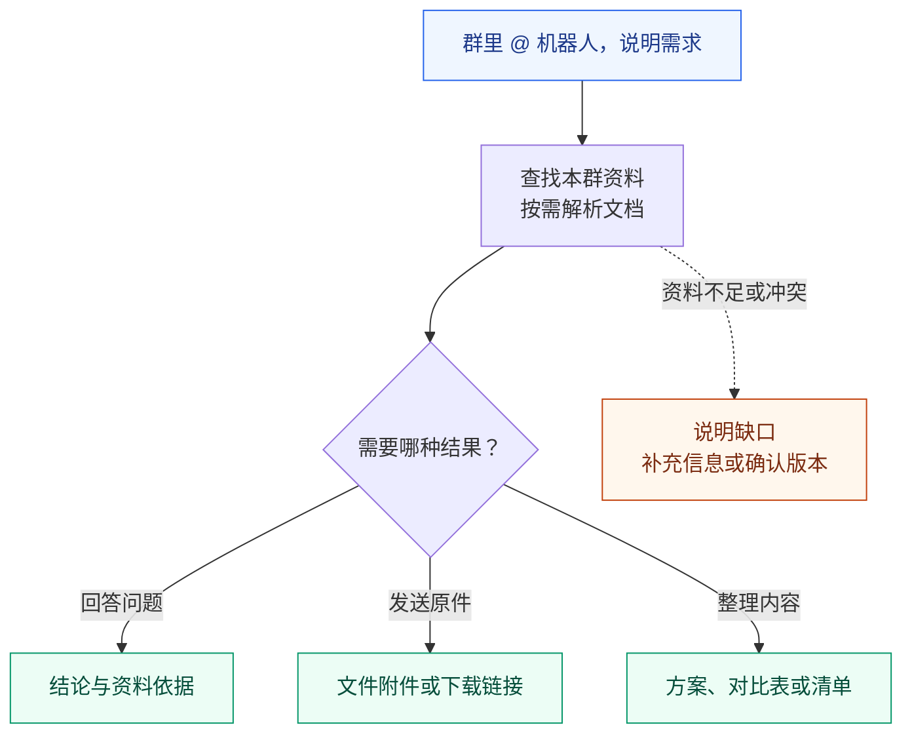
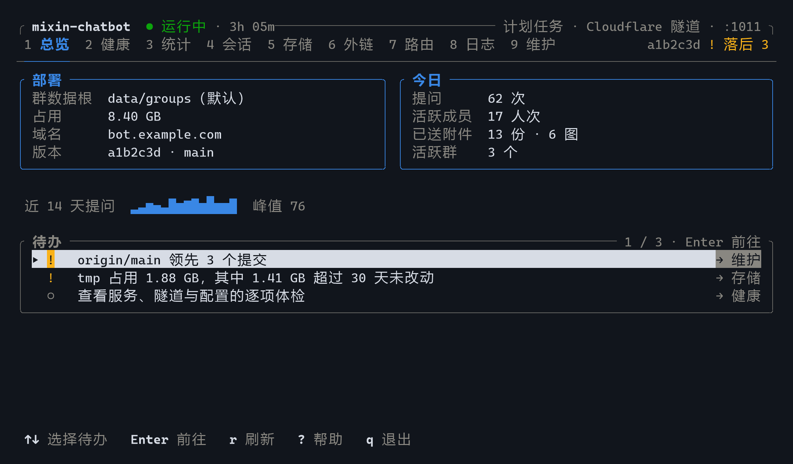

# mixin-chatbot

中国电信量子密信 IM 平台的群聊协作 Agent。

在群里 **@ 机器人、说明需求**，它会查找本群资料、调用工具，并把回答或生成的文件发回群里。

默认提供产品资料助手提示词和文档加工 skill，支持查询产品、发送原件、修改 Word、选编 PPT、按模板生成方案和制作对比表，适用于售前、交付及售后文档工作。修改 [prompt.ts](src/agent/prompt.ts) 可调整用途，文档能力见[设计说明](docs/document-tools.md)。

每个群有独立的资料目录，每位成员在各群中有独立会话。

[快速开始](#快速开始) · [群聊使用](#群聊使用) · [日常管理](#日常管理) · [详细文档](#详细文档)

## 可以做什么

| 需求 | 在群里这样问 |
| --- | --- |
| 查资料 | “X 产品支持哪些部署方式？请注明资料来源。” |
| 拿原件 | “把 X 产品当前正式版的手册原文件发给我。” |
| 做对比 | “对比 X 和 Y 的功能、部署方式及限制，生成 Excel 表。” |
| 整理方案 | “根据本群资料整理项目 A 的方案，生成 Word 文件，列出待确认项。” |
| 修改底稿 | “按最新产品资料更新这份交付方案的部署条件，保留原版式。” |
| 选编 PPT | “从已有产品 PPT 中挑页、修改客户名称并补充部署建议，组装客户方案。” |

### 使用流程



## 快速开始

### 1. 准备环境

选择与你的服务器对应的部署方式：

| 部署方式 | 需要准备 |
| --- | --- |
| Windows 原生 | Bun 1.4.2+、Git for Windows（含 GNU Bash）、原生 `uv.exe`；使用管理员 PowerShell |
| Linux / Docker | glibc Linux、Git、Docker Engine、Bash、curl、coreutils、util-linux 的 `flock`；直连模式需要 UFW 及 root / sudo 权限 |

Docker 镜像已包含应用运行环境和文档解析依赖，宿主机无需安装 Bun；使用终端管理台时，宿主机另需 Bun 1.4.2+。Linux 需要可访问 `/proc`，不支持 macOS、Alpine/musl。安装链接见[环境要求](docs/deployment.md#选择部署方式)。

同时准备：

- **模型账号**：API Key 和要使用的模型；自定义接口还需接口地址和协议。
- **机器人入口**：选择直连或 Cloudflare 隧道。直连需平台可访问的服务器地址；隧道需已接入 Cloudflare 的域名、隧道 token 和公开路由，详见[隧道托管](docs/operations.md#隧道托管)。
- **平台配置权限**：用于填写机器人的回调地址。每个群需独立的 callback key（平台回调标识）。

### 2. 获取代码并部署

```sh
git clone https://github.com/jaykwok/mixin-chatbot.git
cd mixin-chatbot
```

在项目目录运行对应平台的部署脚本，按向导选择模型、填写凭据和设置入口。首次部署可以沿用默认端口 `1011` 和群数据目录 `data/groups`；大文件外链可稍后配置。

**Windows**（管理员 PowerShell）：

```powershell
powershell -NoProfile -ExecutionPolicy Bypass -File scripts/deploy/deploy.ps1
```

**Linux / Docker**：

```sh
bash scripts/deploy/deploy.sh
```

脚本会准备依赖、保存配置、生成回调密钥并启动服务。模型配置由向导生成，通常无需手写 JSON；各项配置说明见[部署与配置](docs/deployment.md)。

### 3. 接入群聊并验证

1. 将部署脚本输出的完整回调地址填到 IM 平台，路径为 `/webhook/<secret>`。Cloudflare 模式还需在控制台完成 DNS、公开路由和访问规则配置。
2. 运行下方 `doctor` 命令，检查配置、服务和网络入口。
3. 在测试群 @ 机器人，发送“只回复 OK”，确认能收到回答。
4. 将资料同步到该群的 `workspace/` 目录，再请求查找资料、发送文件，并验证 `/status`、`/stop`。默认位置为 `data/groups/<群目录>/workspace/`；标识编码与备份说明见[数据目录](docs/deployment.md#数据目录)。

**Windows**：

```powershell
powershell -NoProfile -ExecutionPolicy Bypass -File scripts/ops/ops.ps1 doctor
```

**Linux / Docker**：

```sh
bash scripts/ops/ops.sh doctor
```

收到群内回复和文件后，才完成实际使用验证；本地健康检查只表示应用已就绪。遇到问题先看[运维手册](docs/operations.md)。

## 群聊使用

说明产品或项目名称、版本要求和输出格式即可。同一用户的请求会按顺序处理，等待时可以查询进度或取消。

| 指令 | 用途 |
| --- | --- |
| `/status` | 查看当前进度、排队情况和待补发回复 |
| `/stop` | 取消当前任务并清空等待消息 |
| `/clear` | 取消任务，归档本人在本群的会话，开始新会话 |
| `/deliver` | 补发已保存但未送达的回复或下载链接 |
| `/help` | 查看指令说明 |

文件不超过 **25 MiB** 时直接作为附件发送；更大的文件需要[配置外链](docs/operations.md#配置可选的大文件外链)，默认分发上限为 **2 GiB**。`/clear` 不会清除待补发记录；直接附件发送失败后，需要重新请求发送文件。完整行为与文件交付流程见[群聊使用指南](docs/usage.md)。

## 日常管理

在项目目录启动终端管理台（TUI）：

```sh
bun run tui
```

用 **`←` `→` 切换分区**，`Tab` 切换子页，**空格打开操作菜单**。推荐终端尺寸为 100×24 或更大。



*由实际 TUI 渲染生成，使用演示数据，示例尺寸为 100×24。*

| 想做什么 | 在哪里操作 |
| --- | --- |
| 检查故障、查看日志 | 监控 → 体检 / 日志 / 隧道日志 |
| 查看用量、导出离线 HTML 报表 | 统计；`w` 选日期范围，`e` 导出，`o` 打开 |
| 查看会话、清理临时文件和外链 | 数据 → 会话 / 临时文件 / 外链 |
| 启停、升级或重新部署 | 系统 → 服务部署 |
| 修改外链、隧道连接模式和运行参数 | 系统 → 设置 |

详细键位与报表预览见[管理台与报表](docs/tui.md)。不用管理台时，可将上面命令中的 `doctor` 替换为 `start`、`stop`、`restart`、`logs` 或 `update`；升级条件与备份清理规则见[命令行运维](docs/operations.md#命令行运维)。

升级会自动完成配置迁移和数据版本登记；尚未登记时，TUI 仅显示升级 / 诊断。Windows 从旧升级器首次过渡需要先停机，步骤见[数据版本与升级](docs/data-migrations.md)。

## 详细文档

| 文档 | 适合什么时候看 |
| --- | --- |
| [部署与配置](docs/deployment.md) | 安装部署、选择模型、查配置项、同步和备份群资料 |
| [群聊使用指南](docs/usage.md) | 学习提问、控制任务、了解附件和补发行为 |
| [管理台与报表](docs/tui.md) | 查键位、设置入口、清理操作和报表导出 |
| [运维手册](docs/operations.md) | 命令行管理、排查故障、配置隧道与外链、升级旧数据 |
| [开发指南](docs/development.md) | 理解架构、修改提示词与工具、运行开发检查 |

基于 Bun、Hono 和 Pi 本地 SDK。项目面向可信内部成员：`bash` 工具拥有运行账户的系统权限，详细边界见[提示词与工具](docs/development.md#提示词与工具)。
