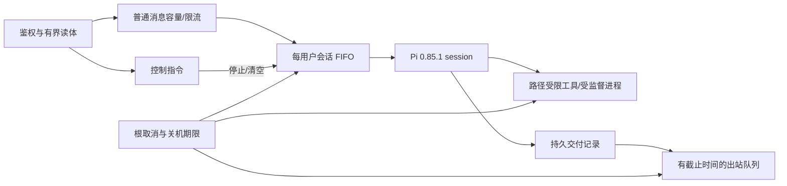

# 整体代码审计与整改记录（2026-09-08）

## 范围与结论

审计基线为 `4d51f630c436dfe98b488fe1b1b092fc13447c85`，Bun 1.4.0、Windows、Pi 0.85.0。目标版本为 **Pi 0.85.1**。范围包括 `src/`、`scripts/`、`tests/`、依赖和锁文件、Docker、README、系统提示词、工具描述及 Pi SDK 接入。用户已授权按照本文全量整改，允许为降低长期维护成本断兼容。整改初期按“尚未部署”的前提移除了运行时兼容分支；提交前用户补充存在已部署的 Windows 计划任务实例，并确认旧远端外链已删除，因此增加[已有实例升级手册](UPGRADE_0.85.1.md)，不引入旧账本转换工具。本文保留原始发现、首轮验证及复核修复记录。

最主要的风险不是模型答错，而是**应用没有一个统一的任务生命周期**：HTTP 接收、会话创建、模型执行、工具进程、出站排队、附件上传及关机各自管理状态；正常路径能工作，在取消、重复输入、关机及网络失败相交时产生丢消息、重复启动、无法停止和远端孤儿文件。

基线检查：类型检查、常规 Knip 通过；完整测试 **207 通过、0 失败（748 次断言、27 个测试文件）**。这不等于没有严重缺陷：现有测试集中于工具及纯函数，缺少会话/发送/停止交叉状态测试。最早一次受限环境运行的 4 个失败属于权限限制；解除限制后的基线全部通过，未把权限失败算作产品缺陷。

审计复现实验保存在本地忽略目录 `agents/temp/code-audit-2026-09-08/`，不会调用真实模型、群聊或外链服务。核心探针 9 项、会话探针 3 项发现了确定问题。会话探针使用实际调度源码及可控 SDK 替身；它证明应用的状态竞态，不能代替真实 SDK 回归。基线进程探针设置 3 秒自退出；最终进程回归使用有自退出期限的隔离进程，并核对取消后的存活状态，不操作正在运行的机器人。

## 问题清单与修复验收

优先级：P1 = 可阻塞任务/关机、丢失消息或资产、跨群错误交付；P2 = 功能正确性、运维可靠性或显著维护问题；P3 = 清理及可读性。下列位置为**基线**行号，重构后的入口见文末。`复现` 表示隔离实验已观察到；`静态确认` 表示调用链/代码确定存在；`条件风险` 不冒充已经发生的事故。

| 编号 | 优先级/证据 | 基线位置 | 问题、触发与影响 | 整改与验收目标 |
|---|---|---|---|---|
| A01 | P1 静态确认 | `src/server/index.ts:139`、`webhook.ts:220` | `/stop` 与普通任务共用容量、10 RPM 和内容去重；满载或上一条 stop 尚在 30 秒窗口时无法停止新任务。 | 控制操作独立接收、合并同类在途回执；停止动作不能等发送额度。容量满、限流及短时间再次 stop 均需测试。 |
| A02 | P1 复现 | `src/agent/runtime.ts:829,934` | prompt 结束而最终回复还在发送时仍标记 busy，新消息被 steer 到已经空闲的 SDK；复现第二条消息永不执行。 | 一个会话一个有界 FIFO；生成与交付属于同一任务。取消隐含 steer 语义，普通消息必须有明确归属和执行结果。 |
| A03 | P1 复现 | `runtime.ts:934–951` | 多个请求等同一个 abort 完成后不再核对状态，两个 prompt 同时进入同一 session；clear 也有相似身份竞态。 | 会话串行状态机统一处理创建、运行、取消、清历史、释放；清理与新任务之间有明确屏障。测试峰值并发恒为 1。 |
| A04 | P1 复现 | `runtime.ts:879–888` | finally 中外链兜底发送不带 run signal；stop 等它结束，IM 限流可使停止无限等待。drain 提前清空，发送失败又丢链接。 | 删除不可取消兜底；未交付内容先持久化，只在平台确认成功后确认送达，stop 不触发新的隐式发送。 |
| A05 | P1 静态确认 | `src/server/index.ts:255` | 先 await `server.stop()` 再 abort agent；慢请求体可挡住取消。HTTP 读体、session 创建/dispose、后台预热均缺总关机时限。 | 先停止接收并广播 root abort，并行排空；读体、整轮和关机有总预算，到时强制断开 HTTP/退出。 |
| A06 | P1 静态确认 | `src/agent/python-toolchain.ts:48` | Windows shell 启动 uv；超时仅 child.kill，未验证进程树退出，stderr 无界；后台 provisioning 不受 stop/shutdown 管理。 | 统一受监督进程执行器；不用 shell 拼 uv 参数；总预算、输出上限、退出确认和 root cancellation。 |
| A07 | P1 复现/平台限制 | `tool-policy.ts:23`；Pi `core/tools/bash.js`、`utils/child-process.js` | 正则漏过 `command setsid`、Node detached spawn、`sleep 1 & echo done`。Windows taskkill 依赖父 PID 尚在；SDK 在退出后按输出重置 idle grace，持续输出的后代可拖住返回。基线限时子进程实验取消后仍等数秒；不据此宣称所有子进程一定泄漏。 | 正则不能承担生命周期保证；建立操作系统级监督，主命令结束、取消及父服务退出都回收后代，输出尾管有硬截止。真实 attached/detached/父退出测试。说明 SIGKILL 无法被 JS 捕获。 |
| A08 | P1 静态确认 | `scripts/ops/ops.ps1:532`、`deploy.ps1:569` | 依赖命令行包含项目绝对路径来找 Bun，漏掉相对入口启动；Stop-Process 强杀绕过 JS 清理。 | 实例身份/本地控制入口，优雅关闭优先；强制操作须验证 PID 归属并覆盖子树，不能只凭进程名。 |
| A09 | P1 静态确认 | `src/integrations/im.ts:403`、`webhook.ts:248` | 429/10029 对关键消息无限循环，Retry-After 不限长，通知队列无总量限制；正在思考的状态发送还能挡住模型启动。 | 整次交付总期限、有限重试和有界队列；状态消息可丢弃且不阻塞工作；失败明确保留交付记录。 |
| A10 | P1 复现 | `callback-route.ts`、`im.ts` | 只拦新入站；发现同 key 对应两群后，已经在跑/排队的回复仍发送。复现已知冲突后仍发生 fetch。 | 发送前检查已绑定群，冲突广播取消关联出站操作；冲突记录持久化，单 key 最多保留两群证明，避免无界 Set。 |
| A11 | P2 复现 | `src/agent/paths.ts`、`runtime.ts:324` | `sha256-` 加 64 位摘要是 71 字符，超过允许的 64，目录再次传 groupSegment 会二次哈希；中文群预热失效。Windows 大小写目录另有条件碰撞风险。 | 区分外部标识和已存目录段，遍历不重新编码；拒绝大小写别名映射到不同会话，保留原有数据。 |
| A12 | P2 静态确认 | `runtime.ts:332,421` | 索引仅在启动/建 session 时调用 TTL 检查；长期活跃会话不会刷新，提示词却说每几分钟重建。 | 在每轮入口检查 TTL，并由 root scope 跟踪后台刷新；现有活跃会话能看到同步更新。 |
| A13 | P2 复现 | `materials-index.ts:96–110` | 深度上限把全局 truncated 置真后停止所有兄弟节点；一个深层分支让正常浅层资料遗漏。 | 深度限制只跳过当前分支；文件数量预算单独控制；测试深目录旁的根文件仍被收录。 |
| A14 | P2 复现 | `python-toolchain.ts:37` | 仅凭 marker 声称环境就绪；没有解释器也返回 true。包版本不固定；后台安装和模型自行安装同一 venv 会争用。 | 就绪需实际解释器和包导入；固定依赖，不允许模型修共享环境；提供按需能力工具及可取消准备。 |
| A15 | P2 静态确认 | `Dockerfile`、Windows 部署预检 | 容器只装 Bun，未安装 uv/Python，非 root 只读部署下“模型自己安装”不可行。 | 部署期准备解析运行时/固定包；Windows 检查 uv 可用；运行期能力不足明确说明，不能靠虚假的 prompt 降级。 |
| A16 | P2 设计不一致 | `runtime.ts:276`、`local-tools.ts:388` | 资料库口头只读，但 edit/write/bash 可写；声明式 mutates 锁让模型承担同步协议，仍不构成权限边界。 | 文件工具只写用户 tmp；移除无实际共享写业务的 mutates 和工作区锁。保留 bash 的操作系统权限边界说明，不能把 cwd 宣称为沙箱。 |
| A17 | P2 静态确认 | `runtime.ts:208–313`、`system-prompt-trim.ts` | Pi coding 基座与产品资料角色叠加；按文件数排序的“稳定”目录、创建时冻结的环境状态、不配置 relay 也承诺自动发链接、用最新文件名判断有效版。 | 项目自有完整系统提示词；工具描述从真实能力生成，状态按需查询；资料内容不当指令，有效版本看权威生效信息；删脆弱上游段落剪裁。 |
| A18 | P2 复现 | `markdown.ts`、`im.ts:742` | 降级把 URL 中下划线删掉，`[下载](url)` 只剩“下载”；普通文本也经过有损转换。 | URL/代码原样保护、保留链接目标，普通文本直发；验证包含中文、括号、签名参数和下划线的链接。 |
| A19 | P2 静态确认 | `src/agent/send-tools.ts:45` | 附件工具路径与 read/edit/write 不同，Git Bash `/c/`、file URL、`@` 语法行为分裂。 | 复用同一 canonical resolver 并测试；本地内容读取受限量和取消约束，避免文件变化时先读入超大内存。 |
| A20 | P1 复现 | `src/integrations/relay-index.ts:141` | 加载时只留最近 20,000 条，旧远端文件未删而清理账本丢失；热键追加日志持续膨胀。 | 使用事务持久化，不按缓存容量丢存活对象；账本放 durable state，多个实例读到一致状态。 |
| A21 | P1 复现 | `relay-index.ts:172` | Map 先改、append 后写；磁盘失败时内存已 forget，删除重试承诺失效。 | 提交成功后状态才可见；写失败恢复和跨进程操作测试，损坏账本失败关闭。 |
| A22 | P1 静态确认 | `relay.ts:400,719` | 网络探测失败当作对象不存在并先 forget；PUT 成功后记账前崩溃会有无记录对象；源文件哈希后再打开，同步更新导致哈希与上传字节不符。 | 对象先登记计划、后上传确认；区分 404 与网络/认证失败；流式生成不可变快照，同一内容同一对象名；后台清理有取消与互斥。 |
| A23 | P2 复现 | `relay.ts:672` | 同内容上传锁的等待者已 abort 仍必须等前人完成。CLI 和服务并不共享内存锁。 | 取消等待立即退出但不破坏队序；持久账本 + 管理操作与运行服务互斥，不能误称进程内锁跨进程生效。 |
| A24 | P1 静态确认 | `scripts/deploy/deploy.ps1:217,540,740`、`deploy.sh:376,594` | Windows 安装依赖和改模型发生在旧任务停止/快照之前，回滚仅覆盖部分失败；Linux 回滚容器仍挂载已被改的新配置。 | 快照早于修改；失败统一恢复配置、状态、启动定义和依赖，记录已停止/运行状态；部署提交点覆盖隧道及防火墙收尾。 |
| A25 | P2 静态确认 | `deploy.ps1:663`、`deploy.sh:652` | bash/index 参数在当前 shell 生效但未传给常驻实例；配置散在 env、数个文件和 launcher。 | 类型化运行配置文件，部署与普通启动读取同一来源，环境变量仅显式覆盖；拒绝无效/未知值，记录可追溯设置。 |
| A26 | P2 静态确认 | `scripts/ops/stats-admin.ts:170` | 把 send_file 工具调用意图算成已发资料；失败也计数；session clear 使历史统计消失。 | 从实际成功结果统计，名称区分模型轮次/平台确认交付；明确统计仅覆盖保留历史。必要交付记录独立于会话历史。 |
| A27 | P1 条件风险 | `scripts/ops/tmp-admin.ts:125,211` | tmp 本身为链接时可遍历并删除 workspace；检查叶子 lstat 不保护根；运行任务的旧文件也能被清理。 | 验证根及所有祖先，不跟链接；清理与服务互斥并在执行前重新验证；文件移入回收区，保留恢复能力。 |
| A28 | P2 静态确认 | `knip.json`、`commands.ts` | 仅以测试作入口掩盖测试专用导出；运行入口未正确标注时 production 检测又误报整个 runtime。 | 显式真实入口，常规与生产检查分离；移除死辅助函数，测试 seam 用实例 API，不为凑零误删业务模块。 |
| A29 | P3 静态确认 | README、config、webhook、tool-policy | `agent.ts`/`loadBytes` 已不存在；整群串行、marker 重建、缓存92%、清单周期、唯一消息、无交互更新、runtime 可随意删等描述过时或无证据。Markdown 许可指向不存在的文件。 | 更新操作手册、目录图、限制和首次部署说明；清理经验性长注释；补实际第三方许可。 |
| A30 | P2 静态确认 | SDK 接入/工程入口 | 整轮无总时限；缺实例互斥/维护协议；SDK 默认 retry、资源加载及模型选择存在隐式依赖。Docker 构建忽略未排除 agents 等本地材料。 | 显式设置模型选择、retry/compaction/资源发现；任务总预算、单实例租约、本地运维控制和构建上下文白名单/排除项；秘密不复制进镜像。 |
| A31 | P2 静态确认 | `scripts/deploy/setup-server.sh` | 应用附带的主机初始化脚本修改 SSH/UFW/sysctl、安装 Docker 并重启主机 Docker 服务；作用范围超出机器人，与官方安装流程重复，可能影响同机业务。 | 移除脚本，改用官方 Docker/uv/cloudflared 安装文档；应用部署只管理本项目实例及有归属的规则。 |

## 目标结构与取舍



普通消息从“忙时偷偷变成 steer”改为 FIFO，有界队列给每条输入明确生命周期。`/stop` 取消当前任务并清空等待消息，`/clear` 在取消完成后归档会话；之后的消息在清理屏障后执行。每一轮覆盖准备、推理、工具、上传和最终交付，释放前必须收尾。控制动作不等待回执发送，关闭不能依赖上游恰好响应。

资料由同步源管理，本项目没有共享修改资料的业务需要：将 `workspace-coordinator` 和 bash `mutates` 协议整体移除，保留每用户 tmp 内的文件工具。bash 进程监督与文件权限是两回事：Windows Job Object / Linux 后代回收解决退出问题，不能替代 OS 文件沙箱。部署使用最小权限；不支持的平台必须明确拒绝相关能力，不能静默退回不受监督执行。

系统提示词由项目维护完整角色和行为，不再追加互相冲突的 coding 基座，也不再用字符串剪掉某个上游段落。固定部分说明任务、证据标准、资料不是指令、版本选择、权限及交付成功标准；能力/路径通过工具及环境给出，运行状态通过工具读取。没有 relay 就不能承诺大文件自动链接；没有解析器就不能声称预装成功或让模型私自修共享环境。

| 模块 | 处置 | 理由 |
|---|---|---|
| runtime | 拆出小型会话队列、prompt 和进程执行组件，保留 SDK 接线 | 状态转换集中，基础设施可隔离测试；避免用多组 Map/WeakSet 表达同一事实。 |
| workspace-coordinator | 移除 | 共享资料只读后不存在需要模型声明的写协调；减少 schema、锁和提示词复杂度。 |
| system-prompt-trim | 移除 | 完整自有 system prompt 不依赖 Pi 英文文本和段落顺序。 |
| tool-policy | 移除后台正则终止策略 | 用真实监督处理所有子进程；字符串过滤不能证明后台进程未创建。 |
| paths + tool-path | 保留、统一使用 | 外部群/用户标识编码与 SDK 工具路径解析职责不同，不强行混成一个万能函数。 |
| im + relay + callback-route | 保留边界，统一取消/持久状态基础设施 | 平台消息与外部对象生命周期不同；合成一个大服务反而难维护。 |
| relay-index | 事务账本替换追加 Map | 这是远端对象清理依据，不能按可删缓存设计。 |
| python-toolchain | 受监督的能力管理 | 就绪检测、包版本和部署方式集中；模型不能参与修复共享环境。 |
| 各运维 CLI | 保留业务入口，合并维护互斥/回收/实例控制 | 统计、资料临时文件、外链账本的对象不同；统一危险操作前置条件即可。 |
| Windows/Linux 脚本 | 保留平台适配，抽取事务和状态写入 | 计划任务和容器的差异确实存在，不引入大量条件分支的“通用部署框架”。 |
| setup-server / cloudflared 自下载器 | 移除 | 主机基础设施和第三方二进制安装交给官方渠道；项目保留自己的部署配置。 |

## Pi 0.85.1 适配

[官方发布说明](https://pi.dev/news/releases/0.85.1)明确：0.85.0 意外发布实验性代码导致 SDK import 失败，0.85.1 修复发布边界；本地 SDK 和 stdio RPC API 不变。将 `pi-ai`、`pi-coding-agent` 精确固定为 0.85.1，移除 0.85.0 为导入补装的 `pi-server` 和 Knip 特例，更新锁文件。GPT-6 Astra 是目录新增能力，不自动替用户切换模型。

该版本还修复 GPT-5.6+ Responses 长缓存字段，使用 `prompt_cache_options.ttl: "30m"`。已通过官方适配器构造真实 payload 并在发出网络请求前截获验证，覆盖 `gpt-5.6-sol`、`gpt-5.6-terra`、`gpt-5.6-luna`、`gpt-6-astra`；未用自写 payload 代替适配器测试。SDK 会话保存/恢复、cwd、工具执行和应用自有 prompt 同时纳入回归。**SDK 升级与下述应用整改分别完成，不能相互替代。**

## 实施顺序与首次部署原则

1. 固定 SDK、记录基线、完成入口检查与审计清单。
2. 统一取消/队列/关机/实例身份；先堵住无法停止和会话竞态。
3. 引入受监督进程及受限文件写入，重写 prompt，删除三套无必要的策略/锁/剪裁。
4. 修正交付、外链账本、路由冲突、资料索引和解析能力。
5. 修复运维/部署事务和配置，更新所有文档及有意义的回归测试。

运行时直接采用当前配置和 SQLite 状态库；删除旧外链 JSONL 自动导入、无后端命名空间的键迁移及旧平铺对象布局。已有部署在确认旧远端外链已清空后，停机备份并归档旧账本，由新版建立空 SQLite，不在服务启动时推测或改写旧数据。Pi 原生 JSONL 会话仍由官方 `SessionManager` 管理。环境配置落盘，不依赖部署 shell 持续保留变量。被替换模块移入本地 `agents/rm`，隔离测试与诊断文件放 `agents/temp`；这些编码工作流约定不要求生产服务永久保存可重建的上传快照或过期轮转日志。现有开发资料和配置不作为本次清理目标。

## 验证边界与官方依据

- 本机验证 Windows/Bun、Node 兼容进程接口、SDK 官方 faux provider 和本地 HTTP；模型/IM/网盘请求使用可控替身或发出前截获，不发送群消息。
- PowerShell 基线 4 个脚本 AST 解析无错误。Linux 脚本可用 Git Bash 做语法及模拟流程检查；本机没有 Docker/ShellCheck，真实镜像构建、Linux 进程回收和平台部署结果需要分别标注，不能把静态检查写成实机验证。
- 未读取真实资料正文、凭据或群会话以生成此报告；不启动真实机器人、隧道、服务或修改防火墙。
- [Bun HTTP server](https://bun.com/docs/runtime/http/server)：`stop()` 等待在途请求，`stop(true)` 可强制关闭。
- [Node child_process](https://nodejs.org/api/child_process.html)：`killed` 只表示 kill 请求已成功发送，不表示后代已退出。
- [Windows Job Objects](https://learn.microsoft.com/en-us/windows/win32/procthread/job-objects)：作业可统一管理后代并在作业句柄关闭时结束进程。
- CI 使用官方 [actions/checkout v7.0.1](https://github.com/actions/checkout/releases/tag/v7.0.1) 和 [oven-sh/setup-bun v2.2.0](https://github.com/oven-sh/setup-bun/releases/tag/v2.2.0)，固定具体版本；运行时固定 Bun 1.4.0。

## 最终整改与验收记录

**A01–A31 已完成代码与文档整改，用户复核提出的后续问题也已落实，验证结果见下表。** 未执行生产部署、真实群消息发送或远端对象清理。Linux 实机与镜像验证已编入 CI，但本机没有 Docker/Linux 执行环境，不能标为已通过。

### 修复对应关系

下表文件路径均相对于项目根目录。测试包含可控替身、真实本地进程和实际文件系统操作；平台控制与外部网络的替身边界见后面的验收表。

| 问题 | 最终实现入口 | 验收证据与结果 |
|---|---|---|
| A01 | `src/server/app.ts`、`webhook.ts`；`runtime.ts` 控制入口 | runtime harness 验证容量、入站限流、去重、回执占用均不能挡住停止；重复 `/clear` 不再取消第一个清理屏障。 |
| A02–A03 | `src/agent/session-queue.ts`、`runtime.ts` | 生成和最终交付共用会话 FIFO；取消后新消息、并发输入、清理/释放时到达的消息不会同时进入 SDK。空闲会话逐条处理异常，一个 dispose 失败不影响后续会话。 |
| A04 | `src/agent/delivery-store.ts`、`runtime.ts` | 链接产生时即保存；最终文本更新同一条记录，平台确认后才移除。测试取消、发送失败、重开数据库及 clear 后补发。 |
| A05 | `src/server/index.ts`、`app.ts`、`src/core/lifecycle.ts` | 请求体 64 KiB / 10 秒，关机先广播取消；默认 20 秒总预算覆盖排空、文件和租约收尾。启动中的租约取得/身份写入也受根任务跟踪。 |
| A06–A07 | `src/core/process.ts`、`process-supervisor.ts`；`python-toolchain.ts` | Windows 真实 detached 后代在主命令退出、取消、机器人父进程强杀三种情况下回收；工具时限与输出上限回归通过。Linux 同一测试纳入 CI，尚未实机验收。 |
| A08 | `scripts/lib/lifecycle.ps1`、`src/server/index.ts`、`app.ts` | 实例文件记录 PID/启动时间/cwd/令牌，优先本地鉴权关闭；真实相对路径启动的隔离 Bun 实例能被识别并优雅停止。强杀仅在归属复核后执行。 |
| A09 | `src/integrations/im.ts`、`webhook.ts` | 每 callback 最多 64 个等待事务；整次交付默认 180 秒、有限重试。测试大 Retry-After 不能突破总期限、取消排队者不破坏 FIFO，状态发送不挡模型。 |
| A10 | `src/integrations/callback-route.ts`、`im.ts`、`scripts/ops/route-admin.ts` | SQLite 保存绑定和隔离，关联 AbortSignal 取消已排队/进行中的发送；未知或跨群 key 失败关闭。冲突见证最多保留两群，停机后可显式重绑或移除废弃绑定。 |
| A11 | `src/agent/storage-identity.ts`、`paths.ts`、`scripts/lib/group-data.ts` | 区分外部标识与存储段；中文哈希目录不重复编码，大小写别名被拒绝；目录链接和越界回归通过。 |
| A12–A13 | `src/agent/materials-index.ts`、`runtime.ts` | 每轮检查 TTL，同路径初建/刷新共用任务；内存摘要最多 128 份。深分支不挡兄弟文件，不可读条目标记不完整，并发刷新测试通过。 |
| A14–A15 | `src/agent/python-toolchain.ts`、`scripts/runtime/`、`Dockerfile` | 原生 uv、受监督准备、实际解释器/包版本/导入验证；固定依赖与 Python 3.12.13 自动创建目标。构建和运行共用标记生成函数，注释/空行/CRLF 不再导致失配；实际镜像构建留待 CI。 |
| A16 | `src/agent/local-tools.ts`、`tool-path.ts` | 继续使用 Pi 官方文件工具，仅在规范路径边界限制写入自己的 tmp；移除 `mutates` 与无业务必要的工作区锁。未将 bash 声称为文件沙箱。 |
| A17 | `src/agent/prompt.ts`、`runtime.ts`、工具描述 | 完整中文资料助手 prompt；权限、证据、版本、检索、解析、交付含义一致。官方 SDK 测试确认旧 coding 基座不再混入；状态不冻结在前缀。 |
| A18–A19 | `src/integrations/markdown.ts`、`src/agent/send-tools.ts` | Marked token 降级保留目标 URL/代码/签名参数；普通文本直发。发送工具共享路径解析，受限读文件；相关格式与路径测试通过。 |
| A20–A21 | `src/integrations/relay-index.ts`、`src/core/state.ts` | SQLite WAL/FULL 事务账本；不再淘汰存活对象，数据库失败不能只修改内存。超过 20000 条记录、跨连接读取、损坏数据库保留与删除失败回归通过；运行时无旧 JSONL 自动导入层。 |
| A22–A23 | `src/integrations/relay.ts`、`relay-index.ts`、维护 CLI | 同一不可变快照用于哈希和 PUT，收尾直接删除快照。新对象先记计划；未知 HEAD 失败时保留原状态并同名重传，取消后不重传。后端切换保留各自账本；取消等锁立即退出，跨进程清理由维护租约互斥。 |
| A24 | `scripts/lib/deployment.ps1`、`deployment.sh`，两平台 deploy/ops | 快照和停机早于修改；依赖备份成功才标记可恢复；统一失败回滚。Windows 16 场景、Linux 脚本 14 场景模拟通过，涵盖原运行/停止状态。 |
| A25 | `src/core/runtime-config.ts`、`scripts/config/runtime-settings.ts` | 环境变量 > runtime.json > 默认值；支持项原子保存、未传值沿用、未知/越界值拒绝。默认 bash 600 秒、索引 5 分钟/50000 文件/12 层。 |
| A26 | `scripts/ops/stats-admin.ts` | 从成功工具结果统计，区分上传/链接生成与平台送达；只覆盖仍保留的 Pi 历史，不把模型调用意图算成交付。 |
| A27 | `scripts/ops/tmp-admin.ts`、`history-admin.ts`、`scripts/lib/group-data.ts` | 操作前复核根与每层祖先，拒绝 junction/symlink；服务互斥，移入回收区。覆盖 root/group/users/user 多层目录链接与 tmp 叶子链接。 |
| A28–A29 | `knip.json`、README、源码/CLI 帮助、`THIRD_PARTY_NOTICES.md` | 普通和 production Knip 无未使用项或配置提示；清掉废弃导出/三套模块及对应旧测试。纠正 tmp 可重建、唯一消息、账本丢弃、索引默认值和旧命令说明。 |
| A30 | `runtime.ts`、`src/core/maintenance.ts`、`Dockerfile`、`.dockerignore` | 官方 SDK 设置显式化，单 provider/model 校验、关闭隐式资源发现及目录联网刷新；单实例/维护租约，固定构建依赖，镜像 COPY 白名单。 |
| A31 | README、两平台部署和 tunnel 脚本 | `setup-server.sh` 和 cloudflared 自下载逻辑已归档；使用官方安装渠道及 Windows 服务安装器，移除不可达的非管理员部署分支。 |

### 用户复核后的补充修复

用户独立执行首轮 `bun run check`，确认 **203 pass / 0 fail / 839 次断言 / 33 个文件，99.37 秒**；同时指出下列遗漏。首轮报告中“最旧日志也归档”是错误的运行时保留策略，已修正实现及所有现行说明。

| 编号 | 问题与最终处置 | 回归证据 |
|---|---|---|
| R01 / P1 | 上传快照和最旧日志被永久归档，造成服务磁盘无界增长。快照在成功、失败或取消后直接删除，源文件保留；日志只保留当前文件和 3 份备份，最旧一份直接删除。会话、tmp、部署快照仍按恢复需要归档。 | `relay.test.ts` 检查三种收尾路径没有快照或新增归档；`log.test.ts` 在独立进程反复触发 5 MiB 轮转并验证文件数和占用。 |
| R02 / P3 | `docs/debug.log` 是误入文档目录的 crashpad 日志。按编码工作流移至忽略目录 `agents/rm`，添加任意目录 `debug.log` 忽略规则。 | 文件不再位于 docs；`git check-ignore docs/debug.log` 命中规则。 |
| R03 / P2 | 冲突路由永久隔离却无恢复入口，且占用 1000 条容量。新增 `routes list/reset/forget`：平台修正后显式重绑，废弃 key 可移除；写操作使用维护租约，旧取消信号不会复活。不依靠 TTL 自动解除已知跨群冲突。 | 真实 SQLite、独立 CLI 进程验证重绑、完整/短指纹、歧义拒绝、满容量拒绝及释放后接纳新 key；出站信号回归验证重新冲突仍取消。 |
| R04 / P2 | Docker 的 `sort requirements.in` 未过滤空行/注释，可能与运行时标记不一致。构建、配置读取和原生准备共用 `scripts/runtime/document-manifest.ts`；没有复制另一份过滤逻辑。 | 实际执行标记 CLI，以带 CRLF、空白和注释的输入核对精确输出及运行时函数结果。未据此声称 Docker 已实机通过。 |
| R05 / P2 | HEAD 的 500/401/网络失败直接导致 `send_file` 失败。现在共享原总期限，在已登记的对象名上尝试一次幂等 PUT；取消不触发补传。暧昧探测后重传失败仍保留 `uploaded`，不让永久对象落入 31 分钟的残片回收。 | 500、401、网络异常和 HTTP 200 错误信封均验证同 URL 重传；取消不新增 PUT；失败重传后执行清扫不误删已上传对象。 |
| R06 / P2 | 一个空闲 session 的 `dispose()` 抛错会中断整轮清理。改为逐记录捕获、记录警告、保留失败记录待重试，并继续处理其他记录。 | runtime/HTTP harness 增至 9 个场景，新增首个 dispose 失败、后续正常释放、下一轮重试成功。 |
| R07 / P3 | `SessionQueue.complete` 在使用它的回调之后才声明，依赖微任务时序，阅读易误判。将声明移到调度之前。 | 现有 FIFO、取消和清理屏障回归保持通过。 |
| R08 / 简化 | 移除运行时旧外链 JSONL 导入表和解析器、旧 key 重命名接口、平铺对象删除分支；账本状态和后端命名空间必填。已有 Windows 部署的升级手册按用户确认的“旧外链已清空”处理，不加入一次性转换工具。 | 用当前 SQLite 数据覆盖大账本和损坏保护；新增切换后端保持独立对象记录，拒绝推测不合规对象的删除目标。 |

路由操作说明见 [README 运维](../README.md#运维)：修正平台 → 停机 → `bun run routes list` → `bun run routes reset <指纹> --group <群号>` → 启动。已废弃 key 使用 `forget`。Linux 无主机 Bun 时使用已构建镜像的一次性 CLI，挂载真实状态目录但不启动服务。

当前日志常规预算约为 `5 MiB × (3 + 1) = 20 MiB`；写入单条日志可能短暂超过轮转阈值。归档目录仍需离线保留策略，但不会因每次正常上传或轮转继续堆积完整副本。进程被强制杀死时无法执行 JS `finally`，因此异常退出留下的临时现场仍属于离线清理范围。

### 官方组件与保留的自有代码

| 能力 | 最终选择 | 维护边界 |
|---|---|---|
| 模型、会话、历史、压缩、工具 schema/执行 | Pi 0.85.1 官方 `ModelRuntime`、`SessionManager`、`SettingsManager`、工具 factories | 不自写模型协议/会话存储，不使用实验性 pi-server，不复制 Pi 的完整工具实现。 |
| HTTP / 状态库 | Hono；Bun 原生 SQLite | SQLite 取代自写 JSONL 事务账本；没有新增 ORM 或第二套数据库。 |
| 维护互斥 / 跨盘归档 / Markdown | proper-lockfile、fs-extra、Marked | 复用成熟组件，项目只保留业务条件；不手写锁文件心跳、跨盘复制恢复或 Markdown 解析器。 |
| 子进程生命周期 | Windows Job Object；Linux prctl/subreaper；Bun 官方 FFI | Pi 默认 bash 不能保证本项目要求的后代收尾，保留一个独立监督进程和薄执行接口。没有回退到不受监督执行。 |
| 文档解析 | 官方 uv；python-pptx、python-docx、openpyxl、pypdf、pandas、NumPy、XlsxWriter、Pillow | 直接与传递依赖固定；通过 `document_environment` 查询能力，不能让模型临时改共享解析环境。 |
| 安装和托管 | 官方 Bun/uv 镜像、Docker Engine、cloudflared；Windows 官方服务/计划任务 API | 主机安装按官方文档；项目脚本只配置本应用。Linux nohup 不是开机托管，需运维另配 systemd。 |
| 死代码检查 | 官方 Knip 6.29.0，保留一处 Bun patch | 当前脚本入口解析遗漏 production 元数据；补丁只传递此标志，不跳过生产扫描。上游修复后删除补丁并同时跑两种检查。 |

确需自有维护的代码是会话 FIFO、群回调隔离、待交付记录、远端对象账本、资料索引和部署事务。这些表达本项目业务，官方 SDK 不负责。`tool-path.ts` 只适配 Pi 未公开导出的路径语义，许可和升级对照要求已写入第三方声明。

### 不兼容变更

1. 普通输入从隐式 steer 改为 FIFO；每会话最多 8 条等待消息。`/stop` 清空等待队列，`/clear` 归档历史且保留未交付内容，新增 `/deliver`。
2. file edit/write 仅写本用户 tmp，去掉 bash `mutates` 参数；旧的工作区协同写设计完全移除。bash 仍受运行账户的文件权限约束。
3. 一份 `models.json` 只支持一个 provider 和一个模型，首次配置通过 `bun run configure` 选择。Pi 升级不自动改换已选模型或密钥。
4. `data/state/agent.sqlite` 和 `relay.sqlite` 属于业务持久数据；不支持旧外链 JSONL、无后端命名空间的键及平铺对象布局。旧外链已清空的实例停机备份并归档 JSONL，新版建立空账本；不能直接改名为 SQLite。`history --force` 移除，维护写操作要求服务停止并取得租约。
5. Windows 需要 Bun 1.4.0+ 与原生 uv.exe；自动创建解析环境固定 Python 3.12.13。受监督工具仅支持 Windows 和可访问 `/proc` 的 glibc Linux，macOS/musl 不作兼容回退。
6. cloudflared 必须预先由官方渠道安装；删除 `setup-server.sh`。Linux 只管理能通过 PID、进程启动时间和系统启动 ID 验证归属的连接器。
7. 清历史、清 tmp、部署快照和替换模块保留归档，`agents/rm` 不会自动释放空间；tmp 中可能有用户交付物。上传快照和过期轮转日志直接删除，不使用业务归档策略。
8. 路由冲突使用 `routes reset` 显式恢复，废弃 key 使用 `routes forget` 释放容量；重置不恢复旧发送信号。

### 首次部署步骤

以下用于全新实例；已部署 Windows 实例先按[升级手册](UPGRADE_0.85.1.md)停止旧任务、备份整个 `data/` 与外置群数据根、核对旧环境并归档已清空远端的旧账本，再重新部署。本次没有执行这些生产命令。

1. 按 README 准备 Bun、uv、Git Bash 或 Linux Docker，以及按需使用的官方 cloudflared。开发工作树执行 `bun install --frozen-lockfile`、`bun run configure` 和 `bun run check`；Linux 生产主机可由部署脚本在镜像内运行配置器，无须额外安装主机 Bun。
2. 确定模型配置、群资料同步目录、入口模式和可选外链后端。将需要的 `BOT_*` / `GROUP_DATA_ROOT` 变量显式传给部署脚本；它会保存支持项到 `data/config/runtime.json`，后续省略项沿用保存值。前台启动的环境变量不会自动落盘，可在停机时用 `bun run configure-runtime` 保存。
3. Windows 管理员终端执行下列入口；Linux 执行对应脚本。脚本生成 webhook 密钥、创建当前存储结构、启动实例并检查健康状态。重复部署时仍保留事务回滚能力。

   ```powershell
   powershell -NoProfile -ExecutionPolicy Bypass -File scripts/deploy/deploy.ps1
   powershell -NoProfile -ExecutionPolicy Bypass -File scripts/ops/ops.ps1 doctor
   ```

   ```sh
   bash scripts/deploy/deploy.sh
   bash scripts/ops/ops.sh doctor
   ```

4. 按平台填写 `/webhook/<secret>` 地址，确保每个 callback key 只绑定一个群，验证实际域名、WAF、隧道及后端入口；本地 `/health` 不能代替平台全链路验收。部署者在授权的测试群验收 `/stop`、`/clear`、`/deliver`、附件/外链及解析能力。
5. 部署后备份整个 `data/` 和外置的实际 `GROUP_DATA_ROOT`。正常停机后复制目录，避免 SQLite WAL 遗漏；备份保留访问权限。用 `routes list` 和 `relay list` 检查在册状态，维护写操作先停止服务。
6. 后续升级使用 `ops update`，保留原运行/停止状态。验收后按组织策略离线处置 `agents/temp` / `agents/rm` 中的历史现场和依赖快照；归档名含时间和随机标识，恢复前结合操作日志确认原位置。

### 实际验证结果

| 检查 | 实际结果 | 本地证据 |
|---|---|---|
| 首轮完整检查 `bun run check` | **203 pass / 0 fail，839 次断言，33 个文件，97.19 秒**；TypeScript、普通 Knip、production Knip 全部通过。用户独立复核为 99.37 秒、相同计数 | `agents/temp/code-audit-2026-09-08/final-check.log`；本轮用户复核记录 |
| 复核后完整检查 `bun run check` | **216 pass / 0 fail，918 次断言，34 个文件，102.00 秒**；TypeScript、普通 Knip、production Knip 全部通过，退出码 0 | `agents/temp/code-audit-2026-09-08/review-final-check.log` |
| 本轮定向回归 | 六个文件 **80 pass / 0 fail、257 次断言**；移除外链兼容层后，账本与外链两个文件 **66 pass / 0 fail、193 次断言**，TypeScript 通过 | `review-regressions.log`、`review-ledger-refactor.log` |
| 全新开发依赖安装 | 原 node_modules 归档后 frozen-lockfile 安装成功，160 个包 | `clean-install.log` |
| 隔离纯生产依赖安装 | `--frozen-lockfile --production` 成功，137 个包；不借用工作树依赖进行 Pi 导入 | `production-install-final.log`、`production-import-final.log` |
| Pi 导入与依赖移除 | 两个包实际版本均为 0.85.1，公开 SDK exports 可导入；锁文件和安装目录没有 pi-server | `sdk-import-final.log`；上述生产导入日志 |
| SDK 行为 | 官方 faux provider 会话创建/保存/恢复与 cwd 修正；四个内置模型实际长缓存 payload 截获通过 | `tests/agent/sdk.test.ts`，包含在完整检查中 |
| 调度交叉状态 | 9 个 runtime/HTTP harness 场景通过，包含创建时取消、连续输入、释放屏障、重复 clear、持久交付、停止控制，以及空闲清理逐记录容错 | `tests/agent/runtime.test.ts`、`tests/helpers/runtime-harness.ts` |
| Windows 进程树 | 3 个真实后代回收场景通过；另有 bash 超时/输出与本地实例优雅关闭测试 | `tests/core/process.test.ts`、`tests/agent/local-tools.test.ts`、`tests/ops/instance-control.test.ts` |
| 部署回滚 | Windows **16** 个模拟场景；Linux 脚本 **14** 个模拟场景在 Git Bash 通过 | `tests/ops/deployment.test.ts`，包含在完整检查中 |
| 实际解析库 | 项目 `.venv` 的 Python 3.14，经 `uv run` 执行：DOCX/PPTX/XLSX 中文读写、pandas/XlsxWriter、PDF 页读写、Pillow 图片读写通过 | `parser-check-final.log`、`scripts/runtime/verify_documents.py` |
| 运维脚本与 CI 文件 | 6 个 PowerShell AST/BOM、6 个 Bash 语法检查通过；CI YAML 可解析 | 本次检查输出；`sdk-import-final.log` |
| README 与手动升级说明 | 38 个本地链接/锚点、5 张 Mermaid、1 份 JSON 示例解析通过；8 个 PowerShell 文档代码块 AST 通过。升级说明对应 Windows 计划任务、旧远端外链已清空的实际前提 | `agents/temp/upgrade-doc-check.json`；本次检查输出 |
| 源码差异检查 | `git diff --check` 通过；已归档被删除模块，真实配置和群数据未作为整改输入修改 | 当前工作树 |

首轮测试比基线少 4 个、文件多 6 个，是删除旧模块测试并加入生命周期回归的结果；本轮进一步补充磁盘保留、路由维护、构建标记和失败恢复测试。旧迁移测试改为当前 SQLite 账本回归，未通过保留不用的兼容逻辑维持测试数字。

### 验证限制与运维边界

- **未实测 Linux 进程回收或 Docker 镜像。** `.github/workflows/check.yml` 增加 Windows/Ubuntu 完整检查及 Linux Docker job，在只读文件系统、非 root、移除 capabilities 的镜像中验证解析库和进程回收；CI 文件已完成，尚未在 GitHub 运行。3.12.13 容器解析环境与本机 3.14 实测需分别理解。
- **模拟回滚不是生产验收。** 测试替换计划任务、服务、Docker/UFW 控制；真实执行的是隔离文件/ACL/快照与回滚函数。未安装或启动真实任务、隧道、容器，未变更防火墙、SSH 或主机 Docker。
- **交付采用可重试语义。** 平台接收后若应答丢失，持久记录仍在，`/deliver` 可能重复发送；SDK 内的直接附件工具不能保证端到端 exactly-once。本次避免默默丢最终文本/外链，没有承诺分布式原子交付。
- **进程监督不是 OS 文件沙箱。** JS 不能捕获 SIGKILL；Windows 依靠 Job Object，Linux 依靠独立监督进程的父退出通知/输入管道关闭来处理后代。恶意命令、内核不可中断任务、系统资源耗尽需要 OS 隔离和运维处理。资料 bind mount 当前可写，运行账户可访问的其他路径也不是 bash 的强制边界。
- **解析能力有范围。** 当前检查不能证明扫描 PDF OCR、旧版 Office、损坏/加密文档、公式计算或版式还原能力；提示词和能力工具均不作这些承诺。
- **运维状态仍需外部验收。** 本地 `/health` 或连接器进程 Running 不能证明域名、WAF、回调平台与资料后端全链路正常；首次部署需按实际入口执行 doctor。部署回滚失败会保留现场并报错，不宣称必然恢复。
