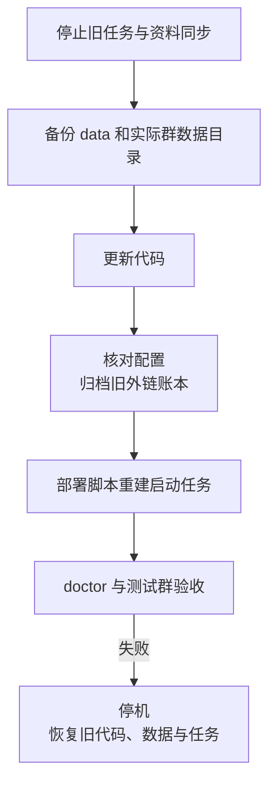

# 已部署实例升级到 Pi 0.85.1

本文针对 **Windows 原生、`mixin-chatbot` 计划任务，且旧远端外链已经清空**的实例，从审计基线 `4d51f63`（Pi 0.85.0）的数据布局升级到本次重构。断兼容来自本项目的配置、流程和账本改造，不代表 Pi 的补丁升级本身要求搬迁数据。更早版本先按下表核对实际目录。

**建议在原项目目录就地升级。群资料、索引、用户目录和 Pi 会话无需改名或搬家。先复制备份，旧外链 JSONL 归档后由新版创建空 SQLite。** 本文采用手动操作和现有部署入口，不增加迁移模块；开发和测试没有在生产主机执行这些步骤。



## 备份哪些，升级后放哪里

以下路径相对于旧项目根目录。`$Backup` 是后文创建的备份目录；`<群数据根>` 以旧 `data/state/group-data-root` 和实际 launcher 为准，默认 `data/groups`。

| 原位置 | 备份位置 | 升级后的处理 |
|---|---|---|
| **整个 `data/`** | `$Backup/data/` | 原地保留；包含配置、部署状态、运行资源和默认群数据 |
| `data/config/models.json` | `$Backup/data/config/models.json` | 原路径；必须是一个 provider、一个模型，多模型用配置向导重新选择 |
| `data/config/webhook-secret` | 同上相对路径 | 原路径、原内容；保留后不用更改平台回调密钥 |
| `data/config/relay.json`、`tunnel-token` | 同上相对路径 | 原路径；保留后端地址、账号、签名密钥和隧道凭据 |
| `data/state/bot-port`、`deploy-mode`、`bot-domain`、`group-data-root` | 同上相对路径 | 部署向导沿用这些值；不要把文件改名成 `runtime.json` |
| `data/runtime/bot-launcher.ps1` | 同上相对路径 | 新版部署脚本重新生成；备份只用于核对旧环境和回滚 |
| `data/runtime/relay-index.jsonl` | 同上相对路径 | **归档到 `agents/rm/<随机ID>-relay-index.jsonl`；新版创建空 `data/state/relay.sqlite`，不要改名冒充 SQLite** |
| 外置 `<群数据根>/`，例如 `D:/bot-groups/` | `$Backup/group-data/` | 继续使用原绝对路径；整棵目录备份，不能只复制 workspace |
| `node_modules/` | `$Backup/node_modules/` | 建议备份用于离线回滚；新版按新锁文件重装，不混用旧依赖 |
| 旧提交与计划任务 | `$Backup/source.bundle`、`revision.txt`、`task.xml`、`task-state.xml` | 仅用于回滚；任务 XML 不包含账户密码 |
| `%ProgramData%/cloudflared/`、服务定义 | `$Backup/cloudflared/`、`cloudflared-service.xml` | 使用隧道时备份；通常原地沿用，不改到 `data/` 下 |
| `logs/`、`agents/rm/` | 可另存为 `$Backup/logs/`、`$Backup/archive/` | 可选；故障追查或需要恢复已归档会话时保留 |

群目录内部保持原样，包括：

```text
<群数据根>/<群目录>/
├── workspace/                   原始资料
├── index/materials.md           资料索引
├── index/ignore.txt             如果配置过，必须保留
├── venv/                        本群解析环境
└── users/<用户目录>/
    ├── session.jsonl            Pi 原生会话
    └── tmp/                     生成文件、缓存和工具完整输出
```

不要把中文群目录重新命名成群名，也不要重新计算用户目录。路径编码规则没有变化。`tmp` 可能含尚未取走的交付物，不能作为升级清理目标。

新增的 `data/config/runtime.json` 由部署脚本生成；`data/state/agent.sqlite` 由新版应用创建。已经存在的 SQLite 状态要随整个 `data/` 一并备份。正常停机后复制目录，不能在运行中只复制 `.sqlite` 而漏掉 WAL 文件。

## 1. 停止旧实例并建立备份

在**原部署账户的管理员 PowerShell** 中进入旧项目根目录。先暂停资料同步写入，尽量等正在执行的任务结束。若手改过 launcher，记录实际群数据根、端口和环境变量；不要执行旧 launcher 来“读取配置”。

以下命令取得新版的停止函数，但此时不切换旧工作树。该函数会禁用计划任务，核对本项目进程归属后停止进程树，避免直接结束旧任务后丢失子进程归属。

```powershell
$ErrorActionPreference = 'Stop'
$Project = (Get-Location).Path
$Backup = Join-Path $Project ('agents\temp\pre-pi-0851-' + (Get-Date -Format 'yyyyMMdd-HHmmss'))
New-Item -ItemType Directory -Path $Backup | Out-Null
[Console]::OutputEncoding = New-Object System.Text.UTF8Encoding($false)
$OutputEncoding = [Console]::OutputEncoding

git diff --quiet HEAD
if ($LASTEXITCODE -ne 0) { throw '先保存并处理已跟踪代码的本地改动，再升级' }
git fetch origin
if ($LASTEXITCODE -ne 0) { throw '获取新版代码失败，尚未停机' }
$helper = git show origin/main:scripts/lib/lifecycle.ps1
if ($LASTEXITCODE -ne 0) { throw '缺少新版停止函数，尚未停机' }
$helper | Set-Content -LiteralPath (Join-Path $Backup 'lifecycle.ps1') -Encoding UTF8
. (Join-Path $Backup 'lifecycle.ps1')
Protect-ProjectSecretPath $Backup

git rev-parse HEAD | Set-Content -LiteralPath (Join-Path $Backup 'revision.txt') -Encoding ASCII
git bundle create (Join-Path $Backup 'source.bundle') HEAD
if ($LASTEXITCODE -ne 0) { throw '旧代码备份失败' }
Export-ScheduledTask -TaskName 'mixin-chatbot' |
    Set-Content -LiteralPath (Join-Path $Backup 'task.xml') -Encoding Unicode
Get-ScheduledTask -TaskName 'mixin-chatbot' |
    Export-Clixml -LiteralPath (Join-Path $Backup 'task-state.xml')

if (-not (Stop-ProjectBot $Project 'mixin-chatbot' -KeepDisabled)) {
    throw '旧实例未停止，不能继续复制数据或更新依赖'
}
```

如果旧版本此前已经留下脱离父进程的 Bash/Python，停止函数无法凭空恢复其归属。应先核对这些进程；无法确认时，保持计划任务禁用，重启 Windows，再继续停机备份。不要通过“结束全部 bun.exe/python.exe”处理，也不要仅凭旧 `ops stop` 的成功提示认定磁盘已停止写入。

接着复制数据。此函数拒绝把备份放进源目录内部，`robocopy` 返回码 8 及以上视为失败；不使用镜像删除选项。`/XJ` 跳过目录联接，若资料通过联接指向别处，还需单独备份实际目标。

```powershell
function Copy-UpgradeTree([string]$Source, [string]$Destination) {
    $sourceFull = [IO.Path]::GetFullPath($Source).TrimEnd('\')
    $targetFull = [IO.Path]::GetFullPath($Destination).TrimEnd('\')
    if ($targetFull -eq $sourceFull -or
        $targetFull.StartsWith($sourceFull + '\', [StringComparison]::OrdinalIgnoreCase)) {
        throw '备份目标不能位于源目录内；请选择另一备份位置'
    }
    robocopy $sourceFull $targetFull /E /COPY:DAT /DCOPY:DAT /R:2 /W:1 /XJ /NP
    if ($LASTEXITCODE -ge 8) { throw "目录备份失败：$sourceFull" }
}

Copy-UpgradeTree (Join-Path $Project 'data') (Join-Path $Backup 'data')
$groupRootFile = Join-Path $Project 'data\state\group-data-root'
$OriginalGroupRoot = if (Test-Path -LiteralPath $groupRootFile) {
    (Get-Content -LiteralPath $groupRootFile -Raw -Encoding UTF8).Trim()
} else { 'data\groups' }
if (-not [IO.Path]::IsPathRooted($OriginalGroupRoot)) {
    $OriginalGroupRoot = Join-Path $Project $OriginalGroupRoot
}
$OriginalGroupRoot = [IO.Path]::GetFullPath($OriginalGroupRoot)
$OriginalGroupRoot | Set-Content -LiteralPath (Join-Path $Backup 'group-root.txt') -Encoding UTF8
if ($OriginalGroupRoot.TrimEnd('\') -ne (Join-Path $Project 'data\groups').TrimEnd('\')) {
    Copy-UpgradeTree $OriginalGroupRoot (Join-Path $Backup 'group-data')
}
if (Test-Path -LiteralPath (Join-Path $Project 'node_modules')) {
    Copy-UpgradeTree (Join-Path $Project 'node_modules') (Join-Path $Backup 'node_modules')
}
$cloudConfig = Join-Path $env:ProgramData 'cloudflared'
if (Test-Path -LiteralPath $cloudConfig) {
    Copy-UpgradeTree $cloudConfig (Join-Path $Backup 'cloudflared')
}
Get-CimInstance Win32_Service -Filter "Name='Cloudflared'" |
    Export-Clixml -LiteralPath (Join-Path $Backup 'cloudflared-service.xml')
```

手改 launcher 导致实际群数据根与状态文件不一致时，上面的 `$OriginalGroupRoot` 应改为实际值后再复制。备份中包含密钥和可能带凭据的服务定义，保持目录访问权限受限。核对复制结果后，建议再将完整 `$Backup` 保存到另一块磁盘或受限备份存储；`agents/temp` 中的副本不能防止整盘损坏。

## 2. 更新代码，补齐旧运行设置

保留同一个 PowerShell 窗口，旧计划任务继续禁用。先确认 Windows 主机具备 Bun 1.4.0+、Git Bash 和原生 `uv.exe`。

```powershell
git merge --ff-only origin/main
if ($LASTEXITCODE -ne 0) { throw '代码未成功快进，停止升级' }
```

后续部署脚本会按新锁文件重新安装依赖；无需手动卸载或重新安装实验性 `pi-server`，新锁文件已移除该依赖。

| 旧设置来源 | 本次怎么处理 |
|---|---|
| `bot-port`、`group-data-root`、`deploy-mode`、`bot-domain` | 后续部署向导读取并沿用；确认没有选到新空目录或改错入口模式 |
| 旧 launcher 的 `BOT_DEBUG`、`BOT_MAX_ACTIVE_REQUESTS` | 第一次升级前在当前 PowerShell 中显式设置原值，否则分别采用 `0`、`32` |
| 自定义 `BOT_BASH_TIMEOUT`、`BOT_INDEX_*`、其他受支持的 `BOT_*` | 按 [README 运行设置](../README.md#运行设置) 在当前窗口重新设置；部署会保存到 `runtime.json` |
| 机器/用户环境中的同名变量 | 会继续覆盖 `runtime.json`；核对实际值，避免遗留覆盖项 |
| 多 provider / 多模型的 `models.json` | 在后续部署向导中选择重新配置 AI，改为一个 provider、一个模型；保留原配置备份 |

例如旧实例确实使用以下值时，才执行：

```powershell
$env:BOT_DEBUG = '0'
$env:BOT_MAX_ACTIVE_REQUESTS = '16'
$env:BOT_BASH_TIMEOUT = '900'
```

端口、群目录、模式和域名不变，且保留 `webhook-secret` 时，平台原回调 URL 可以继续使用。每个群必须使用独立 callback key。

## 3. 归档已清空远端的旧账本

本节前提是**旧链接及对应远端文件均已处理完毕，没有需要保留或清理的旧对象**。只在群里删除链接消息不等于删除了远端文件。

旧 JSONL 已包含在第一步的完整备份中。继续在原 PowerShell 窗口调用已经加载的归档函数；文件不存在时无需处理：

```powershell
Move-ToProjectArchive (Join-Path $Project 'data\runtime\relay-index.jsonl') $Project
```

这一步将旧账本移到 `agents/rm/<随机ID>-relay-index.jsonl`。**不把它移到 `data/state/`，也不改名为 `relay.sqlite`。** 新版首次使用外链账本时会创建空的 `data/state/relay.sqlite`。不需要创建空文件、不需要运行 SQL，也没有额外迁移 CLI。

`data/config/relay.json` 继续原地保留，供以后发送新的大文件使用。已经存在的 `agent.sqlite` 或 `relay.sqlite` 属于新版业务数据，应保留并备份；本步骤只归档旧 JSONL。

如果其他实例仍有旧远端对象，不能照此当作空账本升级；应先按原后端完成盘点、保留或清理方案。项目不自动导入旧 JSONL，也不支持旧平铺对象布局。

## 4. 重新部署并验收

```powershell
powershell -NoProfile -ExecutionPolicy Bypass -File scripts/deploy/deploy.ps1
if ($LASTEXITCODE -ne 0) { throw '部署失败，先查看保留现场和回滚说明' }
powershell -NoProfile -ExecutionPolicy Bypass -File scripts/ops/ops.ps1 doctor
if ($LASTEXITCODE -ne 0) { throw '部署诊断未通过，暂不恢复正常使用' }
```

部署向导确认原群目录、端口和入口模式；它会保存 `runtime.json`、重建 launcher 与计划任务并启动服务。不要在这之后用备份中的旧 launcher 覆盖新文件。已有 Cloudflared 服务若缺少项目归属标记，只有确认它属于本项目后才选择沿用。

验收至少覆盖：原会话可继续、旧资料可检索、Office/PDF 可解析、附件可发送、一个适当的测试任务能被 `/stop` 终止，以及配置外链时的新文件上传、链接交付和下载。需要验证清历史或补发时，使用授权测试群中的 `/clear`、`/deliver`。`/health` 或计划任务显示 Running 不能替代这一步。

恢复资料同步和正常使用后，保留升级前备份到确认无需回滚。本次属于第一次跨结构升级，使用上述完整部署流程；完成后日常更新才使用 `ops.ps1 update`。

## 失败时怎样回滚

**部署脚本的自动快照不能替代这份备份。** 快照主要覆盖配置、启动定义、依赖、入口和运行状态，不包含完整群数据及所有 SQLite 业务状态。手动快进代码后运行 `deploy.ps1`，失败也不会自动把 Git 切回旧提交。

1. 使用仍在新工作树中的 `scripts/lib/lifecycle.ps1`，调用 `Stop-ProjectBot $Project 'mixin-chatbot' -KeepDisabled`，确认新实例停止，暂停同步。
2. 将新版写过的整个 `data/` 和外置群数据根分别归档到项目 `agents/rm/`，保留故障现场，再将 `$Backup/data/` 复制回原项目的 `data/`；外置目录将 `$Backup/group-data/` 复制回 `group-root.txt` 记载的原绝对路径。不要把新旧状态库或用户目录混合覆盖。跨盘归档可复用新版 `src/core/maintenance.ts` 的 `archiveFile`，而不是依赖目录跨盘重命名。
3. 在工作树没有需要另存的改动时，读取 `$Backup/revision.txt`，执行 `git switch --detach <旧提交>`。若本地提交不可用，可从 `source.bundle` 恢复。将新 `node_modules` 归档后，恢复 `$Backup/node_modules/`；未备份依赖时，按旧 `bun.lock` 重新 `bun install --frozen-lockfile`。
4. 用 `$Backup/task.xml` 恢复原任务定义和账户，保留禁用状态直到数据、依赖、原 launcher 和目录权限核对完毕。部署改动过隧道时，再按备份恢复属于本项目的 Cloudflared 配置和服务；未改动的入口无需重建。
5. 按 `task-state.xml` 中记录的原运行状态决定是否启动旧任务，然后使用旧版 `doctor` 和测试群验收。新版运行期间已发送的消息或已删除的远端对象不会因本地回滚自动撤销、恢复；保留验收期间产生的新数据归档以便后续核对。

只还原旧提交、不还原相配套的数据和启动定义，不属于完整回滚。
