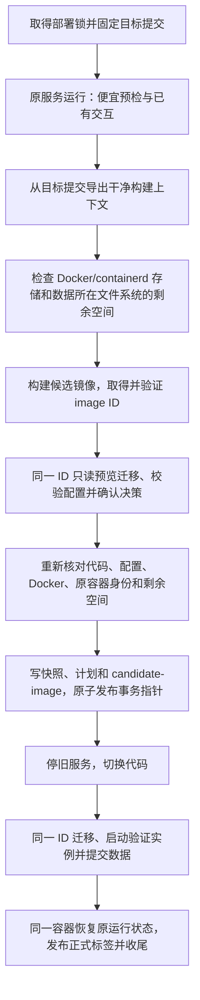

# 停机前构建候选镜像：实施方案

基线：98f1b4a。状态：第 1、2 段已通过审查，一起提交为 929a4a4，升级和部署已改为停机前构建并按 ID 执行；第 3 段已通过审查，提交为 1b6272d，停机前按实际切换路径预演未跟踪文件冲突，并完成故障注入和真实 Docker 验收。

目标是把构建、拉取构建依赖和可提前完成的检查移到停机之前；一次升级只构建一次，预检、迁移、验证实例和正式实例使用同一个不可变 Docker image ID。构建失败或用户取消时，原业务容器继续运行。

## 现状与需要改变的边界

- `scripts/deploy/upgrade.sh` 先用目标 Dockerfile 的 Bun 基础镜像执行 `preview --decisions-only`，再调用 `begin_deployment` 停机、切换代码，最后交给 `deploy.sh` 构建。
- `scripts/deploy/deploy.sh` 的构建、迁移、目录检查、配置命令和启动多处使用 `mixin-chatbot` 标签。标签可能被重指向，单纯把 build 往前移不能保证执行的仍是预检过的镜像。
- `begin_deployment` 已在停机前写完快照、事务记录及指针，可复用这个提交顺序。候选镜像必须在调用它之前就绪。
- `UPGRADER_EXPORT_PATHS` 只有升级器、共用库、迁移、一个版本文件和 Dockerfile，缺少 package.json、锁文件、src、public、Python 环境等构建输入。旧入口运行的是旧导出清单，不能只修改新版导出清单来解决首次过渡。
- 当前事务记录由 Bash、PowerShell 和 TUI 共用严格解析规则：只接受 `format=1`，未知键拒绝整份记录（`transaction.sh`、`tui/transaction.ts`）。恢复入口 `ops.sh resume/rollback` 和 TUI 用**当前检出的代码**读取它。首次过渡时，新升级器在停机前发布指针，而工作区仍是旧代码；记录格式一变，旧入口就读不了。因此事务记录保持 format 1，镜像身份另存（见下文）。
- `group_data_admin`、`relay_admin` 和模型校验在服务未运行时按 `mixin-chatbot` 标签启动一次性容器，且不检查未完成事务。现在切换代码后先 `docker build -t mixin-chatbot` 再迁移，所以没有“旧镜像处理新数据”的窗口；正式标签推迟到最后发布后，这个窗口必须由一次性容器保护关闭。

## 推荐流程

1. 保持现有部署锁覆盖整个升级。先检查 Git 快进、未提交改动、Docker 可用性、群根、端口及 rootless 限制（rootful daemon 要求 root 运行，见“磁盘预检”），再收集已有的隧道归属/token 确认。
2. 升级器自行对已经固定的 `TARGET_SHA` 执行完整 `git archive`，解包到本次独立的 `tmp/upgrade-*/build-context`。检查导出成功再调用 Docker；保留目标提交的 `.dockerignore`。不从实际工作目录打包，避免本地配置、未跟踪文件、旧 node_modules 或下一次 fetch 影响构建。
3. 构建前检查磁盘空间（见“磁盘预检”）：原服务仍在运行，构建占满磁盘会让线上 SQLite 和日志写入失败，所以空间不足时在构建前停止。
4. 用唯一的临时标签构建，例如 `mixin-chatbot:candidate-<项目标识>-<随机操作ID>`，通过 `docker build --iidfile` 取得完整 `sha256:…` ID；再用 `docker image inspect` 核对 ID、目标提交标签、OS/架构和本次归属。构建阶段不改动正式 `mixin-chatbot` 标签。
5. 候选镜像可运行后，直接运行镜像内 `/app/scripts/migrations/run.ts`；预检不再挂载另一份迁移代码覆盖镜像代码，也不再解析 Dockerfile 的 FROM 来选择另一个预览镜像。
6. 预览与正式迁移保持相同的服务 UID 和群根路径。数据、群根只读挂载；仅本次 scratch 与操作日志可写。预览收集决策、投影配置并校验目标版本配置，不启动业务服务、不修改真实数据库或获取服务独占租约。
7. 完整的数据/schema 校验仍在停机并应用迁移后进行。将 `src/core/data-validation.ts` 中的配置校验拆出供预览复用（`scripts/migrations/validate.ts` 和 `src/server/verify.ts` 都调用它），避免在迁移前拿新 schema 要求检查旧数据库，也避免把活跃 WAL 数据库的只读打开限制误判为配置错误。
8. 构建和交互可能耗时较长，因此停机前再次检查原 HEAD/工作区、计划输入摘要、原容器身份与挂载、Docker daemon、候选镜像身份和数据所在文件系统的剩余空间。发生变化时留在停机前阶段并要求重新预检；不只依赖停机后的 apply 才发现变化。apply 仍保留自己的最终摘要校验。
9. 在事务指针发布前，把镜像身份完整、原子地写入快照中的 `candidate-image`（见下文），迁移计划照旧存入快照。之后 `deploy.sh` 从快照加载 ID，升级续做路径禁止再 build 或 pull，不提供“找不到就退回 mixin-chatbot 标签”的分支。
10. 数据提交前失败沿用既有回滚机制；数据提交后只能继续激活新版本。原本停止的服务完成验证后仍保持停止。

构建期业务进程继续运行，但构建会竞争 CPU、内存、磁盘；这不是零性能影响。日志分别记录构建耗时和实际停机窗口，不承诺固定停机秒数。停机后仍有迁移、验证和现有连接器准备步骤，本轮也不把它宣称为完整离线升级。

## 镜像身份与保留

事务记录（`transaction`）保持 format 1，键不增不减；镜像身份写在同一快照目录的独立文件 `candidate-image` 中，与已有的 `previous-image`、`target-sha`、`migration-plan.json` 一样按名读取，旧版代码忽略它。格式同样是每行一个 `key=value`，逐键校验：

| 字段 | 用途 |
| --- | --- |
| `format` | 本文件的格式版本，现为 1 |
| `source` | `commit`（升级，从固定提交导出）或 `workspace`（独立部署从工作区构建） |
| `target_sha` | 构建输入的提交；必须与事务记录一致 |
| `image_id` | 完整 `sha256:…`；所有执行命令的唯一镜像选择依据 |
| `image_tag` | 本次操作独占的保留标签 `<仓库>:candidate-<项目标识>-<操作ID>`；防止镜像失去标签 |
| `daemon_id` | 绑定构建时的 Docker Engine（`docker info` 的 ID，rootful 与 rootless 不同）；切换 context/socket 后先拒绝操作 |
| `project_id` / `operation_id` | 项目路径摘要和随机操作 ID；与镜像标签、保留标签的后缀一致，供归属核验和定向收尾 |

写入顺序：先校验全部字段，写临时文件并落盘（`dd conv=fsync`），再改名，最后发布事务指针；读者要么看不到文件，要么看到完整的一份。候选流程的目标升级器和部署脚本按指针打开事务时，`candidate-image` 缺失或任何一项无效都拒绝继续和自动回滚，提示人工检查；不能退回按标签运行。由于升级事务总是由目标版本的升级器写入，含候选流程的版本写出的事务必然带这个文件，缺失只能是损坏，不需要猜测；更早的事务由它自己记录的目标提交导出的旧升级器处理。

原镜像 ID 继续使用已有的 `previous-image`。升级候选镜像添加 revision、项目标识、操作 ID 和来源标签，供审计和定向收尾使用；镜像标签不是签名，不能代替 ID 核验。独立 deploy 若从有改动的工作区构建，应明确标为 workspace 来源，不能只用 HEAD 的 revision 标签代表全部输入。不要仅用提交 SHA 作为临时标签，因为同一提交可以被重复构建，并可能产生不同 ID。

Windows 原生部署和 TUI 的事务解析不变，不增加 Windows 镜像构建流程。恢复入口先读镜像身份，再执行 committed 检查、rollback 或任何可能调用容器的代码。

必须补测旧版入口（98f1b4a 的 `ops.sh`、TUI）在两个窗口中的行为：指针已发布、代码尚未切换时的续做和回滚；回滚时旧代码已恢复、指针尚未删除时的完成回滚。另用一个格式冻结测试固定 `transaction` 的键集合和 format，防止以后改动再次破坏首次过渡。

正常构建缓存继续使用。不做全局 image/builder prune。带标签的未使用镜像仍可能被管理员执行的 `image prune -a` 清除，因此恢复逻辑必须显式处理镜像丢失，不能把保留标签视为绝对保证。

## 正式标签和生命周期

- 所有属于本次事务的 `docker run` 都使用 `target_image_id`：预览、配置预检、存储权限检查、migration 的 apply/validate/commit/rollback，以及验证实例创建。验证结束后正式激活继续使用同一个容器，不重新按标签创建。
- 只有数据提交、部署激活条件满足后，才把 `mixin-chatbot` 指向候选 ID；原本停止的服务也需要更新该标签，让停机状态下的运维命令使用新版本。
- 正式标签发布成功并核验后，才清理事务指针。若数据已提交但发布标签失败，保留事务，resume 重试发布/激活；禁止回退已提交数据。
- 原镜像继续由既有回滚容器、记录的 previous-image 和回滚标签保留。回滚时迁移撤销使用本次候选 ID，随后恢复原镜像及原运行状态。
- 成功或完整回滚后，只移除本次临时标签和临时容器，不按 image ID 强制删除镜像。删除标签前核对它仍指向本次 ID；被外部重指向时保留并报告。
- 没有事务指针的构建失败/取消，只清本次构建上下文、预览容器和临时标签。SIGINT/TERM/HUP 要终止并等待本次客户端；不终止共享 Docker daemon 或其他构建。
- SIGKILL/断电可能留下有归属标签的孤儿候选镜像。它不代表未完成的数据事务，不阻塞下一次正常升级；通过明确的清理入口处理，不在下次启动时自动扫描并删除其他候选。

## 一次性容器保护

正式标签在数据提交后才指向候选镜像，事务期间 `mixin-chatbot` 仍是旧镜像。服务未运行时，`stat`、`routes`、`tmp-purge`、`relay-*`、`backup-*`、`history-clear` 和模型校验等普通管理入口会用它启动一次性容器，可能让旧代码处理已迁移的数据。

- 服务未运行、需要一次性容器时，入口先非阻塞地取得部署锁，取不到就说明部署或升级正在进行并停止；取得后检查事务指针，有未完成事务就拒绝，提示用 resume 或 rollback 处理。锁一直持有到一次性容器结束，避免检查之后才出现事务。
- `history-clear` 这类先停服务再执行的入口，在停服务之前取得锁，整个过程持有。
- 服务正在运行时仍用 `docker exec` 进入运行中的容器，不受影响；事务内部（部署脚本、升级器）的容器按记录的 ID 运行，不经过这些入口。

## 磁盘预检

构建前和停机前各检查一次，按共享剩余空间的单位汇总需求；剩余空间一律以本机 `df` 实测为准，估算值只用来决定门槛。

- **只支持本机 daemon。** Docker 端点必须是 unix socket，且 daemon 报告的主机名与本机一致；否则说明无法检查远程 Docker 的存储空间并停止（项目的 bind mount 本来也要求本机 daemon），不拿本机路径的剩余空间冒充。
- **rootful daemon 要求 root。** rootful daemon 的数据目录（`DockerRootDir`、`/var/lib/containerd`）只有 root 能进入；docker 组普通用户看不到其中的符号链接，确认不了数据实际放在哪块磁盘上。因此 `docker info` 的 `SecurityOptions` 不含 `name=rootless` 且有效 UID 不是 0 时，在查看任何存储位置之前停止，提示改用 root 运行；脚本不自动 `sudo`。rootless daemon 由它所属的普通用户运行，进程属主、程序信任和存储可见性检查照旧。
- **Docker 存储位置。** `docker info` 的 `DockerRootDir`（构建缓存、容器层）、被符号链接指到它以外的子目录（例如移到另一块盘的 `overlay2`、`buildkit`），以及挂在这些目录内部的其他文件系统（`volumes/`、`plugins/` 下是卷和插件，构建不写入，不计）；找这些链接要列出目录内容，当前用户不能同时读取和进入 `DockerRootDir`（例如 0300：按名字仍能写入，却列不出链接），或列出失败时停止。使用 containerd 镜像存储（`DriverStatus` 含 `io.containerd.snapshotter.v1`）时，再加上正在为这个 Docker 服务的 containerd 的存储位置，按以下顺序确定，不看目录是否存在：
  1. 取 Docker 报告的 containerd 地址（`docker info` 的 `Containerd.Address`）。
  2. 只看属于 root 或当前用户的 containerd 进程（rootful 的属于 root，rootless 的属于部署者本人）；其他用户的同名进程直接跳过，从不执行它们提供的程序。
  3. 解析配置要执行进程的程序（`config dump`），执行前核对该程序：解析符号链接后的文件和各级目录都属于 root 或当前用户，组和其他用户不可写（带粘滞位的目录除外）。其他用户能替换的程序一律不执行，不能等执行之后再按地址或锁拒绝。
  4. 按进程的启动参数（`--config`、`--root`、`--address`）和 `containerd config dump` 得到的有效配置（由 containerd 自己合并 imports）算出 gRPC 地址；只有地址与 Docker 报告一致的进程才是候选。
  5. 位置按配置和挂载表列出，不从锁推断：根目录；Docker 所用快照器（overlayfs、native、btrfs、zfs）的 `root_path`（若有设置）；内容存储（`io.containerd.content.v1.content`）和默认快照目录被符号链接指到根目录以外时的真实位置；以及 `/proc/self/mountinfo` 中挂在这些目录内部的其他文件系统（例如单独挂载的内容盘，它空闲时没有常驻锁）。容器运行时的 overlay、tmpfs 等挂载不计。内部挂载点当前用户进不去时无法衡量，停止并提示用 root 运行。devmapper、blockfile 和代理快照器的数据不在可用 `df` 衡量的目录中，直接拒绝。
  6. 用 `/proc/locks` 只确认进程身份：候选进程必须持有根目录中元数据库（`io.containerd.metadata.v1.bolt/meta.db`）和自定义快照目录中 `metadata.db` 的锁，按设备号和 inode 核对；读不到数据库文件（例如当前用户进不去根目录）就无法核对，停止。它在上述位置以外的磁盘文件系统上持有锁，说明还有没识别出的位置，同样拒绝；tmpfs 上的锁是状态目录，不计。
  7. 恰好一组位置核对通过才采用；找不到、读不到配置或结果互相矛盾都停止，并列出每个 containerd 进程未通过的原因。

  docker 组用户进不去 rootful 的数据目录，看不到其中的符号链接，原先只能按挂载表和锁的设备号判断；这个盲区由上面“rootful daemon 要求 root”消除，读不到数据库文件时也不再退回按设备号核对。
- **共享剩余空间的单位。** 按 `/proc/self/mountinfo` 中挂载的超级块设备号归组：btrfs 的各子卷共用一个超级块，`stat` 报告的设备号却各不相同，不能用后者；ZFS 的数据集各有设备号但共用存储池，按池名归组，可用空间取组内最小值。同一组的需求相加。LVM thin 等超分配的存储上 `df` 本身不反映底层池的余量，检查以 `df` 为准。
- **构建门槛。** 原镜像解压后大小（`docker image ls` 的大小；containerd 存储下 `image inspect` 的 `.Size` 只是压缩后的内容大小）与 2 GB 取大，乘 1.5 再加 1 GiB，每组 Docker 存储只算一次；组内其余位置仍参与检查（需求为 0），因为它们可能受更小的配额限制，例如同一 ZFS 池中配额更小的数据集。
- **数据门槛。** `data/`、群根、`backup/` 和本次导出目录所在文件系统至少保留 1 GiB；停机前复核时再加上迁移快照的预计大小。与 Docker 存储共享剩余空间时各项需求相加。
- 空间不足时列出每组的挂载点、涉及的路径、可用和所需空间，服务不停。

## 中断恢复规则

| 中断位置 | resume / rollback 行为 |
| --- | --- |
| 构建或预览期间，事务指针尚未发布 | 旧服务继续；重试是一轮新的准备，可重新构建 |
| 指针已发布，服务尚未停止 | 先核对记录中的候选 ID、daemon 和计划，再停机；不重建 |
| 已停机、尚未迁移 | 只用记录的候选 ID 继续；若无需数据撤销，可用原容器完成回滚 |
| 迁移已开始、尚未提交 | 候选 ID 执行迁移继续或撤销，再恢复原版本 |
| 数据已提交 | 保留新代码和数据，用记录的候选 ID 完成激活和标签发布；拒绝回滚 |
| 候选镜像被删除 | 在进一步改动之前停止。需要候选迁移逻辑时，要求恢复完全相同的 image ID；不能重新构建同 SHA 后当成原候选使用 |
| 候选标签被改指向其他镜像 | 执行仍绑定记录的 ID；归属核验失败则停止或保留异常标签，不切换到被改指向的镜像 |
| 切换了 Docker daemon/context | 拒绝继续和自动回滚，提示回到原 daemon；不操作另一个宿主上的同名容器 |

没有 `candidate-image` 的旧事务按它记录的目标提交导出旧升级器处理；不猜测或补写 image ID。候选流程写出的事务缺少 `candidate-image`、镜像不可用或记录损坏时明确拒绝，不能降级走旧流程。保留现有“目标提交丢失时仅可进行原本可安全完成的回滚”和人工代码保护规则。

## 本轮范围

主要改动是 Docker upgrade 及它调用的公共部署执行器。独立 `deploy` 原本已经在停机前构建；它也应在构建后固定 ID，并复用镜像记录、执行和恢复机制。升级强制使用目标 Git 提交的导出上下文；独立 deploy 是否允许工作区改动维持现有规则，不把它的工作区构建宣称为目标提交的可复现构建。

AI 向导持久化草稿、外部决策文件、事务 token 文件、完整离线包、SELinux 验证留在后续轮次。本轮不改变它们当前的产品入口和承诺。现有 --decisions-only 入口仍可供旧版升级导出使用，新候选流程改用镜像内的配置预检能力。

## 实施拆分

1. **镜像公共库和身份记录。** 新增 `scripts/lib/candidate-image.sh`：完整提交导出、构建、ID/daemon/标签/归属核对、正式标签发布与定向释放、存储位置识别和磁盘预检；`candidate-image` 的读写校验；`transaction` 格式冻结测试。真实 Docker（WSL 上 docker 组用户、root、rootless，均为 containerd 镜像存储）验证 `--iidfile`、`image inspect`、按 ID 运行、容器实际 `.Image`、标签切换全程候选和旧镜像都有标签保留；root 和 rootless 所属用户识别出的存储路径就是镜像内容实际所在，docker 组用户的存储查找和磁盘预检被拒绝。本段不改变升级流程。
   实测结果（WSL Ubuntu，Docker 29.1.3，三种身份均为 containerd 镜像存储）：`--iidfile` 的 ID 与按标签、按 ID 的 `image inspect` 一致，也等于 manifest 摘要；按 ID 运行的容器 `.Image` 就是该 ID。daemon ID 是 UUID，rootful 与 rootless 不同；`docker info` 的 Name 是主机名。镜像失去最后一个标签后（标签被移走，或 `image rm --force` 删除仍有容器使用的标签）仍然存在，但这是实测行为而不是保证，方案仍要求全程保留标签，并处理镜像丢失；这样留下的无标签镜像不会随容器删除而消失，收尾必须按记录的 ID 清理（失去标签的镜像不出现在按仓库名的列表里）。docker 组用户不能读取系统 containerd 的 `/var/lib/containerd`（700），看不到其中的符号链接，所以 rootful 下磁盘预检要求 root；root 和 rootless 用户按设备号和 inode 核对锁。三种身份下 containerd 都持有 `meta.db`、overlayfs 快照器 `metadata.db`（磁盘）和状态目录中 mount-manager 数据库（tmpfs）的锁。
2. **调整执行顺序并固定 ID。** 改 upgrade.sh 的停机前准备（导出、磁盘预检、构建、预检、复核、写 `candidate-image` 后发布指针），改 deploy.sh 所有事务相关镜像入口；拆出可在配置投影上运行的纯配置校验。处理 committed 激活的早期路径、回滚路径和正式标签发布顺序；加上一次性容器保护；补测旧版入口的两个窗口。
   rootful 要求 root 的检查放在提问之前；同步更新 README、deployment.md 和 development.md 中“docker 组普通用户部署”的说明。容器身份沿用已有实例：现有脚本在 root 执行时一律用 1001 并改挂载目录的属主，已由 docker 组用户部署的实例改用 root 升级就会被迁移。改为停机前读取并验证原容器（停止状态也要能处理）的数值 UID/GID，写入本次事务快照的独立附属记录（transaction 保持 format 1 的键集合），预览、迁移、验证实例、正式实例和续做都复用它；新建的 scratch、日志和快照文件按该身份给出必要的访问权限，不批量改已有数据的属主。无法可靠确定原身份时在停机前拒绝，不猜成 1001。真正的首次部署维持现有默认身份；rootless 保持同一 daemon 下原有的用户映射，不把容器内的 UID 0 当成宿主的 root。验收：docker 组用户部署的实例经 root 升级、续做和回滚后 UID/GID 不变，已有数据的属主不被批量迁移。
   实施结果（第三轮通过审查，929a4a4）：升级器停机前从目标提交导出完整上下文，检查磁盘后构建一次并按 image ID 固定，以原服务身份在该镜像中断网、只读预览迁移并校验配置，复核检出（仍是升级开始时核对的提交、分支、main 且没有已跟踪文件的改动；切换代码前再确认没有改动）、预览输入、原容器、候选镜像和剩余空间，写入 `candidate-image` 和 `service-user` 后才发布指针；deploy.sh 的迁移、验证实例、正式实例、续做和回滚都按记录的 ID 和身份运行，正式标签在数据提交、新实例就绪后发布，保留标签在事务结束时定向释放。服务未运行时的一次性容器入口先取部署锁并检查事务指针。root 操作 docker 组用户的检出会遇到 git 的 dubious ownership：脚本说明原因并提示 `safe.directory`，不代为信任。旧入口的两个窗口（指针已发布、代码未切换；代码已恢复、指针未清除）由 98f1b4a 的 ops.sh 和 TUI 继续或回滚都有测试；旧入口在升级完成后的体检仍以 1001:1001 校验模型配置，对 docker 组用户部署的实例会误报这一项（见 deployment.md）。中断：`run_interruptible` 开启作业控制后，启动时被忽略的 INT 经设置处理再 `trap -` 会变成默认处理，由 ops.sh 在后台启动的升级器因此会被 Ctrl+C 直接结束（停机前留下预览容器，交接后丢下部署脚本）；现在不碰已被忽略的信号并恢复调用方原有的处理。停机前的清理、交接前的回滚、部署回滚和升级器最后的代码恢复在独立的进程组中运行（`run_shielded`，标准输入为 /dev/null），父进程忽略 INT/TERM/HUP 等它结束：终端的 Ctrl+C 和断线只发给前台进程组，到不了收尾中的 docker 客户端、git 和管道；只让父 shell 空处理信号不够（docker 客户端自己处理 INT/TERM，子 shell 恢复默认处理），部署回滚的这一问题 98f1b4a 已存在。后台进程组里 sudo 不能询问密码：回滚以普通用户恢复防火墙规则前先在前台 `sudo -v`，其中的 sudo 用 `-n`。交接后断线由升级器像 TERM 一样转给部署脚本；ops.sh 断线时也等升级器结束才删除导出目录（升级器的提交回执在其中），此前它会先退出，在回滚期间删掉回执。真实 Docker（WSL，Docker 29.1.3，containerd 镜像存储）：rootless 14 项、root 16 项（含 docker 组用户用 98f1b4a 部署的实例经 root 升级、被杀后续做和回滚，UID/GID 与已有数据属主不变）、docker 组用户 1 项，全部通过（rootless 和 root 下验证失败的回滚期间反复向进程组发送 SIGINT，回滚仍完整），结束后没有遗留的容器和带项目标签的镜像。Windows 的 Git Bash 把 /tmp 挂在 TEMP 目录上，测试夹具位于其下时同一工作区有两个 POSIX 路径：目标升级器测试的夹具为所有入口固定 `PWD`，与 Docker stub 报告的挂载路径一致；生产代码对容器归属的检查不放宽。
3. **故障注入和真实 Docker 验收。** 扩展 target-upgrader、deployment、transaction-record 和 real-docker 测试，补操作日志及文档。停机前按实际的切换路径（当前检出 → main → 目标提交）用 Git 的无写入预演（如 `git read-tree -n -m -u`）检查切换不会覆盖未跟踪的文件，覆盖文件、目录和路径前缀冲突；冲突时在停机前停止并列出，不删除或挪走操作者的文件（第 2 段审查的决定：目前 Git 要到停机后才拒绝，随即自动回滚）。每段可单独审查；最终合并发布时要求完整流程验收通过。
   实施结果（第二轮通过审查，1b6272d）：停机前按实际切换路径预演（`switch_preflight`，scripts/lib/common.sh）：当前检出 → main（与当前不同时）→ 目标提交，逐步取新增路径，列出会被覆盖的未跟踪或被忽略的文件、含未跟踪文件（含被忽略文件）会随目录删除的目录、占着新增路径上级目录位置的文件或链接（当前提交跟踪的除外：git 直接替换它们，其下的路径不经链接检查）；规则没有发现冲突时再用 `git read-tree -n -m -u` 在 scratch 中的索引副本上预演两步，git 的失败原样列出。预演不写真实索引（也不取 index.lock）、不改工作区和操作者文件。新升级在构建之前和停机前复核时各做一次；续做在停止服务之前先确认已跟踪文件无改动、本地 main 能快进到目标提交且预演通过，否则服务和代码保持现状。回滚恢复代码的保护复用同一套规则。操作日志记录候选镜像构建耗时和停机窗口：停机发生在之前的进程时注明；中断在指针发布后、停止服务前时，由续做的进程停止服务并开始计时。故障注入测试检查实际状态：服务容器和镜像 ID、正式和保留标签、Git HEAD 与 main、事务指针与记录、迁移回执以及能否继续或回滚；事务记录损坏、属于其他快照、快照缺失、候选镜像记录缺失或属于其他提交时，继续和回滚都在触碰容器之前拒绝，指针和记录保持原样。真实 Docker（WSL，Docker 29.1.3，containerd 镜像存储）：rootless 22 项、root 20 项、docker 组用户 1 项全部通过，候选镜像测试三种身份各 7 项通过，结束后没有遗留的容器和带项目标签的镜像。新增的步骤：放慢构建（约 30 s）期间原服务每 250 ms 一次的健康请求全部成功，容器和启动时间不变，只构建一次，正式标签发布前的容器都用候选 ID，工作区的未跟踪文件不进镜像；预览期间改指正式标签不影响执行，改指保留标签在停机前被发现，标签保留；数据提交后被杀时拒绝回滚，续做只启动新实例。证据见审查记录。Windows 的 upgrade.ps1 仍在停机后才由 git 发现未跟踪文件冲突，未纳入本段。

不建议先只把 build 命令移到前面再发布，那会留下停机后再次构建、早期恢复仍按标签运行等混合状态。

## 验收清单

- 构建失败、缺依赖网络失败、用户取消预览、磁盘空间不足：原容器 ID、运行状态和 Git HEAD 不变；升级流程没有修改配置或业务数据，从未执行 stop。原服务自身的正常业务写入不算升级产生的改动。
- 首次过渡：用 98f1b4a 的 `ops.sh` 和 TUI，在“指针已发布、代码未切换”时续做和回滚都成功；“旧代码已恢复、指针未删除”时完成回滚成功。
- 有未完成事务且服务未运行时，普通管理入口拒绝启动一次性容器；检查与部署锁之间没有竞态。
- 远程或无法识别存储位置的 daemon 在构建前停止；空间检查覆盖 Docker/containerd 存储和数据所在的每个文件系统。
- 故意放慢构建时持续请求原健康端点，证明原实例未被停机或替换；同时记录资源负载。
- 升级从固定目标提交构建；放在真实工作区里的未跟踪文件不会进入镜像。通过旧 UPGRADER_EXPORT_PATHS 导出的新升级器也能完成首次过渡。
- 一次成功升级只执行一次 build。预览、迁移、配置命令和最终容器的实际 Image ID 全部一致。
- 在预检后改指向 mixin-chatbot 标签，执行仍使用候选 ID；修改候选保留标签会被发现。
- 在构建期间修改配置、切换 Git HEAD/引入工作区改动、替换原容器或切换 daemon，停机前复核拒绝继续。
- 工作区有与目标提交新增路径冲突的未跟踪文件或目录时，停机前拒绝并列出冲突；服务没有停止，这些文件不变。
- 候选镜像内的预检读取只读数据、使用独立 scratch；正常请求仍产生的业务数据不被预检修改或锁死。带 WAL 的活跃数据库不会因预检要求目标 schema 而误拒合法迁移。
- 在指针发布前后、停机后、迁移后、数据提交后分别注入中断；resume 不 build、不 pull，并沿用原 ID。数据已提交时不回退。
- 候选镜像丢失、标签被改、正式标签发布失败和清理失败都有可诊断、可重试的结果；不会删除原镜像或其他项目镜像。
- 原服务停止时升级后仍停止；已有人工代码修改的回滚保护保持通过。
- 真实 Docker 分别验证 root 部署和 rootless 所属用户，覆盖默认/外置群根；rootful 下的普通 docker-group 用户在提问、构建和停机之前被拒绝，服务和数据不变。只在隔离 daemon 或可丢弃测试机运行。
- Windows、Ubuntu、容器三个 CI 全通过；真实 Docker 验收单独记录，不能用 mock 测试或现有容器单元测试代替。

完成标准：构建失败不导致停机，停机后的成功路径不构建镜像，整个事务和恢复过程中的目标镜像身份没有歧义。
