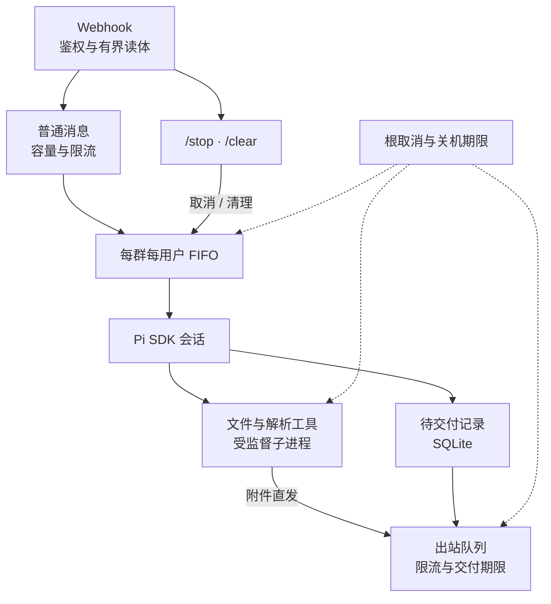

# 开发指南

[返回 README](../README.md) · [部署与配置](deployment.md) · [运维手册](operations.md)

**本页内容**：[工作原理](#工作原理) · [提示词与工具](#提示词与工具) · [资料解析](#资料索引与文档解析) · [缓存与费用统计](#缓存与费用统计) · [开发与检查](#开发与检查)

只调整机器人的用途时，从 [prompt.ts](../src/agent/prompt.ts) 开始。修改代码后，按文末的开发检查流程验证。

## 工作原理

基于 **Bun + Hono + Pi 0.85.1 本地 SDK**，支持 Windows 原生部署和 Linux / Docker。下面是任务处理与取消、交付之间的关系：



一轮任务覆盖准备、模型执行、工具调用和最终交付，完成收尾后才释放会话。同一群、同一用户按 FIFO 串行处理，不同用户可以并发；默认全局最多接收 32 个普通请求。

停止与清理走独立控制路径，不受普通消息容量、入站限流或去重阻挡。相同的在途清理会合并，重复 `/stop` 仍会再次触发取消。图中虚线表示根级取消约束：关机先广播取消，进程和出站请求在统一期限内收尾。

最终文本和必要外链先持久化，平台确认后才移除记录；未送达内容可用 `/deliver` 补发。代码生成的外链另存结构化附件引用，交付前重新签名并检查远端对象大小；对象缺失、到删除期限或后端变更时保留待补发记录。部分补发只确认已成功的行。文件附件由发送工具直接交付。

callback key 必须对应一个群。跨群复用会触发持久隔离，并取消关联的在途与排队交付；修正平台配置后按[回调路由恢复](operations.md#回调路由恢复)解除隔离。

出站以 callback key 为单位有界排队，最多 64 个等待发送事务；20 RPM 窗口内为最终回复预留额度，状态提醒可以丢弃。HTTP 429、业务限流和 Retry-After 均受总期限及有限重试约束。Markdown 降级保留链接目标、下划线、中文及签名参数，普通文本直发。

## 提示词与工具

基础系统提示词在 [prompt.ts](../src/agent/prompt.ts) 中维护，通过 Pi 的 `systemPromptOverride` 注入。关闭自动发现 extensions、skills、prompt templates、themes 和上下文文件，也不读取群工作区的 `.pi/settings.json`。[模块注册入口](../src/agent/modules.ts) 按开关一起提供工具、skill、提示词补充和只读资源目录；文档模块默认开启，设 `BOT_DOCUMENT_WORK_ENABLED=0` 并重启可关闭。启用时通过 `skillsOverride` 加载项目维护的 [document-work](../src/agent/modules/document-work/skills/document-work/SKILL.md)，向提示词提供名称、描述和路径，正文及参考指南由模型按需读取。群资料中的 skill 不能改变指令或运行设置；变化的文件数量、时间和解析状态不进入固定提示词前缀。详见[模块开关与移除](document-tools.md#开关对比测试与移除)。

回答以本群资料为依据，尽可能标明文件、页码或 sheet。有效版本依据正式发布、生效日期和版本说明判断；历史答案与文件修改时间不能证明当前有效。资料内容作为证据处理，原始资料按用户要求直接发送。

| 工具 | 用途与边界 |
| --- | --- |
| `read` | 读取本群 workspace、index、本用户 tmp 及项目文档 skill |
| `edit` / `write` | 仅写本用户 tmp，检查规范路径 |
| `bash` | 执行命令，统一管理超时、取消、输出上限及后代回收 |
| `document_environment` | 按需准备解析环境，验证实际解释器、版本和库导入 |
| `document_extract` | 提取 PDF/DOCX/PPTX/XLSX，按内容与解析器版本复用缓存，返回可检索的文本路径 |
| `document_inspect` | 检查 DOCX/PPTX 包及内部引用，返回段落位置、正文块、实际页序和内容摘要 |
| `document_patch` | 按摘要与精确位置修改副本中的文字，保留未修改的文档部件 |
| `document_compose` | 选编 Word 正文块或 PPT 页面，生成新文件与来源记录 |
| `document_render` | 将 DOCX/PPTX/PDF 渲染为逐页图片及联系表；Office 需要 LibreOffice |
| `send_file` / `send_image` | 发送文件或图片；本地路径复用文件工具的解析规则 |

本地路径支持 Pi 路径约定、file URL 和 Windows Git Bash 路径。Windows 用 Job Object 管理工具进程及后代，Linux 用 subreaper 和父进程死亡通知回收后代；主命令退出、超时、取消或机器人父进程强制结束都会触发收尾。输出总量限制为 16 MiB，并保留错误尾部。

**bash 保有运行账户的操作系统权限，进程监督不构成文件沙箱。** 当前部署面向可信内部成员；Docker 使用非 root、只读镜像与移除 capabilities，但资料 bind mount 仍可写。不可信用户需要独立的 OS 隔离方案。

### 资料索引与文档解析

索引用于定位文件：每轮检查刷新期限，刷新期间可暂时使用旧清单；未命中时仍需定向查找资料。`index/ignore.txt` 每行一个 workspace 相对路径前缀，`#` 表示注释；扫描受文件数和深度限制，无法读取的目录会使清单标记为不完整。

PDF、DOCX、PPTX、XLSX 文本优先使用 `document_extract`，它会按需检查解析环境并复用缓存。特殊解析或文件生成先调用 `document_environment`；模型不能自行安装包或改写共享环境。环境另支持数据表及常用图片处理，不提供 OCR；文档工具只接受现代 Office 格式。三种文档工作方式、复用来源与限制见[文档加工设计](document-tools.md)。

Python 依赖由 [pyproject.toml](../pyproject.toml) 和 [uv.lock](../uv.lock) 管理，[.python-version](../.python-version) 选择 3.14 系列。通过 `UV_PROJECT_ENVIRONMENT` 指向群 venv，执行 `uv sync --locked --no-dev --no-install-project`；Docker 构建、原生准备和就绪检测共用 [document-manifest.ts](../scripts/runtime/document-manifest.ts)，marker 包含依赖锁摘要和 Python 版本。就绪检测同时运行离线 `uv sync --check` 和实际库导入。修改依赖后运行 `uv lock`，再按[文件回归说明](document-tools.md#开发验证)检查。

资料索引保存可验证的 manifest，重启后在 TTL 内复用；清单内容不变时不重写正文，目录扫描适度并发、失败后退避。文档环境成功校验缓存 5 分钟，解释器、marker、项目依赖声明、Python 版本文件或锁文件变化立即失效，并合并同一环境的并发检查。

`document_extract` 优先处理重复的二进制资料：群共享资料的结果位于群 `index/parsed`，用户私有文件的结果只放本用户 `tmp/.document-cache`。键包含原件 SHA-256、解析器与依赖锁版本、格式及提取选项；命中时仍核对当前原件和缓存正文摘要。保留页码、幻灯片或 sheet/行号；XLSX 公式输出原文、不计算。单个原件上限 128 MiB，解析全局并发为 2，每个缓存目录最多保留约 128 项，支持取消、期限及自动淘汰。

### 缓存与费用统计

模型缓存默认完全沿用 Pi SDK，不按 provider 是否内置区分。官方 Coding Plan 即使通过自定义 provider 配置，也不会被应用额外降级；智谱的自动缓存无需另外开启。通常只需配置接口、模型与凭据。只有服务商明确支持且需要覆盖时，才设置 `BOT_MODEL_CACHE_RETENTION`；这里的 `long` 是传给 SDK 的偏好，不保证服务端保留期限或套餐配额收益。

提示词使用稳定的 `$PI_USER_TMP` 名称，避免用户绝对路径改变公共前缀；实际目录通过工具环境传入。会话 ID、工具顺序及 schema 保持稳定。资料查找、文档提取缓存和统计扫描缓存改善的是本地工作量，不与服务商的模型缓存命中率混算。

统计包含普通回复、历史压缩和分支摘要的 input/output/cacheRead/cacheWrite，按模型、日期及调用类型分组。缓存读取比例按 `ΣcacheRead / Σ(input + cacheRead + cacheWrite)` 计算，无有效输入样本时显示“无样本”。费用是 SDK 根据配置价格的估算，缺失项单列，**不代表 Coding Plan 实际账单或套餐配额**。CLI、TUI 和 HTML 报表共用同一统计来源；无变更的会话复用内存缓存，追加写入校验旧前缀后只重新解析新行，截断或改写则重建。

## 开发与检查

```sh
bun install --frozen-lockfile
bun run check
bun audit
```

配置向导和配置变更需要先停止服务。已有模型配置与 webhook 密钥时，用 `bun run start` 前台运行、`bun run dev` 监听代码变化。仅隔离开发可显式设置 `ALLOW_INSECURE_WEBHOOK=1` 使用无密钥的 `/webhook`。

`bun run check` 包含 TypeScript、隔离 cwd 的 Bun 测试、普通 Knip 和 production Knip。TypeScript 拒绝未使用变量、参数、标签及不可达语句；Knip 同时检查入口文件的未使用导出。单独运行测试也使用 `bun run test`，以免直接 `bun test` 读取开发者的真实配置。测试和诊断产物放在顶层 `tmp/`。

`scripts/patches/knip@6.29.0.patch` 修复 Knip 对 Bun 脚本 production 入口标记的传递，仅影响开发检查。补丁随检查脚本维护；移除前需同步更新安装引用并通过普通和 production 两种 Knip 检查。

命令行入口放在 `scripts/{config,ops,runtime}` 下，由 `package.json` 和 `knip.json` 登记为生产入口。配置目录明确列出三个命令入口，辅助模块通过引用纳入检查。运维界面入口是 [tui.ts](../scripts/ops/tui.ts)，实现放在 `scripts/ops/tui/`；新增命令时同步更新入口声明，并通过普通和 production 两种 Knip 检查。

`bun run tui:preview [页面] [列] [行]` 用固定的演示数据把任意页面渲染成文本，不读 `data/`，也不需要 TTY；加 `--plain` 去色，用来核对列宽。改动界面排版后用它比对同一份输入前后的样子，管理台截图也来自同一条渲染路径；图片核对与更新方式见[截图维护说明](assets/README.md)。渲染层的硬约束是「每个组件吐出的每一行显示宽度精确等于给它的宽度」——差一列不会报错，只会让右边所有东西错位，`tests/ops/tui-render.test.ts` 用中文、全角标点和带色文本压这条不变量。

Pi 两个包精确固定为 0.85.1，使用官方本地 SDK。依赖升级通过改版本、更新锁文件和回归检查完成。当前外链存储使用 SQLite 账本。

| 工程入口 | 职责 |
| --- | --- |
| [app.ts](../src/server/app.ts)、[webhook.ts](../src/server/webhook.ts) | HTTP 接入、鉴权与控制路径 |
| [runtime.ts](../src/agent/runtime.ts)、[session-queue.ts](../src/agent/session-queue.ts) | Pi 接线、任务生命周期和会话 FIFO |
| [prompt.ts](../src/agent/prompt.ts)、[local-tools.ts](../src/agent/local-tools.ts) | 资料助手提示词与本地工具边界 |
| [process.ts](../src/core/process.ts)、[process-supervisor.ts](../src/core/process-supervisor.ts) | 工具进程执行与后代回收 |
| [delivery-store.ts](../src/agent/delivery-store.ts)、[im.ts](../src/integrations/im.ts)、[relay.ts](../src/integrations/relay.ts) | 持久交付、平台发送与外链对象 |
| [scripts/ops](../scripts/ops)、[scripts/deploy](../scripts/deploy) | 日常运维与部署事务 |
| [scripts/ops/tui](../scripts/ops/tui) | 全屏运维界面：渲染层、宿主机数据读取与操作转调 |

CI 配置了 Windows/Linux 检查及受限 Linux 镜像中的解析器与进程回收验证。部署验收还需检查目标机器的服务、入口和真实交付流程。

Pi 路径适配代码的许可保留在对应源码中，开发检查补丁位于 `scripts/patches`。
