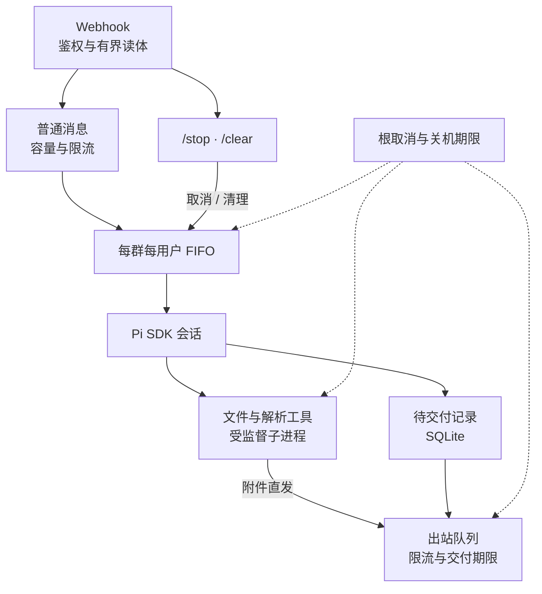

# 开发指南

[返回 README](../README.md) · [部署与配置](deployment.md) · [运维手册](operations.md)

**本页内容**：[工作原理](#工作原理) · [提示词与工具](#提示词与工具) · [资料解析](#资料索引与文档解析) · [文档加工](#文档加工) · [缓存与费用统计](#缓存与费用统计) · [开发与检查](#开发与检查) · [数据版本与升级](#数据版本与升级)

只调整机器人的用途时，从 [prompt.ts](../src/agent/prompt.ts) 开始。修改代码后，按[开发与检查](#开发与检查)验证。

## 工作原理

基于 **Bun + Hono + Pi 本地 SDK**，支持 Windows 原生部署和 Linux / Docker。下面是任务处理与取消、交付之间的关系：


```mermaid
flowchart TD
  W["Webhook<br/>鉴权与有界读体"] --> A["普通消息<br/>容量与限流"]
  W --> C["/stop · /clear"]
  A --> Q["每群每用户 FIFO"]
  C -->|取消 / 清理| Q
  Q --> P["Pi SDK 会话"]
  P --> T["文件与解析工具<br/>受监督子进程"]
  P --> D["待交付记录<br/>SQLite"]
  T -->|附件直发| I["出站队列<br/>限流与交付期限"]
  D --> I
  R["根取消与关机期限"] -.-> Q
  R -.-> T
  R -.-> I
```

一轮任务覆盖准备、模型执行、工具调用和最终交付，完成收尾后才释放会话。同一群、同一用户按 FIFO 串行处理，不同用户可以并发；默认全局最多接收 32 个普通请求。

停止与清理走独立控制路径，不受普通消息容量、入站限流或去重阻挡。图中虚线表示根级取消约束：关机先广播取消，进程和出站请求在统一期限内收尾。

最终文本和必要外链先持久化，平台确认后才移除记录；未送达内容可用 `/deliver` 补发。文件附件由发送工具直接交付。callback key 必须对应一个群，跨群复用会触发持久隔离，修正平台配置后按[回调路由恢复](operations.md#回调路由恢复)解除。出站以 callback key 为单位有界排队，并为最终回复预留限流额度。

## 提示词与工具

基础系统提示词在 [prompt.ts](../src/agent/prompt.ts) 中维护，通过 Pi 的 `systemPromptOverride` 注入。关闭自动发现 extensions、skills、prompt templates、themes 和上下文文件，也不读取群工作区的 `.pi/settings.json`。[模块注册入口](../src/agent/modules.ts) 按开关一起提供工具、skill、提示词补充和只读资源目录；文档加工模块见[下文](#文档加工)。群资料中的 skill 不能改变指令或运行设置。

回答以本群资料为依据，尽可能标明文件、页码或 sheet。资料内容作为证据处理，原始资料按用户要求直接发送。

| 工具 | 用途与边界 |
| --- | --- |
| `read` | 读取本群 workspace、index、本用户 tmp 及项目文档 skill |
| `edit` / `write` | 仅写本用户 tmp，检查规范路径 |
| `bash` | 执行命令，统一管理超时、取消、输出上限及后代回收 |
| `document_environment` | 按需准备解析环境，验证实际解释器、版本和库导入 |
| `document_extract` | 提取 PDF/DOCX/PPTX/XLSX，按内容与解析器版本复用缓存，返回可检索的文本路径 |
| `document_inspect` | 检查 DOCX/PPTX 包及内部引用，返回段落位置、正文块、实际页序和内容摘要；可附带页面或章节大纲 |
| `document_patch` | 按摘要与精确位置修改副本中的文字，保留未修改的文档部件 |
| `document_compose` | 选编 Word 正文块或 PPT 页面，可混合 Markdown 新内容，生成新文件与来源记录 |
| `document_build` | 用 Markdown 在模板的母版、版式与样式上整份生成 Word 或 PPT |
| `document_images` | 从 PDF/PPTX/DOCX 提取内嵌图片或按区域截取渲染页，作为 Markdown 图片素材 |
| `document_render` | 将 DOCX/PPTX/PDF 渲染为逐页图片及联系表；Office 需要 LibreOffice |
| `send_file` / `send_image` | 发送文件或图片；本地路径复用文件工具的解析规则 |

Windows 用 Job Object 管理工具进程及后代，Linux 用 subreaper 和父进程死亡通知回收后代；主命令退出、超时、取消或机器人父进程强制结束都会触发收尾。输出总量限制为 16 MiB，并保留错误尾部。

**bash 保有运行账户的操作系统权限，进程监督不构成文件沙箱。** 当前部署面向可信内部成员；Docker 使用非 root、只读镜像与移除 capabilities，但资料 bind mount 仍可写。不可信用户需要独立的 OS 隔离方案。

### 资料索引与文档解析

索引用于定位文件，未命中时仍需定向查找资料。`index/ignore.txt` 每行一个 workspace 相对路径前缀，`#` 表示注释；扫描受文件数和深度限制，无法读取的目录会使清单标记为不完整。

PDF、DOCX、PPTX、XLSX 文本优先使用 `document_extract`，它会按需检查解析环境，并按原件 SHA-256、解析器与依赖锁版本复用缓存：群共享资料的结果位于群 `index/parsed`，用户私有文件的结果只放本用户 tmp。特殊解析或文件生成先调用 `document_environment`；模型不能自行安装包或改写共享环境。不提供 OCR，文档工具只接受现代 Office 格式。

Python 依赖由 [pyproject.toml](../pyproject.toml) 和 [uv.lock](../uv.lock) 管理，[.python-version](../.python-version) 选择 3.14 系列，各群默认使用自己的 `<群目录>/venv`。Docker 构建、原生准备和就绪检测共用 [document-manifest.ts](../scripts/runtime/document-manifest.ts)。修改依赖后运行 `uv lock`，再做[文档回归](#文档回归)。

## 文档加工

文档加工是默认开启的可选模块，覆盖修改 Word、选编和修改 PPT、整合资料或按模板生成新文档。原件提供可复用内容，正式资料提供事实，模板提供样式；内容取舍和版面由模型决定，工具负责把容易写错的文件操作做可靠。

| 层次 | 负责什么 | 入口 |
| --- | --- | --- |
| Skill | 复用原则、工具选择和交付标准 | [SKILL.md](../src/agent/modules/document-work/skills/document-work/SKILL.md) |
| 按需指南 | Word/PPT 编辑要点、Markdown 生成约定、流程图脚本和各类文档的内容要点 | [references](../src/agent/modules/document-work/skills/document-work/references) |
| 工具 | 摘要校验、大纲、局改、组装、按模板生成、图片素材、渲染、来源记录 | [tools.ts](../src/agent/modules/document-work/tools.ts) |
| 固定环境 | 各群按需 `uv sync`，统一 Python 与依赖锁 | [python-toolchain.ts](../src/agent/python-toolchain.ts) |

**开关。** `BOT_DOCUMENT_WORK_ENABLED` 默认 `1`，设为 `0` 关闭：在 TUI 的「设置 → 高级运行参数 → 文档与诊断 → 文档加工模块」修改并应用，或在 `data/config/runtime.json` 中设置后重启；进程环境变量优先于文件。关闭会移除六个文档工具、skill、模块提示词及其额外 `read` 权限；资料索引、`document_extract`、`document_environment`、原文件发送和 `read/bash/edit/write` 保留，已有 venv 不卸载。

实现集中在 [document-work 模块目录](../src/agent/modules/document-work)，[modules.ts](../src/agent/modules.ts) 是唯一注册点。要从代码中移除，先关闭并重启，再删除模块目录和对应的注册分支，清理相关测试和专用依赖（`pptx-automizer`、`docxcompose`、`pypdfium2`），重新生成锁文件并运行 `bun run check`。

所有来源先复制到本用户 tmp 中再处理，原资料不被覆盖；修改、组装与生成同时输出来源路径、摘要和选编信息。每次调用的中间文件在结束时删除，成功保留成品、预览图片和报告。

### 能力边界

| 情形 | 当前行为 |
| --- | --- |
| Word 组装 | 第一份提供主样式与页眉页脚，后续来源的页眉页脚不导入；正文块范围包含边界 |
| PPT 尺寸不同 | 拒绝直接组装，先按目标尺寸重排所需内容 |
| 文字改长 | 局改保留原容器，不自动放大文本框；需要渲染后检查溢出 |
| 模板推断 | PPT 标题样式取自模板样例页；模板没有内容页或版式差异大时用 `styleFrom` 指定样例页。行数按字宽估算，最终以渲染图为准 |
| 自动图示 | 卡片、流程、分层、时间轴、指标、循环、金字塔只识别短段落和明确的标签模式，装不下时退回普通版式并提示；颜色取模板标题色或主题强调色 |
| Mermaid 流程图 | 子集：节点形状、带标签的连线、虚线与粗线、`&` 汇合；subgraph、style、click 忽略并提示；最多 40 个节点、80 条连线。Word/PNG 需要中文字体，无字体时保留源码 |
| 图片素材 | 只提取位图；EMF/WMF/SVG 和组合图示需用 `crops` 从渲染页截取 |
| 域、修订记录 | 局改工具拒绝受影响段落，需要专门脚本处理副本 |
| 复杂 PPT 对象 | 动画、SmartArt、媒体、外部链接及复杂图形需实际核对，不承诺全部无损 |
| 外部关联 | 检查器提示关联数量，不访问其内容；结构检查不等同于完整 Office 校验或文件脱敏 |
| 预览 | 默认前 20 页，单次最多 50 页。Office 预览依赖 LibreOffice，最终字体和分页以客户软件为准 |

单来源最大 128 MiB，一次来源总量和 Office 解压总量各最大 256 MiB；组装最多 20 个来源、PPT 最多 200 页。文档操作全局并发 2，单次总期限 5 分钟，受任务取消与进程监督约束。

### 参考项目与许可

| 项目 | 用法 |
| --- | --- |
| [pptx-automizer](https://github.com/singerla/pptx-automizer)（MIT） | 以固定 npm 依赖复用跨文件页面、母版及关联资源导入；项目另做页序转换、输出清理与检查 |
| [docxcompose](https://github.com/4teamwork/docxcompose)（MIT） | 以固定 Python 依赖复用 Word 组装，遵循首文档页眉页脚规则 |
| [Anthropic document skills](https://github.com/anthropics/skills) | 查阅能力划分思路；其 [PPTX 许可](https://github.com/anthropics/skills/blob/main/skills/pptx/LICENSE.txt)包含复制与再分发限制，因此未复制其 skill 正文、脚本或素材 |

本项目 skill 和胶水代码独立编写；第三方包保留自身许可证。Pi 路径适配代码的许可保留在对应源码中。

## 缓存与费用统计

模型缓存使用 Pi 原生 `PI_CACHE_RETENTION`（short/long，默认 short），环境变量优先于 runtime.json。`data/runtime/pi/settings.json` 的 `cacheWarming` 在本项目默认 **off**；保温是额外模型请求，与是否允许服务端缓存是两个选项。`compaction.modelOverrides` 可按 `provider/model` 调整压缩预算，模型 `inputLimits.images.resize` 控制图片尺寸。

统计包含普通回复、历史压缩、分支摘要及缓存保温等调用的 input/output/cacheRead/cacheWrite，按模型、日期及调用类型分组。费用是 SDK 根据配置价格的估算，**不代表 Coding Plan 实际账单或套餐配额**。

统计数据独立存放在 `<群数据根>/stats.sqlite`，CLI、TUI 和 HTML 报表都读这一份。入账由 [stats-ledger.ts](../src/agent/stats-ledger.ts) 在任务结束、归档前和每日兜底扫描时增量进行，不重复累加，也不会用较旧的读取覆盖新账；读取方只用只读连接。**不得删库重建**：原件可能已删除，账本是仅存的历史。

## 开发与检查

```sh
bun install --frozen-lockfile
bun run check
bun audit
```

配置向导和配置变更需要先停止服务。已有模型配置与 webhook 密钥时，用 `bun run start` 前台运行、`bun run dev` 监听代码变化。仅隔离开发可显式设置 `ALLOW_INSECURE_WEBHOOK=1` 使用无密钥的 `/webhook`。

`bun run check` 包含 TypeScript、隔离 cwd 的 Bun 测试、普通 Knip 和 production Knip。单独运行测试也使用 `bun run test`，以免直接 `bun test` 读取开发者的真实配置。每次运行的隔离 cwd 是工作根目录下的 `tests-*`，工作根目录由 `MIXIN_TEST_WORK_ROOT` 指定；未设置时用项目 `tmp/`，WSL 用 Linux 文件系统中的 `/tmp/mixin-tests`。全部通过后删除，失败时保留现场并打印路径。

`package.json` 的 overrides 把个别传递依赖固定到修复已知问题的版本，`scripts/patches` 中的 Knip 补丁只影响开发检查；升级依赖时同步检查这些覆盖、补丁和 `bun audit`。Pi 的包精确固定版本，依赖升级通过改版本、更新锁文件和回归检查完成。

命令行入口放在 `scripts/{config,ops,runtime}` 下，由 `package.json` 和 `knip.json` 登记为生产入口；新增命令时同步更新入口声明。`bun run tui:preview [页面] [列] [行]` 用固定的演示数据把管理台页面渲染成文本（`--plain` 去色），用来核对排版；截图维护见[截图说明](assets/README.md)。

| 工程入口 | 职责 |
| --- | --- |
| [index.ts](../src/server/index.ts)、[app.ts](../src/server/app.ts) | 轻量版本检查与服务生命周期；验证模式独立启动 |
| [http-app.ts](../src/server/http-app.ts)、[webhook.ts](../src/server/webhook.ts) | HTTP 接入、鉴权与控制路径 |
| [runtime.ts](../src/agent/runtime.ts)、[session-queue.ts](../src/agent/session-queue.ts) | Pi 接线、任务生命周期和会话 FIFO |
| [session-factory.ts](../src/agent/session-factory.ts)、[session-events.ts](../src/agent/session-events.ts)、[session-control.ts](../src/agent/session-control.ts) | SDK 创建、事件进度与保温取消 |
| [prompt.ts](../src/agent/prompt.ts)、[local-tools.ts](../src/agent/local-tools.ts) | 资料助手提示词与本地工具边界 |
| [process.ts](../src/core/process.ts)、[process-supervisor.ts](../src/core/process-supervisor.ts) | 工具进程执行与后代回收 |
| [delivery-store.ts](../src/agent/delivery-store.ts)、[im.ts](../src/integrations/im.ts)、[relay.ts](../src/integrations/relay.ts) | 持久交付、平台发送与外链对象 |
| [scripts/ops](../scripts/ops)、[scripts/deploy](../scripts/deploy) | 日常运维与部署事务 |
| [scripts/ops/tui](../scripts/ops/tui) | 全屏运维界面：渲染层、宿主机数据读取与操作转调 |

CI 配置了 Windows/Linux 检查及受限 Linux 镜像中的解析器与进程回收验证。部署验收还需检查目标机器的服务、入口和真实交付流程。

常规测试里的 Docker 都是桩。真实 Docker 的部署和升级由可选测试 [real-docker.test.ts](../tests/ops/real-docker.test.ts) 验证，**只能在没有真实服务的 Linux 测试机**（WSL 发行版或虚拟机）上运行：`MIXIN_REAL_DOCKER=1 bun run test tests/ops/real-docker.test.ts`。测试用合成数据，只清理挂载源在其目录下的容器和本次测试项目的镜像，发现其他 `mixin-chatbot*` 容器时拒绝运行；失败或设置 `MIXIN_REAL_DOCKER_KEEP=1` 时保留现场。SELinux 强制模式尚未验证。

### 文档回归

真实文件回归使用单独的测试 venv，不修改群环境或启动机器人。项目根目录的 PowerShell 示例：

```powershell
$env:UV_PROJECT_ENVIRONMENT = (Join-Path $PWD 'tmp/document-validation/group/venv')
uv sync --locked --no-dev --no-install-project
if ($LASTEXITCODE -ne 0) { throw 'uv sync failed' }
bun scripts/runtime/document-manifest.ts . $env:UV_PROJECT_ENVIRONMENT
bun tests/helpers/document-work-integration.ts $env:UV_PROJECT_ENVIRONMENT --office
Remove-Item Env:UV_PROJECT_ENVIRONMENT
```

`--office` 要求可运行的 LibreOffice 并检查 Word/PPT 转 PDF；省略时仍验证 PDF 预览。产物和报告保留在 `tmp/document-validation/run-*` 供人工看图，自动检查不会声称已经看过图片。

## 数据版本与升级

参见[数据版本与升级事务](data-migrations.md)。业务入口 `src/server/index.ts` 和 TUI 入口在加载配置前检查项目与群根的版本；历史迁移集中在 `scripts/migrations/`。升级在提交前仅启动验证实例，提交后恢复正常业务。
