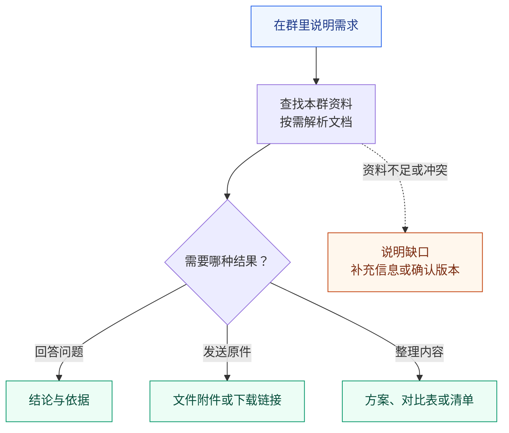
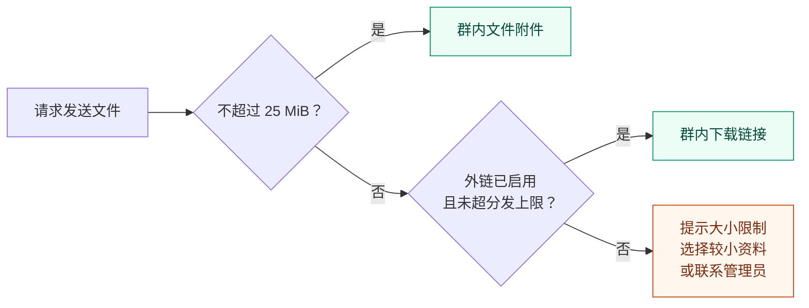

# 群聊使用指南

[返回 README](../README.md) · [部署与配置](deployment.md) · [故障排查](operations.md)

在群里 @ 机器人并说明需求。本文介绍怎么提问、控制任务和接收文件。

**本页内容**：[使用示例](#使用示例) · [使用流程](#使用流程) · [群聊指令](#群聊指令) · [文件交付](#文件交付)

## 使用示例

以下是自带提示词（产品资料助手）下的典型用法。把示例中的产品或项目名称替换为实际名称，在群里说明你要什么结果。

| 想做什么 | 可以这样问 | 预期结果 |
| --- | --- | --- |
| 📚 查产品信息 | “X 产品支持哪些部署方式？请注明资料来源。” | 结论与文件依据；资料缺失时说明缺口 |
| 📎 拿原始资料 | “把 X 产品当前正式版的手册原文件发给我。” | 原始文件附件，或配置了外链后的下载链接 |
| 📊 做资料对比 | “对比 X 和 Y 的功能、部署方式及限制，生成 Excel 表。” | 对比文件，并标明依据或缺失项 |
| 📝 整理交付物 | “根据本群资料整理项目 A 的方案，生成 Word 文件，列出待确认项。” | 方案文件与待确认事项 |
| 📄 修改底稿 | “以现有交付方案为底稿，按最新正式资料更新部署条件，保留原版式。” | 修改后的 Word 副本 |
| 🖥️ 选编方案 | “从产品介绍 PPT 中挑选与客户需求相关的页面，补充部署建议，组装客户方案。” | 可编辑 PPT 与主要来源说明 |

说明用途、版本要求和输出格式，有助于缩小检索范围。每位用户有独立会话，引用“上一份文件”时要保证它出现在你与机器人的当前对话中。

### 文档怎么提需求

三种方式都可以直接用自然语言提出：修改现有 Word；从已有 PPT 选页、改页并组装；整合多份资料生成新文档。说明目标读者、底稿或模板、需要解决的问题即可，不需要指定工具调用顺序。例如：“给客户 IT 负责人看，以现有部署方案为底稿，复用正式产品介绍中的架构图，补充实施与验收部分，输出 Word 和 PPT。”

也可以继续说“把刚才方案中的实施安排改成分两期，其他内容保留”。机器人在用户临时目录生成副本，后续编辑沿用最近成品。售前方案、交付计划和售后问题报告共用文档能力，章节结构根据任务选择。

文件预览需要部署环境支持；模型会用图片检查版式。没有成功预览或模型不能看图时，应明确说明未完成视觉检查。重要客户交付还需用实际 Office 和目标字体核对；来源母版、页眉页脚及复杂对象的具体限制见[文档加工说明](document-tools.md#能力边界)。

## 使用流程

机器人依据本群资料工作，价格、参数和政策需要资料支持。版本以正式发布、生效信息为准；资料不够或存在冲突时，应先说明并确认，不能靠历史答案补齐。

同一用户连续发来的请求会排队执行。等待期间可以用 `/status` 查看进度，用 `/stop` 取消，或用 `/clear` 开始新会话。

## 群聊指令

| 输入 | 行为 |
| --- | --- |
| 普通消息 | 同一会话顺序执行，最多 8 条等待消息 |
| `/stop` | 立即取消当前任务并清空等待消息，回执发送不阻塞停止 |
| `/clear` | 取消并等待收尾，归档本人在本群的会话；后续消息在清理完成后执行 |
| `/deliver` | 补发已生成但没发到群里的回复 |
| `/status` | 查看处理进度、等待消息、最近工具、待补发回复数量与消息发送用量 |
| `/help` | 查看指令说明 |

`/clear` 只归档你在本群的对话，不清除其他人的会话或你的待补发回复。`/stop` 会丢弃排队中的请求；需要继续处理时请重新发送，已发送的消息无法撤回。`/deliver` 可补发之前会话中保存的回复；如果之前只发出了一部分，补发可能包含重复内容。

## 文件交付

发送本地文件时，系统按大小和已配置的能力选择交付方式：

平台单附件上限按本项目约定为 **25 MiB**；外链默认上限为 **2 GiB**，由管理员按需配置。带有效期的链接应在提示的期限内下载，具体保留规则见[大文件外链配置](deployment.md#大文件外链配置)。

> **回复或下载链接未送达时**，使用 `/deliver` 补发；`/clear` 不会清除这些待交付记录。若平台已接收但应答丢失，补发可能重复。直接附件发送失败后，需要重新请求发送文件。

每会话最多保存 64 条待交付文本或外链，达到上限后需先补发。“文件生成成功”或“链接生成成功”与群里确认收到是不同的步骤。
